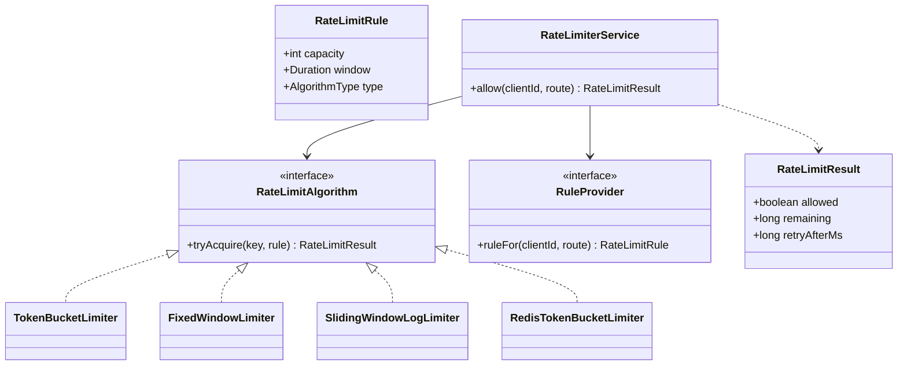
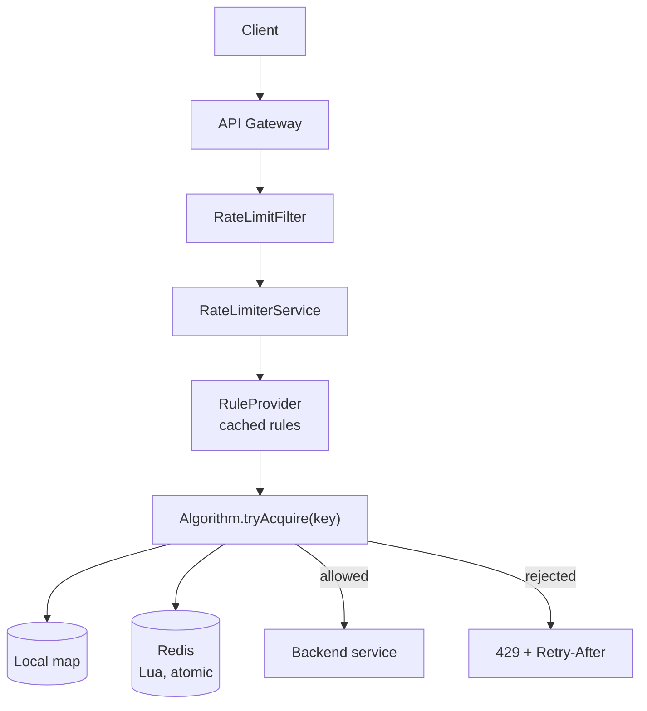
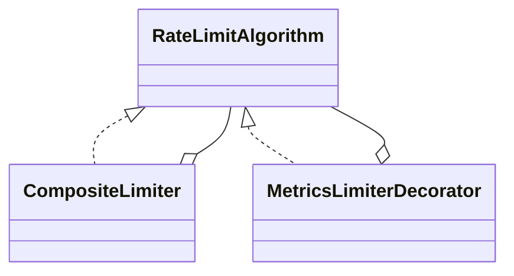

# 01 · Rate Limiter

## Interview question
Design a rate limiter. Discuss Fixed Window, Sliding Window, Token Bucket; then make it work across multiple application instances (Redis, locks, consistency).

## Assumptions / clarification
- Limit per **key** (userId / API key / IP) and optionally per API route.
- Rules are configurable: e.g. `100 req / 60s` for free tier, `1000 / 60s` for premium.
- Rejected requests return HTTP `429` with `Retry-After`.
- Starts in-process (single JVM), then extended to distributed.
- Slight over-admission (a few %) is acceptable under partition; availability of the API matters more than exactness.

## Functional requirements
1. `allow(key)` → true/false.
2. Pluggable algorithms: fixed window, sliding window log, sliding window counter, token bucket, leaky bucket.
3. Per-client / per-route rules.
4. Expose remaining quota + reset time (headers `X-RateLimit-Remaining`).

## Non-functional requirements
- Sub-millisecond decision in-process; < 2 ms with Redis.
- Thread safe under high concurrency.
- Memory bounded (evict idle keys).
- Fail-open if the limiter store is down (configurable).

## CAP / consistency
- Distributed limiter picks **AP**: if Redis shard is unreachable, fail open (or fall back to a local limiter with `limit / N instances`).
- Counter updates must be **atomic** per key → Redis Lua script (single-threaded execution on the shard) instead of GET-then-SET.
- Cross-region: keep counters regional; accept eventual consistency globally.

## Core entities
`RateLimiter`, `RateLimitRule`, `RateLimitAlgorithm` (TokenBucket, FixedWindow, SlidingWindowLog, SlidingWindowCounter), `Bucket/WindowState`, `RuleProvider`, `Clock`, `RateLimitResult`.

## IS-A / HAS-A
- `TokenBucketLimiter` **IS-A** `RateLimitAlgorithm`; `FixedWindowLimiter` **IS-A** `RateLimitAlgorithm`; `RedisTokenBucketLimiter` **IS-A** `RateLimitAlgorithm`.
- `RateLimiterService` **HAS-A** `RuleProvider`, **HAS-A** map of `RateLimitAlgorithm`.
- `TokenBucketLimiter` **HAS-A** `ConcurrentHashMap<String, Bucket>` and a `Clock`.

## Mermaid UML class diagram


## APIs
```
RateLimitResult allow(String clientId, String route)
PUT  /v1/rules/{clientId}      { capacity, windowSec, algorithm }
GET  /v1/rules/{clientId}
Response headers: X-RateLimit-Limit, X-RateLimit-Remaining, Retry-After
```

## Design patterns
- **Strategy** – each algorithm is swappable.
- **Factory** – `AlgorithmFactory` picks the strategy from `AlgorithmType`.
- **Proxy / Decorator** – limiter sits in front of the real handler (API-gateway filter).
- **Singleton (via DI)** – one service instance per JVM.

## SOLID mapping
- **S**: rules lookup (`RuleProvider`) vs algorithm vs HTTP filter are separate.
- **O**: new algorithm = new class, service unchanged.
- **L**: any `RateLimitAlgorithm` works where another is used.
- **I**: small `RateLimitAlgorithm` interface (one method).
- **D**: service depends on `RuleProvider`/`RateLimitAlgorithm` interfaces, `Clock` injected for tests.

## High-level flow


## Algorithm trade-offs
| Algorithm | Memory | Accuracy | Burst | Notes |
|---|---|---|---|---|
| Fixed window | O(1)/key | Boundary burst 2× | Yes at edge | Simplest, `INCR`+`EXPIRE` |
| Sliding log | O(limit)/key | Exact | No | Redis ZSET of timestamps |
| Sliding counter | O(1)/key | ~approx | Smoothed | `prev*(overlap%) + curr` |
| Token bucket | O(1)/key | Good | Controlled bursts | Amazon API GW uses this |
| Leaky bucket | queue | Smooth output | No | Good for shaping outbound |

## Concurrency
- In-process: `ConcurrentHashMap.computeIfAbsent` for bucket creation, `synchronized` on the bucket (per-key lock, no global lock) or `AtomicLong` + CAS.
- Distributed: Redis Lua script = atomic read-modify-write on one shard; keys sharded by `clientId` (consistent hashing / Redis Cluster slots).
- Avoid distributed locks (Redlock) in the hot path — too slow; Lua atomicity is enough.
- Optimisation: local token pre-fetch (take 10 tokens from Redis at once) → fewer round trips, tiny accuracy loss.

## Edge cases
- Clock skew between app servers → use Redis `TIME` inside Lua.
- Unknown client → default rule.
- Rule changed mid-window → apply on next refill.
- Idle keys → TTL on Redis keys / Caffeine eviction locally.
- Redis down → fail open + alert, or local fallback limit.
- Very large `n` requests (batch) → `tryAcquire(key, permits)`.

## End-to-end Java implementation
```java
import java.time.Clock;
import java.time.Duration;
import java.util.Map;
import java.util.concurrent.ConcurrentHashMap;

enum AlgorithmType { TOKEN_BUCKET, FIXED_WINDOW, SLIDING_LOG }

record RateLimitRule(int capacity, Duration window, AlgorithmType type) {
    RateLimitRule {
        if (capacity <= 0) throw new IllegalArgumentException("capacity must be > 0");
    }
}

record RateLimitResult(boolean allowed, long remaining, long retryAfterMs) {
    static RateLimitResult allow(long remaining) { return new RateLimitResult(true, remaining, 0); }
    static RateLimitResult deny(long retryAfterMs) { return new RateLimitResult(false, 0, retryAfterMs); }
}

interface RateLimitAlgorithm {
    RateLimitResult tryAcquire(String key, RateLimitRule rule);
}

interface RuleProvider {
    RateLimitRule ruleFor(String clientId, String route);
}

final class TokenBucketLimiter implements RateLimitAlgorithm {
    private static final class Bucket {
        double tokens;
        long lastRefillNanos;
        Bucket(double tokens, long now) { this.tokens = tokens; this.lastRefillNanos = now; }
    }

    private final Map<String, Bucket> buckets = new ConcurrentHashMap<>();
    private final java.util.function.LongSupplier nanoClock;

    TokenBucketLimiter(java.util.function.LongSupplier nanoClock) { this.nanoClock = nanoClock; }

    @Override
    public RateLimitResult tryAcquire(String key, RateLimitRule rule) {
        long now = nanoClock.getAsLong();
        Bucket bucket = buckets.computeIfAbsent(key, k -> new Bucket(rule.capacity(), now));
        double ratePerNano = (double) rule.capacity() / rule.window().toNanos();
        synchronized (bucket) {                       // per-key lock only
            bucket.tokens = Math.min(rule.capacity(),
                    bucket.tokens + (now - bucket.lastRefillNanos) * ratePerNano);
            bucket.lastRefillNanos = now;
            if (bucket.tokens >= 1) {
                bucket.tokens -= 1;
                return RateLimitResult.allow((long) bucket.tokens);
            }
            long waitNanos = (long) ((1 - bucket.tokens) / ratePerNano);
            return RateLimitResult.deny(Duration.ofNanos(waitNanos).toMillis());
        }
    }
}

final class FixedWindowLimiter implements RateLimitAlgorithm {
    private record Window(long windowStart, int count) {}
    private final Map<String, Window> windows = new ConcurrentHashMap<>();
    private final Clock clock;

    FixedWindowLimiter(Clock clock) { this.clock = clock; }

    @Override
    public RateLimitResult tryAcquire(String key, RateLimitRule rule) {
        long now = clock.millis();
        long size = rule.window().toMillis();
        long start = now - (now % size);
        Window w = windows.compute(key, (k, old) ->
                (old == null || old.windowStart() != start) ? new Window(start, 1)
                                                             : new Window(start, old.count() + 1));
        return w.count() <= rule.capacity()
                ? RateLimitResult.allow(rule.capacity() - w.count())
                : RateLimitResult.deny(start + size - now);
    }
}

final class SlidingWindowLogLimiter implements RateLimitAlgorithm {
    private final Map<String, java.util.ArrayDeque<Long>> logs = new ConcurrentHashMap<>();
    private final Clock clock;

    SlidingWindowLogLimiter(Clock clock) { this.clock = clock; }

    @Override
    public RateLimitResult tryAcquire(String key, RateLimitRule rule) {
        long now = clock.millis();
        var log = logs.computeIfAbsent(key, k -> new java.util.ArrayDeque<>());
        synchronized (log) {
            while (!log.isEmpty() && log.peekFirst() <= now - rule.window().toMillis()) log.pollFirst();
            if (log.size() < rule.capacity()) {
                log.addLast(now);
                return RateLimitResult.allow(rule.capacity() - log.size());
            }
            return RateLimitResult.deny(log.peekFirst() + rule.window().toMillis() - now);
        }
    }
}

final class AlgorithmFactory {
    private final Map<AlgorithmType, RateLimitAlgorithm> registry;
    AlgorithmFactory(Clock clock) {
        registry = Map.of(
            AlgorithmType.TOKEN_BUCKET, new TokenBucketLimiter(System::nanoTime),
            AlgorithmType.FIXED_WINDOW, new FixedWindowLimiter(clock),
            AlgorithmType.SLIDING_LOG, new SlidingWindowLogLimiter(clock));
    }
    RateLimitAlgorithm get(AlgorithmType type) { return registry.get(type); }
}

final class RateLimiterService {
    private final RuleProvider rules;
    private final AlgorithmFactory factory;

    RateLimiterService(RuleProvider rules, AlgorithmFactory factory) {
        this.rules = rules; this.factory = factory;
    }

    RateLimitResult allow(String clientId, String route) {
        RateLimitRule rule = rules.ruleFor(clientId, route);
        return factory.get(rule.type()).tryAcquire(clientId + ":" + route, rule);
    }
}

public class RateLimiterDemo {
    public static void main(String[] args) {
        RuleProvider rules = (c, r) -> c.startsWith("premium")
                ? new RateLimitRule(10, Duration.ofSeconds(1), AlgorithmType.TOKEN_BUCKET)
                : new RateLimitRule(3, Duration.ofSeconds(1), AlgorithmType.FIXED_WINDOW);
        var service = new RateLimiterService(rules, new AlgorithmFactory(Clock.systemUTC()));
        for (int i = 0; i < 5; i++) System.out.println("free  " + service.allow("free-1", "/orders"));
        for (int i = 0; i < 5; i++) System.out.println("prem  " + service.allow("premium-1", "/orders"));
    }
}
```

### Distributed token bucket (Redis Lua)
```lua
-- KEYS[1]=bucket key, ARGV: capacity, refillPerMs, nowMs, permits
local b = redis.call('HMGET', KEYS[1], 'tokens', 'ts')
local tokens = tonumber(b[1]) or tonumber(ARGV[1])
local ts = tonumber(b[2]) or tonumber(ARGV[3])
tokens = math.min(tonumber(ARGV[1]), tokens + (tonumber(ARGV[3]) - ts) * tonumber(ARGV[2]))
local allowed = tokens >= tonumber(ARGV[4])
if allowed then tokens = tokens - tonumber(ARGV[4]) end
redis.call('HSET', KEYS[1], 'tokens', tokens, 'ts', ARGV[3])
redis.call('PEXPIRE', KEYS[1], 120000)
return { allowed and 1 or 0, math.floor(tokens) }
```
```java
final class RedisTokenBucketLimiter implements RateLimitAlgorithm {
    private final RedisClient redis;   // wrapper over Jedis/Lettuce EVALSHA
    private final String scriptSha;
    RedisTokenBucketLimiter(RedisClient redis, String scriptSha) { this.redis = redis; this.scriptSha = scriptSha; }
    public RateLimitResult tryAcquire(String key, RateLimitRule rule) {
        try {
            double refillPerMs = (double) rule.capacity() / rule.window().toMillis();
            long[] r = redis.evalSha(scriptSha, "rl:" + key, rule.capacity(), refillPerMs, redis.timeMs(), 1);
            return r[0] == 1 ? RateLimitResult.allow(r[1]) : RateLimitResult.deny((long) (1 / refillPerMs));
        } catch (RuntimeException e) {
            return RateLimitResult.allow(-1); // fail-open, emit metric
        }
    }
}
interface RedisClient { long[] evalSha(String sha, String key, Object... args); long timeMs(); }
```

## New requirements → how the class diagram evolves
| New requirement | Change |
|---|---|
| Multiple instances | Add `RedisTokenBucketLimiter` (new Strategy). Nothing else changes. |
| Tiered plans (free/premium) | `RuleProvider` backed by DB + cache; `RateLimitRule` gets `tier`. |
| Multiple limits at once (10/s AND 1000/day) | `CompositeLimiter implements RateLimitAlgorithm` holding a list — **Composite**. |
| Weighted requests (bulk API costs 5) | `tryAcquire(key, rule, permits)`. |
| Queue instead of reject | `LeakyBucketLimiter` with bounded queue. |
| Observability | `MetricsLimiterDecorator` wrapping any algorithm — **Decorator**. |



## Amazon follow-up questions
1. Why does fixed window allow 2× bursts at the boundary? How does sliding window counter fix it?
2. How do you rate-limit across 50 app instances? What if Redis is the bottleneck? (shard by key, local pre-fetch of tokens, sticky routing)
3. Redis is down — fail open or closed? Justify per use case (login = closed, catalog read = open).
4. Why Lua script instead of `WATCH/MULTI`? Why not Redlock?
5. How to handle a hot key (one huge customer)? (local bucket with share of the quota, split key)
6. Where does the limiter live — client SDK, gateway, sidecar, service? Trade-offs.
7. How do you test it? (inject `Clock`, deterministic time.)
8. Consistency across regions?
