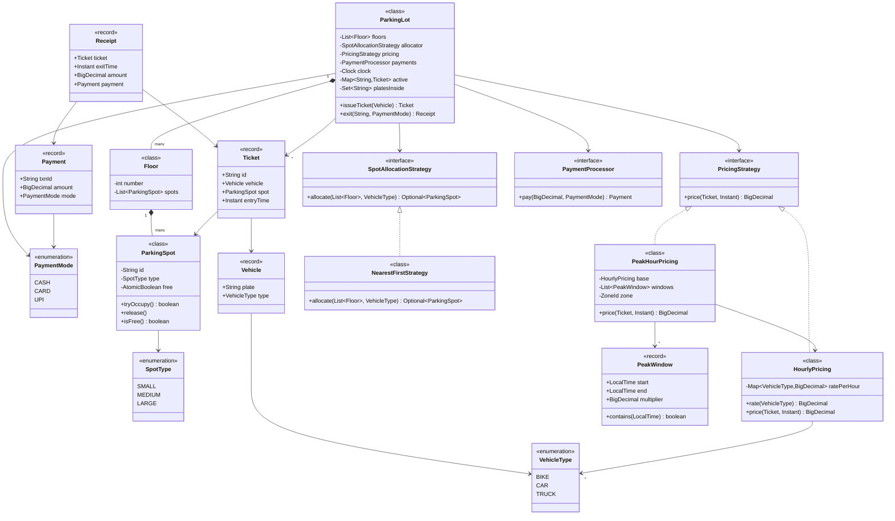
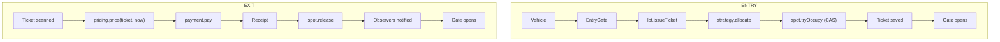
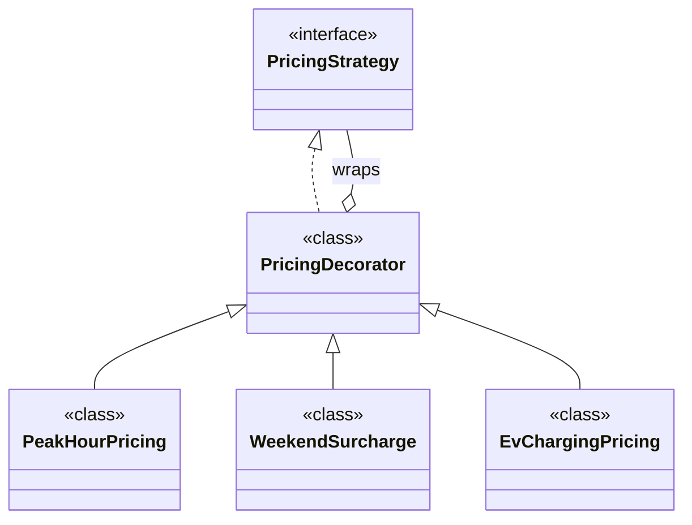

# 02 · Parking Lot / Ticketing & Receipt System

## Interview question
Design a parking lot with ticket issue at entry and receipt/payment at exit. Follow-ups: add new vehicle types, EV charging, and **peak vs non-peak hour pricing** (the one that got missed — don't miss it).

## Assumptions / clarification
- Multiple floors, multiple entry/exit gates.
- Spot types: SMALL (bike), MEDIUM (car), LARGE (truck/bus), EV.
- A vehicle parks only in a spot of its size (optionally bigger if configured).
- Pricing is hourly, depends on vehicle type, and **may vary by time of day** (peak/off-peak) and by day (weekend).
- Payment: cash / card / UPI — payment gateway is external.
- Single building; one backing DB.

## Functional requirements
1. Issue a ticket at entry if a matching spot is free; assign the spot.
2. At exit, compute fee, take payment, generate receipt, free the spot.
3. Show availability per floor / spot type (display board).
4. Admin: add floors/spots, change pricing rules.
5. Lost ticket → max daily charge.

## Non-functional requirements
- Two gates must never assign the same spot.
- Entry/exit decision < 1 s.
- Pricing rules changeable without deploy.
- Auditable receipts (immutable).

## CAP / consistency
- Single lot → **CP**: strong consistency for spot allocation (one DB, row locks). Availability board can be eventually consistent.

## Core entities
`ParkingLot`, `Floor`, `ParkingSpot`, `SpotType`, `Vehicle`, `VehicleType`, `Ticket`, `Receipt`, `Payment`, `Gate` (Entry/Exit), `SpotAllocationStrategy`, `PricingStrategy`, `PricingRule`.

## IS-A / HAS-A
- `Car`, `Bike`, `Truck` **IS-A** `Vehicle` (or just `Vehicle` with `VehicleType` enum — prefer enum, composition).
- `EntryGate`, `ExitGate` **IS-A** `Gate`.
- `HourlyPricing`, `PeakHourPricing` **IS-A** `PricingStrategy`.
- `ParkingLot` **HAS-A** list of `Floor`; `Floor` **HAS-A** list of `ParkingSpot`.
- `Ticket` **HAS-A** `Vehicle`, `ParkingSpot`; `Receipt` **HAS-A** `Ticket`, `Payment`.

## UML diagram


## APIs
```
POST /tickets            { plate, vehicleType, gateId }          -> Ticket
POST /tickets/{id}/exit  { paymentMode }                         -> Receipt
GET  /availability?floor=2                                        -> {SMALL: 4, MEDIUM: 10 ...}
PUT  /admin/pricing      { vehicleType, baseRate, peakWindows[] }
```

## Design patterns
- **Strategy** – `SpotAllocationStrategy`, `PricingStrategy`, `PaymentProcessor`.
- **Factory** – `PricingStrategyFactory` from config.
- **Decorator** – `PeakHourPricing` / `WeekendSurcharge` wrap a base pricing.
- **Observer** – display boards subscribe to spot changes.
- **Singleton** – `ParkingLot` (via DI, not static).
- **Builder** – `Receipt.builder()`.

## SOLID mapping
- **S**: `ParkingLot` orchestrates; pricing, allocation, payment each own class.
- **O**: peak pricing added as new decorator, no edit to `HourlyPricing`.
- **L**: all `PricingStrategy` implementations interchangeable.
- **I**: `DisplayBoard` only needs `SpotListener`, not whole lot.
- **D**: lot depends on interfaces, injected in constructor.

## High-level flow


## Concurrency
- `ParkingSpot.tryOccupy()` uses `AtomicBoolean.compareAndSet(true,false)`; if it loses, strategy tries the next spot. No global lock.
- DB version: `UPDATE spot SET free=false WHERE id=? AND free=true` (row count 1 ⇒ won).
- Free counts per type kept in `ConcurrentHashMap<SpotType, AtomicInteger>` for the board.

## Edge cases
- Lot full → reject with message, don't create ticket.
- Lost ticket → lookup by plate, else charge daily max.
- Payment fails → ticket stays ACTIVE, spot stays occupied.
- Duration crosses peak boundary → price each minute/hour slice by its window (see code).
- Exit at 00:00 across days / DST → use `Instant` + zone-aware `LocalTime`.
- Same plate entering twice → reject if an active ticket exists.

## End-to-end Java implementation
```java
import java.math.BigDecimal;
import java.math.RoundingMode;
import java.time.*;
import java.util.*;
import java.util.concurrent.ConcurrentHashMap;
import java.util.concurrent.atomic.AtomicBoolean;

enum VehicleType { BIKE, CAR, TRUCK }
enum SpotType {
    SMALL, MEDIUM, LARGE;
    static SpotType forVehicle(VehicleType v) {
        return switch (v) { case BIKE -> SMALL; case CAR -> MEDIUM; case TRUCK -> LARGE; };
    }
}
enum PaymentMode { CASH, CARD, UPI }

record Vehicle(String plate, VehicleType type) {}

final class ParkingSpot {
    private final String id;
    private final SpotType type;
    private final AtomicBoolean free = new AtomicBoolean(true);
    ParkingSpot(String id, SpotType type) { this.id = id; this.type = type; }
    boolean tryOccupy() { return free.compareAndSet(true, false); }
    void release() { free.set(true); }
    boolean isFree() { return free.get(); }
    String id() { return id; }
    SpotType type() { return type; }
}

final class Floor {
    private final int number;
    private final List<ParkingSpot> spots;
    Floor(int number, List<ParkingSpot> spots) { this.number = number; this.spots = List.copyOf(spots); }
    List<ParkingSpot> spots() { return spots; }
    int number() { return number; }
}

record Ticket(String id, Vehicle vehicle, ParkingSpot spot, Instant entryTime) {}
record Payment(String txnId, BigDecimal amount, PaymentMode mode) {}
record Receipt(Ticket ticket, Instant exitTime, BigDecimal amount, Payment payment) {}

interface SpotAllocationStrategy {
    Optional<ParkingSpot> allocate(List<Floor> floors, VehicleType type);
}

final class NearestFirstStrategy implements SpotAllocationStrategy {
    public Optional<ParkingSpot> allocate(List<Floor> floors, VehicleType vt) {
        SpotType needed = SpotType.forVehicle(vt);
        for (Floor f : floors)
            for (ParkingSpot s : f.spots())
                if (s.type() == needed && s.isFree() && s.tryOccupy()) return Optional.of(s);
        return Optional.empty();
    }
}

interface PricingStrategy {
    BigDecimal price(Ticket ticket, Instant exit);
}

final class HourlyPricing implements PricingStrategy {
    private final Map<VehicleType, BigDecimal> ratePerHour;
    HourlyPricing(Map<VehicleType, BigDecimal> ratePerHour) { this.ratePerHour = Map.copyOf(ratePerHour); }
    BigDecimal rate(VehicleType t) { return ratePerHour.get(t); }
    public BigDecimal price(Ticket t, Instant exit) {
        long hours = Math.max(1, (long) Math.ceil(Duration.between(t.entryTime(), exit).toMinutes() / 60.0));
        return rate(t.vehicle().type()).multiply(BigDecimal.valueOf(hours));
    }
}

/** Follow-up: peak / off-peak. Prices every started hour by the window it falls in. */
final class PeakHourPricing implements PricingStrategy {
    record PeakWindow(LocalTime start, LocalTime end, BigDecimal multiplier) {
        boolean contains(LocalTime t) { return !t.isBefore(start) && t.isBefore(end); }
    }
    private final HourlyPricing base;
    private final List<PeakWindow> windows;
    private final ZoneId zone;

    PeakHourPricing(HourlyPricing base, List<PeakWindow> windows, ZoneId zone) {
        this.base = base; this.windows = List.copyOf(windows); this.zone = zone;
    }

    public BigDecimal price(Ticket t, Instant exit) {
        BigDecimal rate = base.rate(t.vehicle().type());
        BigDecimal total = BigDecimal.ZERO;
        Instant slot = t.entryTime();
        do {
            LocalTime local = slot.atZone(zone).toLocalTime();
            BigDecimal mult = windows.stream().filter(w -> w.contains(local))
                    .map(PeakWindow::multiplier).findFirst().orElse(BigDecimal.ONE);
            total = total.add(rate.multiply(mult));
            slot = slot.plus(Duration.ofHours(1));
        } while (slot.isBefore(exit));
        return total.setScale(2, RoundingMode.HALF_UP);
    }
}

interface PaymentProcessor { Payment pay(BigDecimal amount, PaymentMode mode); }

final class ParkingLot {
    private final List<Floor> floors;
    private final SpotAllocationStrategy allocator;
    private final PricingStrategy pricing;
    private final PaymentProcessor payments;
    private final Clock clock;
    private final Map<String, Ticket> active = new ConcurrentHashMap<>();
    private final Set<String> platesInside = ConcurrentHashMap.newKeySet();

    ParkingLot(List<Floor> floors, SpotAllocationStrategy a, PricingStrategy p, PaymentProcessor pay, Clock clock) {
        this.floors = List.copyOf(floors); this.allocator = a; this.pricing = p; this.payments = pay; this.clock = clock;
    }

    Ticket issueTicket(Vehicle v) {
        if (!platesInside.add(v.plate())) throw new IllegalStateException("Vehicle already inside");
        ParkingSpot spot = allocator.allocate(floors, v.type()).orElseThrow(() -> {
            platesInside.remove(v.plate());
            return new IllegalStateException("No spot for " + v.type());
        });
        Ticket t = new Ticket(UUID.randomUUID().toString(), v, spot, clock.instant());
        active.put(t.id(), t);
        return t;
    }

    Receipt exit(String ticketId, PaymentMode mode) {
        Ticket t = Optional.ofNullable(active.get(ticketId))
                .orElseThrow(() -> new NoSuchElementException("Unknown ticket"));
        Instant now = clock.instant();
        BigDecimal amount = pricing.price(t, now);
        Payment p = payments.pay(amount, mode);           // throws on failure → ticket stays active
        active.remove(ticketId);
        platesInside.remove(t.vehicle().plate());
        t.spot().release();
        return new Receipt(t, now, amount, p);
    }
}

public class ParkingDemo {
    public static void main(String[] args) {
        List<ParkingSpot> spots = List.of(new ParkingSpot("F1-S1", SpotType.MEDIUM), new ParkingSpot("F1-B1", SpotType.SMALL));
        HourlyPricing hourly = new HourlyPricing(Map.of(
                VehicleType.BIKE, new BigDecimal("10"), VehicleType.CAR, new BigDecimal("40"), VehicleType.TRUCK, new BigDecimal("100")));
        PricingStrategy peak = new PeakHourPricing(hourly, List.of(
                new PeakHourPricing.PeakWindow(LocalTime.of(9, 0), LocalTime.of(11, 0), new BigDecimal("1.5")),
                new PeakHourPricing.PeakWindow(LocalTime.of(17, 0), LocalTime.of(20, 0), new BigDecimal("2"))),
                ZoneId.of("Asia/Kolkata"));
        PaymentProcessor pay = (amt, m) -> new Payment(UUID.randomUUID().toString(), amt, m);
        ParkingLot lot = new ParkingLot(List.of(new Floor(1, spots)), new NearestFirstStrategy(), peak, pay, Clock.systemUTC());

        Ticket t = lot.issueTicket(new Vehicle("KA01AB1234", VehicleType.CAR));
        System.out.println("Ticket " + t.id() + " spot " + t.spot().id());
        System.out.println(lot.exit(t.id(), PaymentMode.UPI));
    }
}
```

## New requirements → how the class diagram evolves
| New requirement | Change |
|---|---|
| **Peak / off-peak pricing** | `PeakHourPricing` decorates `HourlyPricing` (done above). |
| Weekend surcharge, membership discount | More decorators: `WeekendSurcharge(PricingStrategy)`, `MemberDiscount(PricingStrategy)`. |
| EV spots + charging fee | `SpotType.EV`; `ChargingSession` HAS-A spot; `EvChargingPricing` decorator adds kWh cost. |
| Bike may take car spot if bikes full | New `FallbackToLargerSpotStrategy`. |
| Reservation in advance | `Reservation` entity; allocator checks reserved spots. |
| Multiple lots in a city | `ParkingLotRegistry` + `lotId` on `Ticket`. |



## Amazon follow-up questions

Tap a question to see a simple answer.

<details class="qa">
<summary><span class="qn">1</span>How do you price a stay from 8:30 to 10:15 with peak 9–11? (Slice by hour/minute; show the loop.)</summary>

Walk through the stay minute by minute (or hour by hour) and price each slice with the rate for that time. 8:30–9:00 is normal rate, 9:00–10:15 is peak rate. Add the slices together. In code it's a loop from entry to exit time that asks the pricing rule for the rate at each step.

</details>

<details class="qa">
<summary><span class="qn">2</span>Two gates try to assign the last spot — what happens?</summary>

Each spot has a status that can only change with an atomic compare-and-set (`FREE → OCCUPIED`). Both gates try, only one succeeds, and the loser gets `false` and simply asks the strategy for the next free spot. Nobody gets the same spot twice.

</details>

<details class="qa">
<summary><span class="qn">3</span>How would you change pricing without redeploying? (rules in DB + cache refresh.)</summary>

Keep pricing rules (rates, peak hours, caps) in a database table, not in code. The service caches them and refreshes every few minutes or when an admin saves a change. New prices go live without a deploy.

</details>

<details class="qa">
<summary><span class="qn">4</span>How would you support multiple lots with a central server? What if the network to the central server is down? (local gate cache, reconcile later.)</summary>

Each lot has a central server that owns spots, tickets and payments. Gates keep a local cache of free spots and can issue tickets offline, storing them locally. When the network comes back, they send the saved tickets to the server, which reconciles them. Give ticket ids a gate prefix so they never clash.

</details>

<details class="qa">
<summary><span class="qn">5</span>Why enum <code>VehicleType</code> instead of subclass per vehicle? (No behaviour differs → composition.)</summary>

Cars, bikes and trucks don't *behave* differently. They just need different spot sizes and prices. That's data, not behaviour, so an enum field is simpler. Subclasses make sense only when each type has different methods or logic.

</details>

<details class="qa">
<summary><span class="qn">6</span>How do you make receipts tamper-proof? (Immutable records, append-only table.)</summary>

Receipts are never updated or deleted. They're written once to an append-only table. You can also store a hash (or signature) of each receipt so any change is detectable. Corrections are new records (like a refund) that point to the original.

</details>
