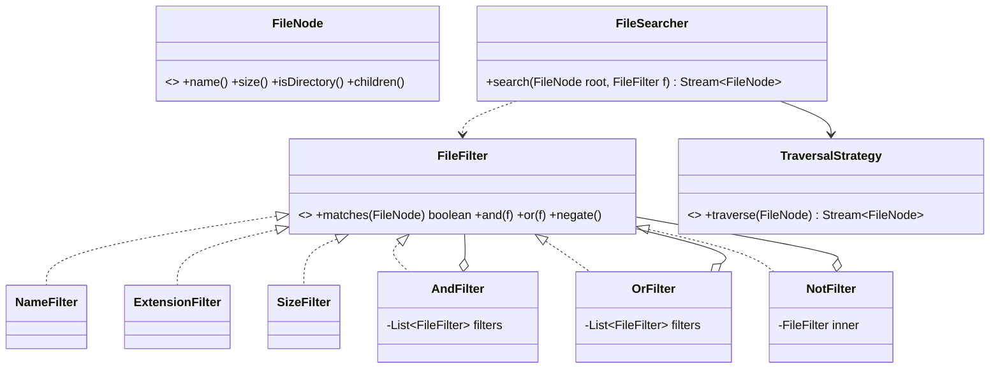
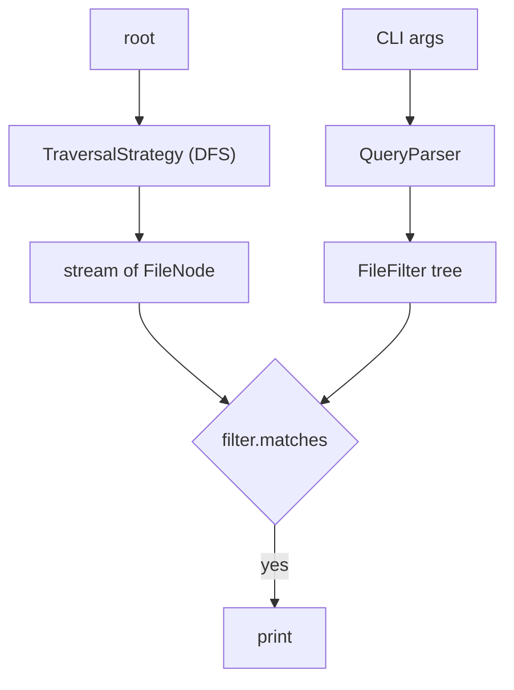
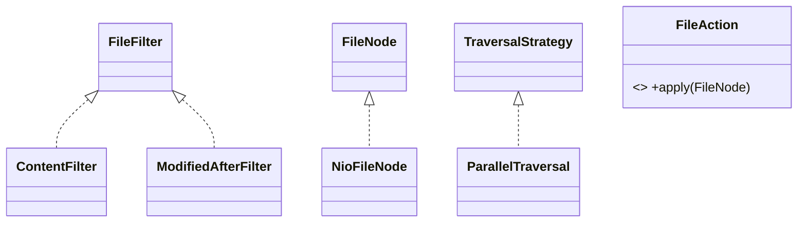

# 03 · Unix File Search Utility (find-like API)

## Interview question
Design a terminal-based file search utility. Search by name, size, extension, etc., and allow complex queries combining filters with AND / OR (and NOT). Focus on extensible OO design.

## Assumptions / clarification
- Input: root directory + filter expression. Output: list (or stream) of matching files.
- Filters: name (exact / glob / regex), extension, size (>, <, between), type (file/dir), modified time, owner.
- Recursive by default, optional max depth; symlinks not followed by default.
- Filesystem abstracted so it can be tested in-memory.

## Functional requirements
1. `search(root, filter)` returns matching files.
2. Combinable filters: `AND`, `OR`, `NOT`, arbitrarily nested.
3. Add new filters without touching existing code.
4. Optional: parse a CLI string `-name "*.log" -and -size +5M`.

## Non-functional requirements
- Handles millions of files: stream results, don't hold everything in memory.
- Short-circuit evaluation (cheap filters first).
- Parallel directory traversal optional.

## CAP / consistency
Local tool — not a distributed concern. Filesystem may change during traversal: results are a **best-effort snapshot**; missing files are skipped, not fatal.

## Core entities
`FileNode` (abstraction over file), `Directory`, `FileSystem`, `FileFilter` (Specification), `AndFilter`, `OrFilter`, `NotFilter`, concrete filters, `FileSearcher`, `TraversalStrategy` (DFS/BFS), `QueryParser`.

## IS-A / HAS-A
- `NameFilter`, `SizeFilter`, `ExtensionFilter` **IS-A** `FileFilter`.
- `AndFilter`, `OrFilter`, `NotFilter` **IS-A** `FileFilter` and **HAS-A** `FileFilter`(s) → Composite.
- `Directory` **IS-A** `FileNode` and **HAS-A** children `FileNode` (Composite for file tree).
- `FileSearcher` **HAS-A** `TraversalStrategy`.

## Mermaid UML class diagram


## APIs
```
Stream<FileNode> search(FileNode root, FileFilter filter)
FileFilter parse("-ext java -and ( -size +1M -or -name Main* )")
CLI: fsearch /home -ext log -and -size +5M -not -name "*tmp*"
```

## Design patterns
- **Specification + Composite** – filters composed into trees (`AndFilter` contains filters).
- **Interpreter** – `QueryParser` turns a CLI expression into a filter tree.
- **Strategy** – traversal (DFS / BFS / parallel).
- **Iterator** – lazily stream results.
- **Builder / fluent API** – `ext("java").and(sizeGt(1_000_000))`.

## SOLID mapping
- **S**: traversal, filtering, parsing separated.
- **O**: new filter (`OwnerFilter`) = new class; no change to combinators or searcher.
- **L**: every filter substitutable in `AndFilter`.
- **I**: `FileFilter` has one abstract method (`matches`), defaults for combinators.
- **D**: searcher depends on `FileNode` interface → works on real FS or in-memory tree.

## High-level flow


## Concurrency
- Optional `ForkJoinPool` / `parallelStream` per subdirectory.
- Filters are immutable → thread-safe by design.
- Results collected into concurrent queue or streamed.

## Edge cases
- Permission denied → skip + warn.
- Symlink loops → track visited inode/real path.
- Empty filter → match all.
- Very deep trees → iterative DFS (explicit stack), not recursion.
- Size units (`+5M`, `-10k`) parsing.
- Case sensitivity for names (flag).

## End-to-end Java implementation
```java
import java.util.*;
import java.util.regex.Pattern;
import java.util.stream.Stream;

interface FileNode {
    String name();
    long size();
    boolean isDirectory();
    List<FileNode> children();
    default String extension() {
        int i = name().lastIndexOf('.');
        return i < 0 ? "" : name().substring(i + 1);
    }
}

record InMemoryFile(String name, long size) implements FileNode {
    public boolean isDirectory() { return false; }
    public List<FileNode> children() { return List.of(); }
}

record InMemoryDir(String name, List<FileNode> children) implements FileNode {
    InMemoryDir { children = List.copyOf(children); }
    public long size() { return 0; }
    public boolean isDirectory() { return true; }
}

@FunctionalInterface
interface FileFilter {
    boolean matches(FileNode f);
    default FileFilter and(FileFilter o) { return new AndFilter(List.of(this, o)); }
    default FileFilter or(FileFilter o)  { return new OrFilter(List.of(this, o)); }
    default FileFilter negate()          { return new NotFilter(this); }
}

record NameFilter(Pattern pattern) implements FileFilter {
    static NameFilter glob(String glob) {
        String regex = glob.replace(".", "\\.").replace("*", ".*").replace("?", ".");
        return new NameFilter(Pattern.compile(regex));
    }
    public boolean matches(FileNode f) { return pattern.matcher(f.name()).matches(); }
}

record ExtensionFilter(String ext) implements FileFilter {
    public boolean matches(FileNode f) { return !f.isDirectory() && f.extension().equalsIgnoreCase(ext); }
}

record SizeFilter(long minInclusive, long maxInclusive) implements FileFilter {
    static SizeFilter greaterThan(long b) { return new SizeFilter(b + 1, Long.MAX_VALUE); }
    static SizeFilter lessThan(long b)    { return new SizeFilter(0, b - 1); }
    public boolean matches(FileNode f) { return !f.isDirectory() && f.size() >= minInclusive && f.size() <= maxInclusive; }
}

record TypeFilter(boolean directory) implements FileFilter {
    public boolean matches(FileNode f) { return f.isDirectory() == directory; }
}

record AndFilter(List<FileFilter> filters) implements FileFilter {
    public boolean matches(FileNode f) { return filters.stream().allMatch(x -> x.matches(f)); }
}
record OrFilter(List<FileFilter> filters) implements FileFilter {
    public boolean matches(FileNode f) { return filters.stream().anyMatch(x -> x.matches(f)); }
}
record NotFilter(FileFilter inner) implements FileFilter {
    public boolean matches(FileNode f) { return !inner.matches(f); }
}

interface TraversalStrategy { Stream<FileNode> traverse(FileNode root); }

final class DfsTraversal implements TraversalStrategy {
    private final int maxDepth;
    DfsTraversal(int maxDepth) { this.maxDepth = maxDepth; }
    public Stream<FileNode> traverse(FileNode root) {
        List<FileNode> out = new ArrayList<>();
        Deque<Map.Entry<FileNode, Integer>> stack = new ArrayDeque<>();
        stack.push(Map.entry(root, 0));
        while (!stack.isEmpty()) {
            var e = stack.pop();
            out.add(e.getKey());
            if (e.getKey().isDirectory() && e.getValue() < maxDepth)
                for (FileNode c : e.getKey().children()) stack.push(Map.entry(c, e.getValue() + 1));
        }
        return out.stream();
    }
}

final class FileSearcher {
    private final TraversalStrategy traversal;
    FileSearcher(TraversalStrategy traversal) { this.traversal = traversal; }
    Stream<FileNode> search(FileNode root, FileFilter filter) {
        return traversal.traverse(root).filter(filter::matches);
    }
}

/** Interpreter: -name X | -ext X | -size +N/-N | -type f/d | -and | -or | -not | ( ) ; AND binds tighter than OR. */
final class QueryParser {
    private final List<String> t; private int i;
    private QueryParser(List<String> tokens) { this.t = tokens; }
    static FileFilter parse(String... tokens) {
        if (tokens.length == 0) return f -> true;
        QueryParser p = new QueryParser(List.of(tokens));
        FileFilter f = p.or();
        if (p.i != p.t.size()) throw new IllegalArgumentException("Unexpected token " + p.t.get(p.i));
        return f;
    }
    private FileFilter or() {
        FileFilter left = and();
        while (peek("-or")) { i++; left = left.or(and()); }
        return left;
    }
    private FileFilter and() {
        FileFilter left = unary();
        while (i < t.size() && !peek("-or") && !peek(")")) {
            if (peek("-and")) i++;
            left = left.and(unary());
        }
        return left;
    }
    private FileFilter unary() {
        String tok = t.get(i++);
        return switch (tok) {
            case "-not" -> unary().negate();
            case "(" -> { FileFilter f = or(); expect(")"); yield f; }
            case "-name" -> NameFilter.glob(t.get(i++));
            case "-ext" -> new ExtensionFilter(t.get(i++));
            case "-type" -> new TypeFilter(t.get(i++).equals("d"));
            case "-size" -> size(t.get(i++));
            default -> throw new IllegalArgumentException("Unknown token " + tok);
        };
    }
    private static FileFilter size(String s) {
        long n = parseBytes(s.substring(1));
        return s.charAt(0) == '+' ? SizeFilter.greaterThan(n) : SizeFilter.lessThan(n);
    }
    private static long parseBytes(String s) {
        char u = Character.toUpperCase(s.charAt(s.length() - 1));
        long mult = switch (u) { case 'K' -> 1L << 10; case 'M' -> 1L << 20; case 'G' -> 1L << 30; default -> 1; };
        return Long.parseLong(mult == 1 ? s : s.substring(0, s.length() - 1)) * mult;
    }
    private boolean peek(String s) { return i < t.size() && t.get(i).equals(s); }
    private void expect(String s) { if (!peek(s)) throw new IllegalArgumentException("Expected " + s); i++; }
}

public class FileSearchDemo {
    public static void main(String[] args) {
        FileNode root = new InMemoryDir("/", List.of(
            new InMemoryFile("Main.java", 2_000_000),
            new InMemoryFile("util.java", 500),
            new InMemoryDir("logs", List.of(new InMemoryFile("app.log", 9_000_000), new InMemoryFile("tmp.log", 10))),
            new InMemoryFile("notes.txt", 100)));

        FileSearcher searcher = new FileSearcher(new DfsTraversal(Integer.MAX_VALUE));

        FileFilter fluent = new ExtensionFilter("java").and(SizeFilter.greaterThan(1_000_000))
                .or(new ExtensionFilter("log").and(NameFilter.glob("tmp*").negate()));
        searcher.search(root, fluent).forEach(f -> System.out.println("fluent: " + f.name()));

        FileFilter parsed = QueryParser.parse("-ext", "log", "-and", "(", "-size", "+1M", "-or", "-name", "tmp*", ")");
        searcher.search(root, parsed).forEach(f -> System.out.println("parsed: " + f.name()));
    }
}
```

## New requirements → how the class diagram evolves
| New requirement | Change |
|---|---|
| Filter by modified date / owner / permissions | New `ModifiedAfterFilter`, `OwnerFilter` classes. |
| Search file **content** (grep) | `ContentFilter` — expensive → cost-aware `AndFilter` sorts children by `cost()`. |
| Real OS filesystem | `NioFileNode` adapter over `java.nio.file.Path` — **Adapter**. |
| Huge trees | `ParallelTraversal` using `ForkJoinPool` — new Strategy. |
| Actions on results (delete, print size) | `FileAction` interface — **Command / Visitor**. |
| Repeat searches fast | `IndexedSearcher` backed by an inverted index (name, ext → files). |



## Amazon follow-up questions
1. Why Specification/Composite instead of a big `if` with flags? (open/closed, arbitrary nesting.)
2. How do you evaluate cheap filters first? (`cost()` hint, order children.)
3. How would you scale to 100M files? Parallel walk, streaming, build an index (like `locate`).
4. How to avoid symlink cycles?
5. How would you unit test without a real disk? (`FileNode` interface + in-memory tree.)
6. Precedence of AND vs OR in your parser?
