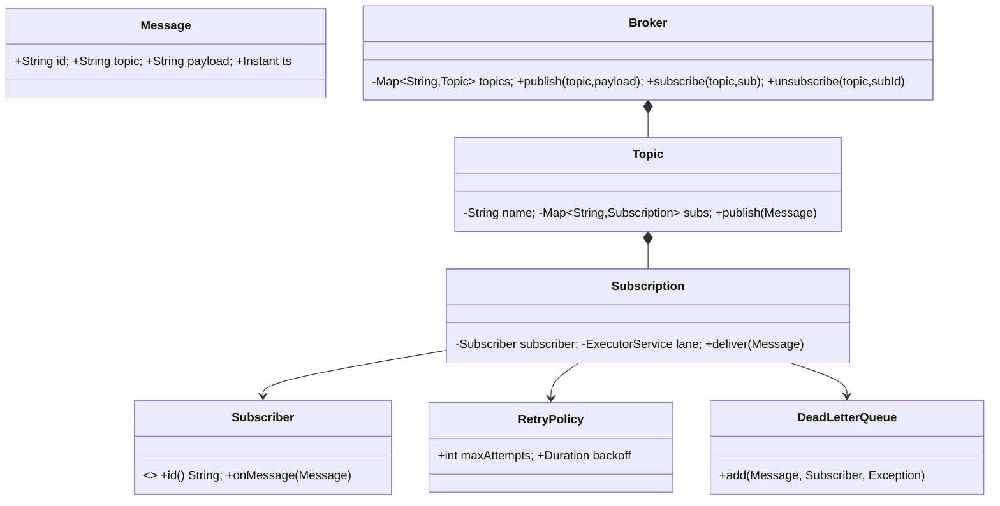

# 04 · Publisher–Subscriber System

## Interview question
Design a pub-sub system where a publisher sends events for an event type (topic) and all subscribers of that type receive the message. Subscribers can subscribe/unsubscribe.

## Assumptions / clarification
- In-process library first (single JVM), then discuss distributed (Kafka/SNS-like).
- Delivery is **asynchronous**; a slow subscriber must not block others or the publisher.
- At-least-once delivery within the process; ordering guaranteed **per subscriber per topic**.
- Subscribers may filter messages (optional).

## Functional requirements
1. `createTopic`, `publish(topic, message)`.
2. `subscribe(topic, subscriber)`, `unsubscribe(topic, subscriber)`.
3. Every active subscriber of the topic gets each message published after it subscribed.
4. Retry on subscriber failure, then dead-letter.

## Non-functional requirements
- High throughput, low publish latency (publish returns immediately).
- Isolation between subscribers.
- Thread safe subscribe/unsubscribe during publishing.

## CAP / consistency
- In-process: N/A.
- Distributed: partitioned log (Kafka) → **AP with per-partition ordering**, replication factor 3, `acks=all` for durability. Consumers track offsets; at-least-once ⇒ subscribers must be idempotent.

## Core entities
`Message`, `Topic`, `Subscriber`, `Subscription`, `Publisher`, `Broker` (`PubSubService`), `DeliveryPolicy` (retry), `DeadLetterQueue`.

## IS-A / HAS-A
- `EmailSubscriber`, `LoggingSubscriber` **IS-A** `Subscriber`.
- `Broker` **HAS-A** map `topic → Topic`; `Topic` **HAS-A** set of `Subscription`.
- `Subscription` **HAS-A** `Subscriber` + its own single-thread executor (ordered, isolated).

## Mermaid UML class diagram


## APIs
```
void createTopic(String topic)
String publish(String topic, String payload)        // returns messageId
void subscribe(String topic, Subscriber s)
void unsubscribe(String topic, String subscriberId)
REST (distributed): POST /topics/{t}/messages, POST /topics/{t}/subscriptions {endpoint}, DELETE /topics/{t}/subscriptions/{id}
```

## Design patterns
- **Observer** – core of pub-sub.
- **Mediator** – `Broker` decouples publisher and subscribers.
- **Strategy** – `RetryPolicy`, delivery (push vs pull).
- **Factory** – `Message.of(...)` static factory.

## SOLID mapping
- **S**: `Topic` fans out, `Subscription` handles delivery+retry, `Broker` routes.
- **O**: new subscriber types just implement `Subscriber`.
- **L**: any `Subscriber` works.
- **I**: `Subscriber` has two methods only.
- **D**: publishers depend on `Broker` interface, not subscribers.

## High-level flow
```
publisher.publish(topic, payload)
  → Broker finds Topic → Topic iterates subscriptions (CopyOnWrite / ConcurrentHashMap)
  → each Subscription.submit(message) to its own single-thread lane
  → lane calls subscriber.onMessage with retry → on exhaustion → DLQ
```

## Concurrency
- `ConcurrentHashMap` for topics and subscriptions — safe iteration while (un)subscribing.
- One **single-thread executor per subscription** → ordering per subscriber and isolation (slow subscriber only fills its own queue). Bounded queue + rejection policy for back-pressure.
- For thousands of subscribers: shared pool with per-subscriber queues (actor style) instead of a thread each.

## Edge cases
- Publish to unknown topic → exception or auto-create (decide).
- Subscribe twice → idempotent (keyed by subscriber id).
- Unsubscribe while message in flight → in-flight completes, no new messages.
- Subscriber throws → retry with backoff, then DLQ.
- Shutdown → drain lanes gracefully.

## End-to-end Java implementation
```java
import java.time.Duration;
import java.time.Instant;
import java.util.*;
import java.util.concurrent.*;

record Message(String id, String topic, String payload, Instant ts) {
    static Message of(String topic, String payload) {
        return new Message(UUID.randomUUID().toString(), topic, payload, Instant.now());
    }
}

interface Subscriber {
    String id();
    void onMessage(Message m) throws Exception;
}

record RetryPolicy(int maxAttempts, Duration backoff) {
    static RetryPolicy defaults() { return new RetryPolicy(3, Duration.ofMillis(100)); }
}

final class DeadLetterQueue {
    private final Queue<String> dead = new ConcurrentLinkedQueue<>();
    void add(Message m, Subscriber s, Exception e) { dead.add(s.id() + " <- " + m.id() + " : " + e.getMessage()); }
    List<String> snapshot() { return List.copyOf(dead); }
}

final class Subscription {
    private final Subscriber subscriber;
    private final ExecutorService lane = Executors.newSingleThreadExecutor();
    private final RetryPolicy retry;
    private final DeadLetterQueue dlq;

    Subscription(Subscriber s, RetryPolicy r, DeadLetterQueue dlq) { this.subscriber = s; this.retry = r; this.dlq = dlq; }

    void deliver(Message m) {
        lane.submit(() -> {
            for (int attempt = 1; ; attempt++) {
                try { subscriber.onMessage(m); return; }
                catch (Exception e) {
                    if (attempt >= retry.maxAttempts()) { dlq.add(m, subscriber, e); return; }
                    try { Thread.sleep(retry.backoff().toMillis() * attempt); }
                    catch (InterruptedException ie) { Thread.currentThread().interrupt(); return; }
                }
            }
        });
    }

    void close() { lane.shutdown(); }
}

final class Topic {
    private final String name;
    private final Map<String, Subscription> subs = new ConcurrentHashMap<>();
    Topic(String name) { this.name = name; }
    void add(Subscriber s, Subscription sub) { subs.putIfAbsent(s.id(), sub); }
    void remove(String id) { Optional.ofNullable(subs.remove(id)).ifPresent(Subscription::close); }
    void publish(Message m) { subs.values().forEach(s -> s.deliver(m)); }
    void close() { subs.values().forEach(Subscription::close); }
}

final class Broker {
    private final Map<String, Topic> topics = new ConcurrentHashMap<>();
    private final DeadLetterQueue dlq = new DeadLetterQueue();

    void createTopic(String name) { topics.putIfAbsent(name, new Topic(name)); }

    String publish(String topic, String payload) {
        Message m = Message.of(topic, payload);
        topic(topic).publish(m);
        return m.id();
    }

    void subscribe(String topic, Subscriber s) {
        topic(topic).add(s, new Subscription(s, RetryPolicy.defaults(), dlq));
    }

    void unsubscribe(String topic, String subscriberId) { topic(topic).remove(subscriberId); }

    DeadLetterQueue dlq() { return dlq; }
    void shutdown() { topics.values().forEach(Topic::close); }

    private Topic topic(String name) {
        return Optional.ofNullable(topics.get(name)).orElseThrow(() -> new NoSuchElementException("No topic " + name));
    }
}

public class PubSubDemo {
    public static void main(String[] args) throws Exception {
        Broker broker = new Broker();
        broker.createTopic("ORDER_PLACED");

        Subscriber email = new Subscriber() {
            public String id() { return "email"; }
            public void onMessage(Message m) { System.out.println("email got " + m.payload()); }
        };
        Subscriber flaky = new Subscriber() {
            public String id() { return "flaky"; }
            public void onMessage(Message m) throws Exception { throw new Exception("downstream down"); }
        };
        broker.subscribe("ORDER_PLACED", email);
        broker.subscribe("ORDER_PLACED", flaky);

        broker.publish("ORDER_PLACED", "order-1");
        broker.unsubscribe("ORDER_PLACED", "email");
        broker.publish("ORDER_PLACED", "order-2");

        Thread.sleep(1000);
        System.out.println("DLQ: " + broker.dlq().snapshot());
        broker.shutdown();
    }
}
```

## New requirements → how the class diagram evolves
| New requirement | Change |
|---|---|
| Message filtering (only orders > ₹1000) | `Subscription` HAS-A `Predicate<Message>` filter. |
| Wildcard topics (`order.*`) | `TopicMatcher` strategy in `Broker`. |
| Pull-based consumers / replay | `Topic` stores append-only log + per-subscriber offset → `PullSubscription`. |
| Persistence / durability | `MessageStore` interface (in-memory, file, Kafka). |
| Priority messages | `PriorityBlockingQueue` in lane. |
| Distributed | Topic → partitions; consumer groups; broker cluster with replication. |

## Amazon follow-up questions
1. How do you guarantee ordering? Per topic or per subscriber? What about with retries?
2. A subscriber is 10× slower than others — what happens? (Isolation lanes, bounded queue, back-pressure, DLQ.)
3. At-most-once vs at-least-once vs exactly-once — which do you give, and how would a consumer dedupe?
4. How would you make this distributed and durable? (Kafka partitions, replication, offsets.)
5. Push vs pull — trade-offs (SNS vs SQS/Kafka).
6. How is this different from the Observer pattern?
