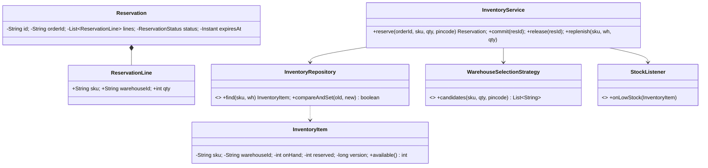
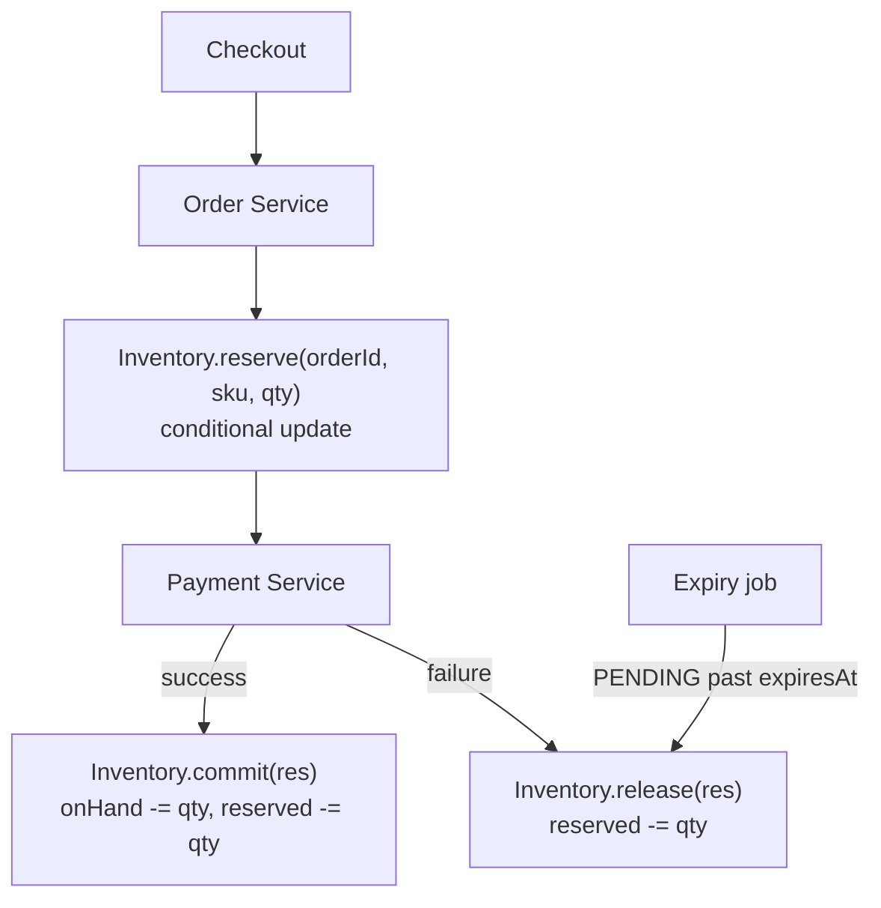

# 05 · Inventory Management System (Amazon)

## Interview question
Design an inventory management system. Deep dive: only one unit left and two users order simultaneously — how do you prevent both succeeding? Race conditions, consistency, concurrent updates, overselling, locking/transactions.

## Assumptions / clarification
- Products (SKU) stocked across multiple warehouses (fulfilment centres).
- Order flow: **reserve** stock at checkout → **commit** after payment → **release** on failure/timeout.
- Stock can be replenished (inbound shipments) and adjusted (damage, returns).
- Never oversell; small undersell (showing out of stock slightly early) is acceptable.

## Functional requirements
1. Add product / warehouse; set stock.
2. Check availability for SKU (optionally near a pincode).
3. Reserve N units for an order (with TTL), commit, release.
4. Replenish / adjust stock; low-stock alerts.
5. Audit trail of every stock movement.

## Non-functional requirements
- **Zero overselling** (correctness first).
- High read throughput for availability (product pages), lower write rate.
- Flash-sale (Prime Day) hot SKUs.
- Idempotent APIs (retries from order service).

## CAP / consistency
- Stock decrement: **CP** — strong consistency per SKU-warehouse row (single leader DB / DynamoDB conditional writes).
- Availability shown on product page: **AP**, cached, eventually consistent ("only 2 left" can be stale).

## Core entities
`Product`, `Warehouse`, `InventoryItem` (sku, warehouse, onHand, reserved, version), `Reservation` (id, orderId, items, status, expiresAt), `StockMovement` (audit), `InventoryService`, `InventoryRepository`, `WarehouseSelectionStrategy`, `StockListener`.

## IS-A / HAS-A
- `NearestWarehouseStrategy`, `MostStockStrategy` **IS-A** `WarehouseSelectionStrategy`.
- `InMemoryInventoryRepository`, `SqlInventoryRepository` **IS-A** `InventoryRepository`.
- `Warehouse` **HAS-A** many `InventoryItem`; `Reservation` **HAS-A** list of `ReservationLine`.

## Mermaid UML class diagram


## APIs
```
GET  /inventory/{sku}?pincode=560001                 -> {available: 3}
POST /reservations  {orderId, sku, qty, pincode}   Idempotency-Key: orderId  -> 201 {reservationId, expiresAt} | 409 OUT_OF_STOCK
POST /reservations/{id}/commit
POST /reservations/{id}/release
POST /inventory/{sku}/replenish {warehouseId, qty}
```

## Design patterns
- **Strategy** – warehouse selection.
- **Repository** – persistence abstraction.
- **Observer** – low-stock alerts, cache invalidation.
- **State** – `Reservation`: PENDING → COMMITTED | RELEASED | EXPIRED.
- **Command / Saga** – order saga: reserve → pay → commit, compensate with release.

## SOLID mapping
- **S**: `InventoryService` business rules; repo storage; strategy selection; scheduler expiry.
- **O**: new selection strategy without touching service.
- **L**: SQL vs in-memory repo interchangeable.
- **I**: `StockListener` separate from repo.
- **D**: service depends on interfaces.

## High-level flow


## Concurrency — "last unit, two buyers"
Options, from simplest to most scalable:
1. **Pessimistic lock**: `SELECT ... FOR UPDATE` on the row, check, update, commit. Correct, but hot SKU = lock contention.
2. **Atomic conditional update** (best default):
   ```sql
   UPDATE inventory SET reserved = reserved + :qty
   WHERE sku = :sku AND warehouse_id = :wh AND on_hand - reserved >= :qty;
   -- rows affected = 1 → success, 0 → out of stock
   ```
   DynamoDB equivalent: `UpdateItem` with `ConditionExpression: onHand - reserved >= :qty`.
3. **Optimistic locking** with `version` column; retry on conflict (shown in code).
4. **Redis `DECRBY` + Lua** as a front gate for flash sales, reconcile to DB asynchronously.
5. **Sharded stock / token pre-allocation** for extreme hot SKUs: split 1000 units into 10 buckets of 100.
6. **Single-writer queue per SKU** (partition Kafka by sku) — serialize all updates for that SKU.

Only one of the two requests' conditions can be true ⇒ exactly one reservation succeeds; the other gets `409`.

## Edge cases
- Retry of same reserve (network timeout) → idempotency key = orderId, return existing reservation.
- Payment succeeds after reservation expired → try re-reserve, else refund.
- Multi-SKU cart: reserve all or none (release partial on failure).
- Negative stock from adjustments → reject.
- Returns → restock after QC.
- Cache says in-stock, DB says no → DB wins.

## End-to-end Java implementation
```java
import java.time.*;
import java.util.*;
import java.util.concurrent.*;

enum ReservationStatus { PENDING, COMMITTED, RELEASED, EXPIRED }

record InventoryItem(String sku, String warehouseId, int onHand, int reserved, long version) {
    int available() { return onHand - reserved; }
    InventoryItem withReserved(int r) { return new InventoryItem(sku, warehouseId, onHand, r, version + 1); }
    InventoryItem withOnHand(int o, int r) { return new InventoryItem(sku, warehouseId, o, r, version + 1); }
}

record ReservationLine(String sku, String warehouseId, int qty) {}

final class Reservation {
    final String id; final String orderId; final List<ReservationLine> lines; final Instant expiresAt;
    private ReservationStatus status = ReservationStatus.PENDING;
    Reservation(String orderId, List<ReservationLine> lines, Instant expiresAt) {
        this.id = UUID.randomUUID().toString(); this.orderId = orderId; this.lines = List.copyOf(lines); this.expiresAt = expiresAt;
    }
    synchronized boolean transition(ReservationStatus from, ReservationStatus to) {
        if (status != from) return false;
        status = to; return true;
    }
    synchronized ReservationStatus status() { return status; }
}

interface InventoryRepository {
    Optional<InventoryItem> find(String sku, String warehouseId);
    boolean compareAndSet(InventoryItem expected, InventoryItem updated);   // version check
    void save(InventoryItem item);
}

final class InMemoryInventoryRepository implements InventoryRepository {
    private final ConcurrentMap<String, InventoryItem> rows = new ConcurrentHashMap<>();
    private static String key(String sku, String wh) { return sku + "|" + wh; }
    public Optional<InventoryItem> find(String sku, String wh) { return Optional.ofNullable(rows.get(key(sku, wh))); }
    public boolean compareAndSet(InventoryItem expected, InventoryItem updated) {
        return rows.replace(key(expected.sku(), expected.warehouseId()), expected, updated); // record equals incl. version
    }
    public void save(InventoryItem item) { rows.put(key(item.sku(), item.warehouseId()), item); }
}

interface WarehouseSelectionStrategy { List<String> candidates(String sku, String pincode); }

final class OutOfStockException extends RuntimeException {
    OutOfStockException(String sku) { super("Out of stock: " + sku); }
}

final class InventoryService {
    private static final int MAX_CAS_RETRIES = 10;
    private final InventoryRepository repo;
    private final WarehouseSelectionStrategy selector;
    private final Clock clock;
    private final Duration ttl;
    private final Map<String, Reservation> byId = new ConcurrentHashMap<>();
    private final Map<String, Reservation> byOrder = new ConcurrentHashMap<>();

    InventoryService(InventoryRepository repo, WarehouseSelectionStrategy selector, Clock clock, Duration ttl) {
        this.repo = repo; this.selector = selector; this.clock = clock; this.ttl = ttl;
    }

    Reservation reserve(String orderId, String sku, int qty, String pincode) {
        if (qty <= 0) throw new IllegalArgumentException("qty");
        return byOrder.computeIfAbsent(orderId, id -> {                  // idempotent per order
            for (String wh : selector.candidates(sku, pincode)) {
                if (tryReserve(sku, wh, qty)) {
                    Reservation r = new Reservation(orderId, List.of(new ReservationLine(sku, wh, qty)),
                            clock.instant().plus(ttl));
                    byId.put(r.id, r);
                    return r;
                }
            }
            throw new OutOfStockException(sku);
        });
    }

    private boolean tryReserve(String sku, String wh, int qty) {
        for (int i = 0; i < MAX_CAS_RETRIES; i++) {
            Optional<InventoryItem> cur = repo.find(sku, wh);
            if (cur.isEmpty() || cur.get().available() < qty) return false;
            if (repo.compareAndSet(cur.get(), cur.get().withReserved(cur.get().reserved() + qty))) return true;
        }
        return false;   // heavy contention → treat as unavailable here; caller may try next warehouse
    }

    void commit(String reservationId) {
        Reservation r = get(reservationId);
        if (!r.transition(ReservationStatus.PENDING, ReservationStatus.COMMITTED))
            throw new IllegalStateException("Cannot commit in state " + r.status());
        r.lines.forEach(l -> update(l, (it) -> it.withOnHand(it.onHand() - l.qty(), it.reserved() - l.qty())));
    }

    void release(String reservationId) { releaseAs(get(reservationId), ReservationStatus.RELEASED); }

    void expireStale() {
        Instant now = clock.instant();
        byId.values().stream().filter(r -> r.status() == ReservationStatus.PENDING && r.expiresAt.isBefore(now))
                .forEach(r -> releaseAs(r, ReservationStatus.EXPIRED));
    }

    void replenish(String sku, String wh, int qty) {
        InventoryItem cur = repo.find(sku, wh).orElse(new InventoryItem(sku, wh, 0, 0, 0));
        if (repo.find(sku, wh).isEmpty()) { repo.save(cur.withOnHand(qty, 0)); return; }
        update(new ReservationLine(sku, wh, qty), it -> it.withOnHand(it.onHand() + qty, it.reserved()));
    }

    private void releaseAs(Reservation r, ReservationStatus to) {
        if (!r.transition(ReservationStatus.PENDING, to)) return;       // already done → idempotent
        r.lines.forEach(l -> update(l, it -> it.withReserved(it.reserved() - l.qty())));
        byOrder.remove(r.orderId);
    }

    private void update(ReservationLine l, java.util.function.UnaryOperator<InventoryItem> fn) {
        while (true) {
            InventoryItem cur = repo.find(l.sku(), l.warehouseId()).orElseThrow();
            if (repo.compareAndSet(cur, fn.apply(cur))) return;
        }
    }

    private Reservation get(String id) {
        return Optional.ofNullable(byId.get(id)).orElseThrow(() -> new NoSuchElementException(id));
    }
}

public class InventoryDemo {
    public static void main(String[] args) throws Exception {
        var repo = new InMemoryInventoryRepository();
        var svc = new InventoryService(repo, (sku, pin) -> List.of("BLR1", "BLR2"), Clock.systemUTC(), Duration.ofMinutes(10));
        svc.replenish("IPHONE", "BLR1", 1);   // only ONE unit

        ExecutorService pool = Executors.newFixedThreadPool(2);
        CountDownLatch start = new CountDownLatch(1);
        Callable<String> buyer1 = () -> { start.await(); return attempt(svc, "order-A"); };
        Callable<String> buyer2 = () -> { start.await(); return attempt(svc, "order-B"); };
        Future<String> f1 = pool.submit(buyer1), f2 = pool.submit(buyer2);
        start.countDown();
        System.out.println(f1.get() + " | " + f2.get());   // exactly one succeeds
        pool.shutdown();
    }
    private static String attempt(InventoryService svc, String order) {
        try { Reservation r = svc.reserve(order, "IPHONE", 1, "560001"); svc.commit(r.id); return order + " OK"; }
        catch (OutOfStockException e) { return order + " OUT_OF_STOCK"; }
    }
}
```

## New requirements → how the class diagram evolves
| New requirement | Change |
|---|---|
| Multi-item cart atomic | `reserveAll(orderId, lines)` — reserve each, compensate on failure (Saga). |
| Flash sale hot SKU | `RedisStockGate` in front (Lua `DECRBY` if ≥ qty), async DB sync; or split stock buckets. |
| Low-stock alerts & auto re-order | `StockListener` observers → `ReorderService`. |
| Split shipment across warehouses | Strategy returns allocation plan (`List<ReservationLine>`). |
| Audit | `StockMovement` append-only table written in same transaction (outbox). |
| Backorders / pre-orders | `ReservationStatus.BACKORDERED`, queue fulfilled on replenish. |

## Amazon follow-up questions
1. Last unit, two users: walk through exactly what the DB does in your approach.
2. Pessimistic vs optimistic locking — when would you pick each? (contention level.)
3. How do you avoid holding stock forever for abandoned carts? (TTL + expiry job / DynamoDB TTL / Redis key expiry.)
4. Payment succeeded but commit call failed — what now? (Retry with idempotency, outbox, reconciliation job.)
5. How would you handle 1M requests/min for one SKU on Prime Day?
6. How does the product page show stock cheaply? (Cache + events; tolerate staleness.)
7. Why is distributed lock (Redis/ZooKeeper) worse than conditional write here?
