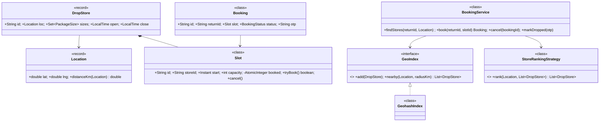
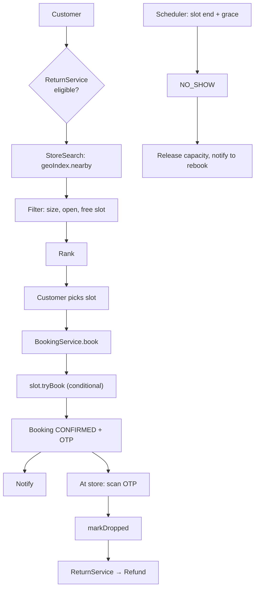

# 06 · Return Drop-off Store Slot Booking (reverse Amazon Locker)

## Interview question
Customer wants to return a package. Instead of pickup, the customer books a **slot at the nearest drop store** and goes there to drop it. Mid-way: *"How will you find the nearest drop store from the customer's location? Think about how Uber does this."*

## Assumptions / clarification
- Drop stores (kirana/partner stores) have opening hours and **capacity per time slot** (e.g. 10 packages per 30 min).
- Customer has a return request (orderId, item, size). Some stores can't accept LARGE items.
- Booking returns a QR/OTP; store scans at drop → return marked RECEIVED → refund triggered.
- Slots can be cancelled/rescheduled until slot start.
- "Nearest" = straight-line within radius, optionally ranked by travel time.

## Functional requirements
1. Find N nearest open stores with available slots for the package size.
2. List slots for a store/date; book a slot (hold → confirm).
3. Cancel / reschedule.
4. Store scans QR → mark dropped; no-show after slot end → release, notify.
5. Notifications (booking confirmation, reminder).

## Non-functional requirements
- Nearest-store query < 100 ms for millions of customers.
- No overbooking of slot capacity.
- Highly available search; booking strongly consistent.

## CAP / consistency
- Store search (geo index): **AP**, eventual (store list changes rarely).
- Slot booking counter: **CP** per slot (conditional decrement).

## Core entities
`Customer`, `ReturnRequest`, `DropStore` (location, hours, supported sizes), `Location(lat,lng)`, `Slot` (storeId, start, end, capacity, booked), `Booking` (status, qrCode), `GeoIndex`, `StoreRankingStrategy`, `BookingService`, `NotificationService`.

## IS-A / HAS-A
- `GeohashIndex`, `QuadTreeIndex` **IS-A** `GeoIndex`.
- `DistanceRanking`, `EtaRanking` **IS-A** `StoreRankingStrategy`.
- `DropStore` **HAS-A** `Location`, many `Slot`s; `Booking` **HAS-A** `Slot`, `ReturnRequest`.

## Mermaid UML class diagram


## APIs
```
GET  /returns/{returnId}/stores?lat=12.97&lng=77.59&radiusKm=5 -> [{storeId, distanceKm, nextSlots[]}]
GET  /stores/{storeId}/slots?date=2026-09-28
POST /bookings {returnId, slotId}  Idempotency-Key  -> {bookingId, otp, qr}
DELETE /bookings/{id}
POST /stores/{storeId}/drops {otp}                -> RECEIVED
```

## How to find the nearest store (the Uber answer)
1. **Geohash**: encode lat/lng into a base-32 string; nearby points share prefixes. Precision 6 ≈ 1.2 km × 0.6 km cell. Index `geohash6 → [stores]`. Query: customer's cell + its **8 neighbours** (edge problem), then compute exact haversine distance and sort. Expand to precision 5 if not enough results.
2. **QuadTree**: recursively split the map into 4 until each leaf has ≤ K stores; dense cities get deeper trees. Good in memory, rebuilt/updated rarely (stores don't move).
3. **Uber H3**: hexagonal cells (uniform neighbour distance), `kRing(cell, k)` to get rings around the user. Uber uses H3 for drivers + supply/demand.
4. **Off the shelf**: Redis `GEOADD` / `GEOSEARCH`, PostGIS `ST_DWithin` with GiST index, Elasticsearch `geo_distance`, DynamoDB + geohash GSI.
5. Rank by ETA via maps API only for the top 10 (expensive call).

Stores are **static** ⇒ much easier than Uber drivers (which update every 4 s); a read-heavy, cached geohash map is enough.

## Design patterns
- **Strategy** – `GeoIndex`, `StoreRankingStrategy`.
- **State** – `Booking`: HELD → CONFIRMED → DROPPED / CANCELLED / NO_SHOW.
- **Observer** – booking events → notifications, refund service.
- **Facade** – `BookingService`.
- **Factory** – slot generation from store hours (`SlotFactory`).

## SOLID mapping
- **S**: geo search, slot capacity, booking lifecycle, notification separated.
- **O**: switch geohash → H3 via new `GeoIndex`.
- **L/I**: small interfaces.
- **D**: `BookingService` depends on abstractions.

## High-level flow


## Concurrency
- `Slot.tryBook()` CAS loop on `booked < capacity`. DB: `UPDATE slot SET booked=booked+1 WHERE id=? AND booked < capacity`.
- One active booking per return: unique constraint on `(returnId, status in active)`/`putIfAbsent`.
- Idempotency key on POST /bookings.

## Edge cases
- No store within radius → expand radius, else fall back to pickup.
- Customer at geohash cell boundary → neighbours search.
- Store closes / holiday → cancel future bookings, notify, offer rebook.
- OTP reused / wrong store → reject.
- Package too large for store → filtered out.
- Timezones for slots.

## End-to-end Java implementation
```java
import java.time.*;
import java.util.*;
import java.util.concurrent.*;
import java.util.concurrent.atomic.AtomicInteger;
import java.util.stream.Collectors;

enum PackageSize { SMALL, MEDIUM, LARGE }
enum BookingStatus { CONFIRMED, DROPPED, CANCELLED, NO_SHOW }

record Location(double lat, double lng) {
    double distanceKm(Location o) {
        double r = 6371, dLat = Math.toRadians(o.lat - lat), dLng = Math.toRadians(o.lng - lng);
        double a = Math.pow(Math.sin(dLat / 2), 2)
                + Math.cos(Math.toRadians(lat)) * Math.cos(Math.toRadians(o.lat)) * Math.pow(Math.sin(dLng / 2), 2);
        return 2 * r * Math.asin(Math.sqrt(a));
    }
}

record DropStore(String id, Location loc, Set<PackageSize> sizes) {}

final class Slot {
    final String id, storeId; final Instant start, end; final int capacity;
    private final AtomicInteger booked = new AtomicInteger();
    Slot(String storeId, Instant start, Duration len, int capacity) {
        this.id = storeId + "@" + start; this.storeId = storeId; this.start = start; this.end = start.plus(len); this.capacity = capacity;
    }
    boolean tryBook() {
        int cur;
        do { cur = booked.get(); if (cur >= capacity) return false; } while (!booked.compareAndSet(cur, cur + 1));
        return true;
    }
    void release() { booked.decrementAndGet(); }
    int free() { return capacity - booked.get(); }
}

final class Booking {
    final String id = UUID.randomUUID().toString(); final String returnId; final Slot slot;
    final String otp = String.format("%06d", new Random().nextInt(1_000_000));
    private BookingStatus status = BookingStatus.CONFIRMED;
    Booking(String returnId, Slot slot) { this.returnId = returnId; this.slot = slot; }
    synchronized boolean move(BookingStatus from, BookingStatus to) { if (status != from) return false; status = to; return true; }
    synchronized BookingStatus status() { return status; }
}

interface GeoIndex { void add(DropStore s); List<DropStore> nearby(Location l, double radiusKm); }

/** Geohash grid index: query own cell + 8 neighbours, then exact distance filter. */
final class GeohashIndex implements GeoIndex {
    private static final String BASE32 = "0123456789bcdefghjkmnpqrstuvwxyz";
    private final int precision;
    private final Map<String, List<DropStore>> cells = new ConcurrentHashMap<>();
    GeohashIndex(int precision) { this.precision = precision; }

    static String encode(double lat, double lng, int precision) {
        double[] la = {-90, 90}, lo = {-180, 180};
        StringBuilder sb = new StringBuilder(); boolean even = true; int bit = 0, ch = 0;
        while (sb.length() < precision) {
            double[] r = even ? lo : la; double v = even ? lng : lat, mid = (r[0] + r[1]) / 2;
            if (v >= mid) { ch = (ch << 1) | 1; r[0] = mid; } else { ch <<= 1; r[1] = mid; }
            even = !even;
            if (++bit == 5) { sb.append(BASE32.charAt(ch)); bit = 0; ch = 0; }
        }
        return sb.toString();
    }

    public void add(DropStore s) {
        cells.computeIfAbsent(encode(s.loc().lat(), s.loc().lng(), precision), k -> new CopyOnWriteArrayList<>()).add(s);
    }

    public List<DropStore> nearby(Location l, double radiusKm) {
        // approximate neighbours by sampling points one cell-size away (simple + robust)
        double cellDeg = 180 / Math.pow(2, (5 * precision) / 2.0);
        Set<String> keys = new HashSet<>();
        for (int dx = -1; dx <= 1; dx++) for (int dy = -1; dy <= 1; dy++)
            keys.add(encode(l.lat() + dy * cellDeg, l.lng() + dx * cellDeg, precision));
        return keys.stream().flatMap(k -> cells.getOrDefault(k, List.of()).stream())
                .filter(s -> s.loc().distanceKm(l) <= radiusKm)
                .sorted(Comparator.comparingDouble(s -> s.loc().distanceKm(l)))
                .collect(Collectors.toList());
    }
}

final class BookingService {
    private final GeoIndex geo;
    private final Map<String, List<Slot>> slotsByStore = new ConcurrentHashMap<>();
    private final Map<String, Slot> slots = new ConcurrentHashMap<>();
    private final Map<String, Booking> activeByReturn = new ConcurrentHashMap<>();
    private final Map<String, Booking> byOtp = new ConcurrentHashMap<>();

    BookingService(GeoIndex geo) { this.geo = geo; }

    void addStore(DropStore s, List<Slot> storeSlots) {
        geo.add(s); slotsByStore.put(s.id(), storeSlots); storeSlots.forEach(sl -> slots.put(sl.id, sl));
    }

    List<DropStore> findStores(Location customer, PackageSize size, double radiusKm) {
        return geo.nearby(customer, radiusKm).stream()
                .filter(s -> s.sizes().contains(size))
                .filter(s -> slotsByStore.getOrDefault(s.id(), List.of()).stream().anyMatch(sl -> sl.free() > 0))
                .limit(5).collect(Collectors.toList());
    }

    Booking book(String returnId, String slotId) {
        return activeByReturn.compute(returnId, (id, existing) -> {
            if (existing != null && existing.status() == BookingStatus.CONFIRMED) return existing;  // idempotent
            Slot slot = Objects.requireNonNull(slots.get(slotId), "slot");
            if (!slot.tryBook()) throw new IllegalStateException("Slot full");
            Booking b = new Booking(returnId, slot);
            byOtp.put(b.otp, b);
            return b;
        });
    }

    void cancel(String returnId) {
        Booking b = activeByReturn.remove(returnId);
        if (b != null && b.move(BookingStatus.CONFIRMED, BookingStatus.CANCELLED)) b.slot.release();
    }

    void markDropped(String storeId, String otp) {
        Booking b = byOtp.get(otp);
        if (b == null || !b.slot.storeId.equals(storeId)) throw new IllegalArgumentException("Invalid OTP for store");
        if (!b.move(BookingStatus.CONFIRMED, BookingStatus.DROPPED)) throw new IllegalStateException("Not droppable");
        activeByReturn.remove(b.returnId);
        // publish ReturnReceived event → refund
    }
}

public class DropStoreDemo {
    public static void main(String[] args) {
        BookingService svc = new BookingService(new GeohashIndex(6));
        Instant nine = Instant.parse("2026-09-28T03:30:00Z");
        DropStore a = new DropStore("S-A", new Location(12.9716, 77.5946), EnumSet.allOf(PackageSize.class));
        DropStore b = new DropStore("S-B", new Location(12.9750, 77.6000), EnumSet.of(PackageSize.SMALL));
        svc.addStore(a, List.of(new Slot("S-A", nine, Duration.ofMinutes(30), 1)));
        svc.addStore(b, List.of(new Slot("S-B", nine, Duration.ofMinutes(30), 5)));

        var stores = svc.findStores(new Location(12.9720, 77.5950), PackageSize.MEDIUM, 3);
        System.out.println("Nearest: " + stores);
        Booking bk = svc.book("RET-1", "S-A@" + nine);
        System.out.println("Booked, OTP " + bk.otp);
        svc.markDropped("S-A", bk.otp);
        System.out.println("Status " + bk.status());
    }
}
```

## New requirements → how the class diagram evolves
| New requirement | Change |
|---|---|
| Rank by travel time | `EtaRanking` strategy calling maps service for top-K. |
| H3 / QuadTree | New `GeoIndex` implementations. |
| Store daily capacity + per-slot | `CapacityPolicy` composite (slot AND day). |
| Multiple packages per booking | `Booking` HAS-A list of `ReturnRequest`; slot consumes N units. |
| Store rating / preferred store | Ranking decorator adds score. |
| Pickup as fallback | `ReturnMethod` strategy (DROP_OFF, PICKUP, LOCKER). |

## Amazon follow-up questions
1. How does geohash work? Why search neighbouring cells? What precision?
2. How does Uber find nearby drivers (moving points)? (H3 cells, in-memory index updated every few seconds, sharded by city/cell.)
3. QuadTree vs geohash vs H3 — trade-offs.
4. Two customers book the last spot in a slot — what happens?
5. How do you scale store search to all of India? (Precomputed cell → stores cache, CDN-able.)
6. Customer doesn't show up — how and when is capacity released?
