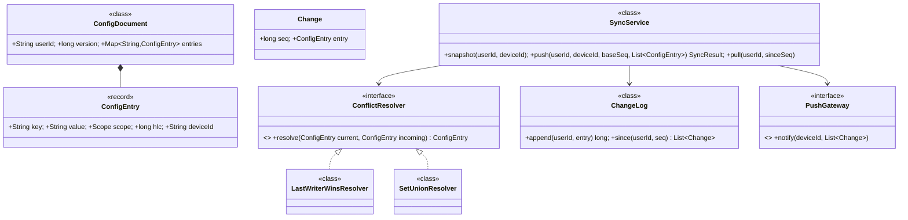
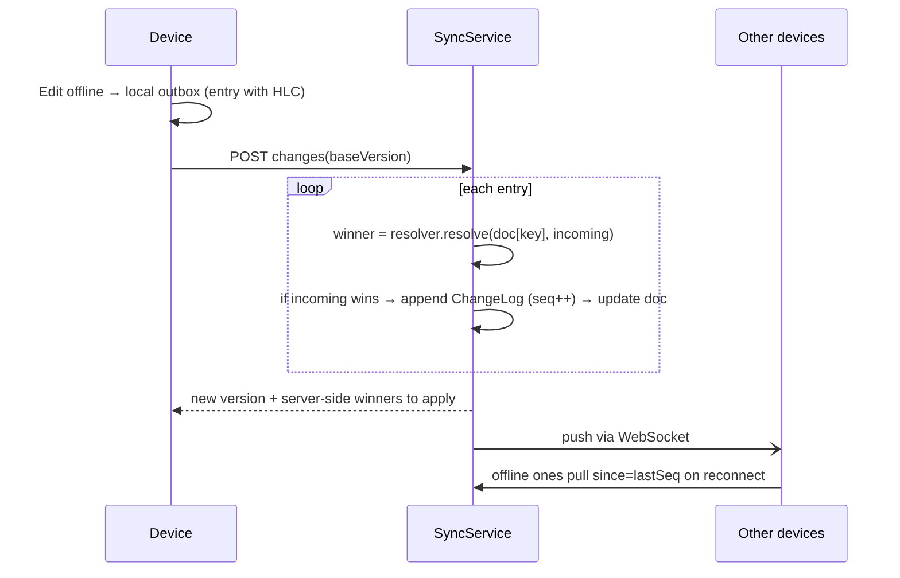

# 07 · Configuration Sync Across Devices

## Interview question
Custom team problem: syncing configurations (settings/preferences) across a user's devices (phone, laptop, Echo, Kindle…). Answer design questions on conflicts, offline, and scale.

## Assumptions / clarification
- Config = set of key→value settings per user (e.g. `theme=dark`, `volume=7`), some device-specific, some global.
- Devices may be offline and edit locally; sync when back online.
- Last-writer-wins acceptable for most keys; some keys need merge (lists like "blocked contacts").
- Changes should reach other online devices within seconds (push).
- Millions of users, ~5 devices each, config size small (< 64 KB).

## Functional requirements
1. Device reads full config on start (`GET snapshot`).
2. Device pushes changes (delta) with its known version.
3. Server resolves conflicts and broadcasts to other devices.
4. Device pulls changes since version `v` (catch-up after offline).
5. Scope: global vs device-specific vs device-type keys.
6. History / rollback (optional).

## Non-functional requirements
- Eventual convergence: all devices end in the same state.
- Low latency propagation (< 2 s online).
- Works offline; battery/network friendly (deltas, not full blobs).
- Durable, highly available.

## CAP / consistency
- **AP + eventual consistency** — a device must be able to write while offline. Convergence guaranteed by deterministic conflict resolution (LWW with hybrid logical clock, or CRDT per key type).
- Server per-user sequence number gives a total order of accepted changes → simple catch-up.

## Core entities
`User`, `Device`, `ConfigEntry` (key, value, scope, timestamp HLC, deviceId), `ConfigDocument` (userId, version, entries), `Change` (seq, entry), `ConflictResolver`, `SyncService`, `ChangeLog`, `PushGateway`.

## IS-A / HAS-A
- `LastWriterWinsResolver`, `SetUnionResolver` **IS-A** `ConflictResolver`.
- `WebSocketPush`, `MobilePush` **IS-A** `PushGateway`.
- `ConfigDocument` **HAS-A** map of `ConfigEntry`; `SyncService` **HAS-A** `ChangeLog`, resolvers, `PushGateway`.

## Mermaid UML class diagram


## APIs
```
GET  /users/{u}/config?deviceId=d                    -> {version, entries}
POST /users/{u}/config/changes {deviceId, baseVersion, entries[]} -> {newVersion, applied[], overridden[]}
GET  /users/{u}/config/changes?since=123             -> [changes]
WS   /sync  (server → device: {version, changes[]})
```

## Design patterns
- **Strategy** – conflict resolution per key type.
- **Observer** – devices subscribe to user channel.
- **Memento / Event sourcing** – change log allows history and rollback.
- **Command** – each change is an immutable command replayable offline (outbox on device).

## SOLID mapping
- **S**: log storage vs resolution vs push delivery.
- **O**: new merge type = new resolver registered for key prefix.
- **D**: `SyncService` depends on `PushGateway` interface (WS/APNs/FCM).

## High-level flow


## Concurrency
- Per-user serialization: all writes for a user go to one partition (DynamoDB key = userId; conditional write on version) or a per-user lock/actor.
- HLC (hybrid logical clock) avoids trusting device wall clocks; tie-break on deviceId → deterministic.
- Idempotency: entry id = deviceId + local counter; server ignores duplicates.

## Edge cases
- Device clock wrong by hours → HLC / server-assigned timestamp on receipt.
- Delete vs update conflict → tombstone entries with timestamps.
- Device offline for months → change log compacted → send full snapshot instead.
- Device-specific keys must not propagate (`Scope.DEVICE`).
- Schema version mismatch (old app) → ignore unknown keys, keep them.
- Large bursts (slider dragging) → debounce on device.

## End-to-end Java implementation
```java
import java.util.*;
import java.util.concurrent.*;

enum Scope { GLOBAL, DEVICE }

record ConfigEntry(String key, String value, Scope scope, long hlc, String deviceId, boolean deleted) {
    static ConfigEntry set(String k, String v, long hlc, String dev) { return new ConfigEntry(k, v, Scope.GLOBAL, hlc, dev, false); }
}
record Change(long seq, ConfigEntry entry) {}
record SyncResult(long version, List<ConfigEntry> applied, List<ConfigEntry> overridden) {}

interface ConflictResolver { ConfigEntry resolve(ConfigEntry current, ConfigEntry incoming); }

final class LastWriterWinsResolver implements ConflictResolver {
    public ConfigEntry resolve(ConfigEntry cur, ConfigEntry in) {
        if (cur == null) return in;
        int cmp = Long.compare(in.hlc(), cur.hlc());
        if (cmp == 0) cmp = in.deviceId().compareTo(cur.deviceId());   // deterministic tie-break
        return cmp > 0 ? in : cur;
    }
}

/** Values are comma-separated sets; merge = union (add-wins). */
final class SetUnionResolver implements ConflictResolver {
    public ConfigEntry resolve(ConfigEntry cur, ConfigEntry in) {
        if (cur == null) return in;
        Set<String> merged = new TreeSet<>(Arrays.asList(cur.value().split(",")));
        merged.addAll(Arrays.asList(in.value().split(",")));
        return new ConfigEntry(in.key(), String.join(",", merged), in.scope(), Math.max(cur.hlc(), in.hlc()), in.deviceId(), false);
    }
}

interface PushGateway { void notify(String userId, String excludeDevice, List<Change> changes); }

final class ChangeLog {
    private final Map<String, List<Change>> log = new ConcurrentHashMap<>();
    long append(String userId, ConfigEntry e) {
        List<Change> l = log.computeIfAbsent(userId, k -> new ArrayList<>());
        long seq = l.size() + 1L; l.add(new Change(seq, e)); return seq;
    }
    List<Change> since(String userId, long seq) {
        List<Change> l = log.getOrDefault(userId, List.of());
        return List.copyOf(l.subList((int) Math.min(seq, l.size()), l.size()));
    }
}

final class SyncService {
    private final Map<String, Map<String, ConfigEntry>> docs = new ConcurrentHashMap<>();
    private final Map<String, Long> versions = new ConcurrentHashMap<>();
    private final ChangeLog changeLog = new ChangeLog();
    private final Map<String, ConflictResolver> resolverByPrefix;
    private final ConflictResolver defaultResolver = new LastWriterWinsResolver();
    private final PushGateway push;

    SyncService(Map<String, ConflictResolver> resolverByPrefix, PushGateway push) {
        this.resolverByPrefix = Map.copyOf(resolverByPrefix); this.push = push;
    }

    Map<String, ConfigEntry> snapshot(String userId) { return Map.copyOf(docs.getOrDefault(userId, Map.of())); }

    SyncResult push(String userId, String deviceId, List<ConfigEntry> incoming) {
        Map<String, ConfigEntry> doc = docs.computeIfAbsent(userId, k -> new HashMap<>());
        List<ConfigEntry> applied = new ArrayList<>(), overridden = new ArrayList<>();
        List<Change> newChanges = new ArrayList<>();
        synchronized (doc) {                                   // per-user serialization
            for (ConfigEntry in : incoming) {
                if (in.scope() == Scope.DEVICE) continue;       // not synced
                ConfigEntry cur = doc.get(in.key());
                ConfigEntry winner = resolverFor(in.key()).resolve(cur, in);
                if (!winner.equals(cur)) {
                    doc.put(in.key(), winner);
                    newChanges.add(new Change(changeLog.append(userId, winner), winner));
                    applied.add(winner);
                } else overridden.add(cur);                     // device must adopt server value
            }
            versions.merge(userId, (long) newChanges.size(), Long::sum);
        }
        if (!newChanges.isEmpty()) push.notify(userId, deviceId, newChanges);
        return new SyncResult(versions.getOrDefault(userId, 0L), applied, overridden);
    }

    List<Change> pull(String userId, long sinceSeq) { return changeLog.since(userId, sinceSeq); }

    private ConflictResolver resolverFor(String key) {
        return resolverByPrefix.entrySet().stream().filter(e -> key.startsWith(e.getKey()))
                .map(Map.Entry::getValue).findFirst().orElse(defaultResolver);
    }
}

public class ConfigSyncDemo {
    public static void main(String[] args) {
        PushGateway ws = (u, ex, ch) -> System.out.println("push to " + u + " devices except " + ex + ": " + ch);
        SyncService svc = new SyncService(Map.of("blocked.", new SetUnionResolver()), ws);

        svc.push("u1", "phone", List.of(ConfigEntry.set("theme", "dark", 100, "phone")));
        // laptop was offline, made an older edit → loses
        SyncResult r = svc.push("u1", "laptop", List.of(ConfigEntry.set("theme", "light", 90, "laptop"),
                                                         ConfigEntry.set("blocked.users", "bob", 95, "laptop")));
        svc.push("u1", "phone", List.of(ConfigEntry.set("blocked.users", "eve", 120, "phone")));
        System.out.println("laptop overridden: " + r.overridden());
        System.out.println("final: " + svc.snapshot("u1"));
        System.out.println("catch-up since 1: " + svc.pull("u1", 1));
    }
}
```

## New requirements → how the class diagram evolves
| New requirement | Change |
|---|---|
| Per device-type config (all Echo devices) | `Scope.DEVICE_TYPE` + targeting in push. |
| Counters (e.g. usage count) | `GCounterResolver` (CRDT). |
| Rollback to yesterday | Rebuild doc from `ChangeLog` up to timestamp (event sourcing). |
| Admin policy overrides user (enterprise) | `PolicyLayer` merged on read — Chain of layers (default < policy < user). |
| E2E encryption | Server stores opaque values; resolution only by HLC. |
| Scale | Partition by userId; DynamoDB (doc) + DynamoDB Streams → push fan-out. |

## Amazon follow-up questions
1. Two devices change the same key offline — who wins and why is it deterministic?
2. Why not trust device timestamps? What is a hybrid logical clock / vector clock?
3. How does a device that's been offline for 6 months catch up?
4. How do you push to 5 devices of 100M users? (Connection service, WebSocket gateway, SNS/FCM/APNs fallback.)
5. How to handle deletes (tombstones, GC)?
6. When would you use CRDTs vs LWW?
