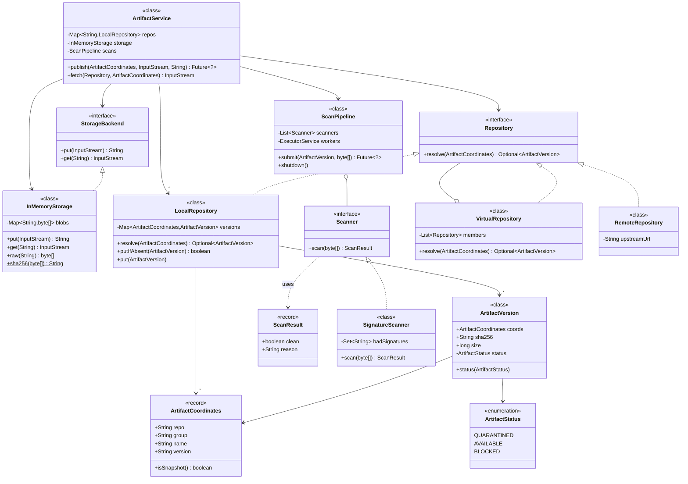
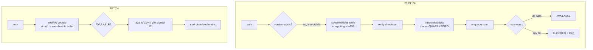

# 08 · Artifact Repository (like JFrog Artifactory / Maven Central / ECR)

## Interview question
Design an artifact repository: upload (publish) an artifact and fetch an artifact. Probing on scalability, metrics/monitoring, reliability, extensibility (e.g. dealing with a malicious artifact).

## Assumptions / clarification
- Artifacts: Maven jars, npm tarballs, Docker layers, generic binaries. Identified by `repo/group/name/version` (coordinates).
- Size: KB to several GB (Docker layers). Read : write ≈ 100 : 1 (CI pulls far more than it publishes).
- Released versions are **immutable**; SNAPSHOT versions can be overwritten.
- Auth via tokens; per-repo permissions (read/publish/admin).
- Every artifact must be virus/vulnerability scanned before it's downloadable (quarantine).

## Functional requirements
1. Publish artifact (with metadata + checksum).
2. Fetch artifact by coordinates (or by digest).
3. List versions / search.
4. Repos: local, remote (proxy cache of Maven Central), virtual (aggregate).
5. Scan & quarantine malicious artifacts; block/unblock; audit.
6. Delete / retention policies (e.g., keep last 20 snapshots).

## Non-functional requirements
- Durability 11 9s (object storage).
- Download availability 99.99%, high throughput, geo-distributed (CI in many regions).
- Upload of multi-GB artifacts (resumable, multipart).
- Integrity: checksum verified end to end.

## CAP / consistency
- Metadata (coordinates → digest) is **strongly consistent** (read-after-write for publish then immediate fetch in CI). Use a relational DB / DynamoDB with strong reads.
- Blobs are content-addressed (sha256) ⇒ immutable ⇒ caching/replication is trivially consistent; cross-region replication is **eventual**.

## Core entities
`Repository` (type LOCAL/REMOTE/VIRTUAL), `ArtifactCoordinates`, `ArtifactVersion` (digest, size, status, uploadedBy), `Blob` (sha256 → bytes in S3), `UploadSession`, `ScanResult`, `Scanner`, `StorageBackend`, `AccessPolicy`, `AuditEvent`.

## IS-A / HAS-A
- `LocalRepository`, `RemoteRepository`, `VirtualRepository` **IS-A** `Repository`.
- `S3Storage`, `FileSystemStorage` **IS-A** `StorageBackend`.
- `AntivirusScanner`, `CveScanner`, `LicenseScanner` **IS-A** `Scanner`.
- `VirtualRepository` **HAS-A** list of `Repository` (Composite). `ArtifactVersion` **HAS-A** `Blob` ref (digest).

## Mermaid UML class diagram


## APIs
```
PUT  /repos/{repo}/{group}/{name}/{version}/{file}   (body stream, header X-Checksum-Sha256)  -> 201
POST /uploads {coords, size}  -> {uploadId, partUrls[]}   (multipart, pre-signed S3 URLs)
POST /uploads/{id}/complete {sha256}
GET  /repos/{repo}/{group}/{name}/{version}/{file}   -> 302 to CDN/pre-signed URL  | 403 QUARANTINED
GET  /repos/{repo}/{group}/{name}/versions
POST /admin/artifacts/{digest}/block {reason}
```

## High-level architecture
```
Clients (mvn, npm, docker, CI)
   → Global LB / CDN (CloudFront) ──cache hit──► blob
   → API service (stateless, autoscaled)
        ├─ AuthN/Z (tokens, repo ACLs)
        ├─ Metadata DB (Aurora/DynamoDB): coords → digest, status, ACL
        ├─ Blob store (S3, content addressed: /blobs/sha256/ab/cd/...)  + cross-region replication
        ├─ Queue (SQS/Kafka) → Scan workers (AV, CVE, license) → update status
        └─ Remote proxy: on miss fetch upstream, verify checksum, store, cache
Observability: metrics (downloads/s, p99 latency, cache hit ratio, scan backlog, 5xx), logs, traces, audit trail
```

## Design patterns
- **Strategy** – `StorageBackend`, `Scanner`.
- **Composite** – `VirtualRepository` aggregates repos.
- **Proxy** – `RemoteRepository` caches upstream.
- **Chain of Responsibility / Pipeline** – scan pipeline; resolution order in virtual repo.
- **State** – artifact: UPLOADING → QUARANTINED(scan pending) → AVAILABLE | BLOCKED.
- **Observer** – events for webhooks (new version published).

## SOLID mapping
- **S**: metadata, blob storage, scanning, auth separated.
- **O**: new package format (PyPI) = new `FormatHandler`; new scanner = new class.
- **L**: any `Repository` resolves coordinates.
- **I**: `Scanner` single method.
- **D**: services depend on `StorageBackend`, not S3 SDK.

## High-level flow


## Concurrency
- Two concurrent publishes of same release version → unique constraint on coords; second gets `409`.
- Dedup: same blob uploaded twice → content-addressed key, `putIfAbsent`.
- Remote proxy stampede (1000 CI jobs miss same jar) → single-flight lock per coords (in-process `ConcurrentHashMap<coords, CompletableFuture>`).
- Status update from scanner uses conditional update `WHERE status = QUARANTINED`.

## Edge cases
- Upload interrupted → multipart session expiry, orphan blob GC.
- Checksum mismatch → reject.
- Malicious artifact already downloaded → block, notify consumers who downloaded it (audit log of who pulled).
- Delete a version others depend on → soft delete / retention; releases generally non-deletable.
- Upstream (Maven Central) down → serve cached.
- Very large files → pre-signed direct-to-S3 upload, never through app servers.

## End-to-end Java implementation
```java
import java.io.*;
import java.security.MessageDigest;
import java.util.*;
import java.util.concurrent.*;

enum ArtifactStatus { QUARANTINED, AVAILABLE, BLOCKED }

record ArtifactCoordinates(String repo, String group, String name, String version) {
    boolean isSnapshot() { return version.endsWith("-SNAPSHOT"); }
}

final class ArtifactVersion {
    final ArtifactCoordinates coords; final String sha256; final long size;
    private volatile ArtifactStatus status = ArtifactStatus.QUARANTINED;
    ArtifactVersion(ArtifactCoordinates c, String sha, long size) { this.coords = c; this.sha256 = sha; this.size = size; }
    ArtifactStatus status() { return status; }
    void status(ArtifactStatus s) { status = s; }
}

record ScanResult(boolean clean, String reason) {}

interface StorageBackend {
    String put(InputStream in) throws IOException;      // returns sha256
    InputStream get(String sha256);
}

final class InMemoryStorage implements StorageBackend {
    private final Map<String, byte[]> blobs = new ConcurrentHashMap<>();
    public String put(InputStream in) throws IOException {
        byte[] bytes = in.readAllBytes();
        String sha = sha256(bytes);
        blobs.putIfAbsent(sha, bytes);                     // content addressed dedup
        return sha;
    }
    public InputStream get(String sha) { return new ByteArrayInputStream(blobs.get(sha)); }
    byte[] raw(String sha) { return blobs.get(sha); }
    static String sha256(byte[] b) {
        try { return HexFormat.of().formatHex(MessageDigest.getInstance("SHA-256").digest(b)); }
        catch (Exception e) { throw new IllegalStateException(e); }
    }
}

interface Scanner { ScanResult scan(byte[] content); }

final class SignatureScanner implements Scanner {
    private final Set<String> badSignatures;
    SignatureScanner(Set<String> bad) { this.badSignatures = Set.copyOf(bad); }
    public ScanResult scan(byte[] c) {
        String s = new String(c);
        return badSignatures.stream().filter(s::contains).findFirst()
                .map(sig -> new ScanResult(false, "matched " + sig)).orElse(new ScanResult(true, "ok"));
    }
}

interface Repository { Optional<ArtifactVersion> resolve(ArtifactCoordinates c); }

final class LocalRepository implements Repository {
    private final Map<ArtifactCoordinates, ArtifactVersion> versions = new ConcurrentHashMap<>();
    public Optional<ArtifactVersion> resolve(ArtifactCoordinates c) { return Optional.ofNullable(versions.get(c)); }
    boolean putIfAbsent(ArtifactVersion v) { return versions.putIfAbsent(v.coords, v) == null; }
    void put(ArtifactVersion v) { versions.put(v.coords, v); }
}

final class VirtualRepository implements Repository {
    private final List<Repository> members;
    VirtualRepository(List<Repository> members) { this.members = List.copyOf(members); }
    public Optional<ArtifactVersion> resolve(ArtifactCoordinates c) {
        return members.stream().map(r -> r.resolve(c)).flatMap(Optional::stream).findFirst();
    }
}

final class ScanPipeline {
    private final List<Scanner> scanners; private final ExecutorService workers = Executors.newFixedThreadPool(4);
    ScanPipeline(List<Scanner> scanners) { this.scanners = List.copyOf(scanners); }
    Future<?> submit(ArtifactVersion v, byte[] content) {
        return workers.submit(() -> {
            for (Scanner s : scanners) {
                ScanResult r = s.scan(content);
                if (!r.clean()) { v.status(ArtifactStatus.BLOCKED); System.out.println("BLOCKED " + v.coords + ": " + r.reason()); return; }
            }
            v.status(ArtifactStatus.AVAILABLE);
        });
    }
    void shutdown() { workers.shutdown(); }
}

final class ArtifactService {
    private final Map<String, LocalRepository> repos;
    private final InMemoryStorage storage;
    private final ScanPipeline scans;

    ArtifactService(Map<String, LocalRepository> repos, InMemoryStorage storage, ScanPipeline scans) {
        this.repos = repos; this.storage = storage; this.scans = scans;
    }

    Future<?> publish(ArtifactCoordinates c, InputStream in, String expectedSha) throws IOException {
        LocalRepository repo = Objects.requireNonNull(repos.get(c.repo()), "repo");
        String sha = storage.put(in);
        if (expectedSha != null && !expectedSha.equals(sha)) throw new IllegalArgumentException("Checksum mismatch");
        ArtifactVersion v = new ArtifactVersion(c, sha, storage.raw(sha).length);
        if (c.isSnapshot()) repo.put(v);
        else if (!repo.putIfAbsent(v)) throw new IllegalStateException("Release versions are immutable: " + c);
        return scans.submit(v, storage.raw(sha));
    }

    InputStream fetch(Repository from, ArtifactCoordinates c) {
        ArtifactVersion v = from.resolve(c).orElseThrow(() -> new NoSuchElementException("404 " + c));
        return switch (v.status()) {
            case AVAILABLE -> storage.get(v.sha256);
            case QUARANTINED -> throw new IllegalStateException("423 scan pending");
            case BLOCKED -> throw new SecurityException("403 artifact blocked");
        };
    }
}

public class ArtifactRepoDemo {
    public static void main(String[] args) throws Exception {
        LocalRepository libs = new LocalRepository();
        InMemoryStorage storage = new InMemoryStorage();
        ScanPipeline pipeline = new ScanPipeline(List.of(new SignatureScanner(Set.of("EICAR"))));
        ArtifactService svc = new ArtifactService(Map.of("libs-release", libs), storage, pipeline);
        Repository virtual = new VirtualRepository(List.of(libs));

        var good = new ArtifactCoordinates("libs-release", "com.amazon", "cart", "1.0.0");
        var bad = new ArtifactCoordinates("libs-release", "com.evil", "miner", "6.6.6");
        svc.publish(good, new ByteArrayInputStream("clean jar".getBytes()), null).get();
        svc.publish(bad, new ByteArrayInputStream("EICAR payload".getBytes()), null).get();

        System.out.println(new String(svc.fetch(virtual, good).readAllBytes()));
        try { svc.fetch(virtual, bad); } catch (SecurityException e) { System.out.println(e.getMessage()); }
        try { svc.publish(good, new ByteArrayInputStream("again".getBytes()), null); }
        catch (IllegalStateException e) { System.out.println(e.getMessage()); }
        pipeline.shutdown();
    }
}
```

## New requirements → how the class diagram evolves
| New requirement | Change |
|---|---|
| New format (PyPI, Helm) | `FormatHandler` interface (path parsing, metadata index generation) — Strategy per format. |
| Proxy Maven Central | `RemoteRepository` with single-flight fetch + cache. |
| Artifact signing (Sigstore) | `SignatureVerifier` scanner step; `ArtifactVersion` HAS-A `Signature`. |
| Retention policies | `RetentionPolicy` strategies run by a scheduled cleaner. |
| Webhooks on publish | Observer: `ArtifactEventPublisher` → SNS. |
| Re-scan when new CVE disclosed | Periodic job re-queues AVAILABLE artifacts; may flip to BLOCKED. |

## Amazon follow-up questions

Tap a question to see a simple answer.

<details class="qa">
<summary><span class="qn">1</span>How do you handle a 5 GB upload? (Multipart pre-signed S3, resumable, never proxy bytes through API.)</summary>

Never push the 5 GB through your API servers. The API hands out pre-signed S3 URLs for a multipart upload: the client uploads parts (say 100 MB each) straight to S3, in parallel and resumable, so a failed part is simply retried. When all parts are done, the client calls 'complete' and the API records the metadata.

</details>

<details class="qa">
<summary><span class="qn">2</span>A malicious artifact was downloaded 10k times before detection — what now? (Block, audit log of consumers, notify, SBOM search.)</summary>

Mark the artifact `BLOCKED` right away so no one can download it. Use the download logs to list every user, build or service that fetched it. Notify those teams and search SBOMs (software bills of materials) to find anything that bundled it. Keep the file itself for investigation, and publish a fixed version.

</details>

<details class="qa">
<summary><span class="qn">3</span>What metrics and alarms? (p99 download latency, 5xx rate, cache hit ratio, scan queue age, storage growth, upstream error rate.)</summary>

Watch download speed (p99 latency), error rate (5xx), CDN cache hit ratio, how long items wait in the scan queue, storage growth, and failures reaching upstream sources like Maven Central. Alarm when errors spike, the scan queue gets old (new versions stuck), or cache hits drop sharply.

</details>

<details class="qa">
<summary><span class="qn">4</span>How do you make downloads fast globally? (CDN on content-addressed immutable URLs, regional replicas.)</summary>

Artifacts never change once published, so they're perfect for a CDN: cache them at edges worldwide with long expiry. Use content-addressed URLs (based on the file's hash) so the cache never serves a stale file. Replicate the blob storage to a few regions for fast origin fetches.

</details>

<details class="qa">
<summary><span class="qn">5</span>Why content addressing? (Dedup, integrity, immutable caching.)</summary>

Content addressing means the file's name *is* its SHA-256 hash. The same file uploaded twice is stored once (dedup). The download can be verified against the name (integrity). And the content behind a hash can never change, so it can be cached forever.

</details>

<details class="qa">
<summary><span class="qn">6</span>How to keep metadata and blob consistent if the service dies between the two writes? (Write blob first; metadata commit is the "publish"; GC orphans.)</summary>

Write the file first, then the metadata row. The metadata write is the moment it's 'published', so if the service dies before it, no one can see the file. A clean-up job later deletes blobs that have no metadata after a while. The reverse order would be dangerous, because metadata would point at a missing file.

</details>
