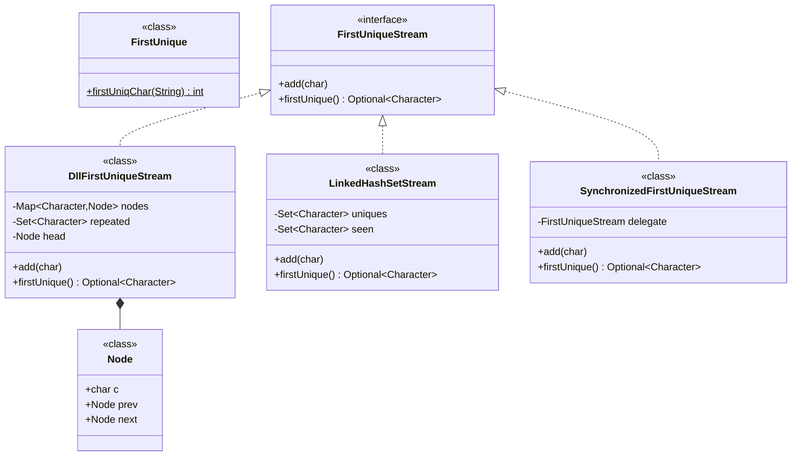

# 09 · First Unique Character (String → Stream)

## Interview question
Find the first non-repeating character in a string. Then extend to a **stream** of characters: at any time, return the first unique character seen so far. (Asked together with the Unix file search round.)

## Assumptions / clarification
- Characters: ASCII first; then general Unicode (use `int` code points / map).
- Stream: `add(char)` called many times, `firstUnique()` called any time; both should be O(1).
- Return sentinel (`Optional.empty()` / `'#'`) when none.
- Single-threaded first; then thread-safe.

## Functional requirements
1. `firstUniqChar(String s)` → index or -1.
2. `FirstUniqueStream.add(c)`, `FirstUniqueStream.firstUnique()`.

## Non-functional requirements
- String: O(n) time, O(k) space (alphabet).
- Stream: O(1) per op, memory bounded by alphabet size (not stream length).

## CAP / consistency
Not distributed. If sharded across machines, "first" needs a global order (sequence numbers) — mention only.

## Core entities
`FirstUniqueFinder` (interface), `ArrayCountFinder` (string), `FirstUniqueStream`, `Node` (DLL node).

## IS-A / HAS-A
- `LinkedHashMapStream`, `DllStream` **IS-A** `FirstUniqueStream`.
- `DllStream` **HAS-A** `Map<Character, Node>` + doubly-linked list + `Set<Character>` repeated.

## UML diagram


## APIs
```
int firstUniqChar(String s)
interface FirstUniqueStream { void add(char c); Optional<Character> firstUnique(); }
```

## Design patterns
- **Strategy** – two interchangeable stream implementations.
- **Decorator** – `SynchronizedFirstUniqueStream` adds thread safety.

## SOLID mapping
- **S/O/L/I/D** trivially: one interface, swappable implementations, caller depends on the interface.

## High-level flow

```mermaid
flowchart TD
  A["add(c)"] --> R{c in repeated?}
  R -->|yes| I[ignore]
  R -->|no| U{c in uniques?}
  U -->|yes| RM[remove from uniques O&#40;1&#41;<br/>add to repeated]
  U -->|no| T[append to tail of uniques]
  F["firstUnique()"] --> H[head of uniques]
```


## Concurrency
- Decorator with `synchronized` or a `ReentrantReadWriteLock` (reads are frequent).
- For very high write rate: single writer thread consuming a queue.

## Edge cases
- Empty string → -1. All repeated → -1.
- Unicode surrogate pairs → use `codePoints()`.
- Case sensitivity (`'a'` vs `'A'`) — clarify.
- Stream of billions: memory is O(alphabet), fine.

## End-to-end Java implementation
```java
import java.util.*;

final class FirstUnique {
    private FirstUnique() {}
    static int firstUniqChar(String s) {
        Map<Integer, Integer> count = new HashMap<>();
        s.codePoints().forEach(cp -> count.merge(cp, 1, Integer::sum));
        int idx = 0;
        for (int i = 0; i < s.length(); ) {
            int cp = s.codePointAt(i);
            if (count.get(cp) == 1) return idx;
            i += Character.charCount(cp); idx++;
        }
        return -1;
    }
}

interface FirstUniqueStream {
    void add(char c);
    Optional<Character> firstUnique();
}

/** Explicit doubly linked list — what the interviewer usually wants to see. */
final class DllFirstUniqueStream implements FirstUniqueStream {
    private static final class Node { final char c; Node prev, next; Node(char c) { this.c = c; } }
    private final Map<Character, Node> nodes = new HashMap<>();
    private final Set<Character> repeated = new HashSet<>();
    private final Node head = new Node('\0'), tail = new Node('\0');

    DllFirstUniqueStream() { head.next = tail; tail.prev = head; }

    public void add(char c) {
        if (repeated.contains(c)) return;
        Node n = nodes.remove(c);
        if (n != null) { unlink(n); repeated.add(c); return; }
        n = new Node(c);
        n.prev = tail.prev; n.next = tail; tail.prev.next = n; tail.prev = n;
        nodes.put(c, n);
    }

    public Optional<Character> firstUnique() {
        return head.next == tail ? Optional.empty() : Optional.of(head.next.c);
    }

    private static void unlink(Node n) { n.prev.next = n.next; n.next.prev = n.prev; }
}

/** Same idea with LinkedHashSet (insertion ordered, O(1) remove). */
final class LinkedHashSetStream implements FirstUniqueStream {
    private final Set<Character> uniques = new LinkedHashSet<>();
    private final Set<Character> seen = new HashSet<>();
    public void add(char c) { if (seen.add(c)) uniques.add(c); else uniques.remove(c); }
    public Optional<Character> firstUnique() { return uniques.stream().findFirst(); }
}

final class SynchronizedFirstUniqueStream implements FirstUniqueStream {
    private final FirstUniqueStream delegate;
    SynchronizedFirstUniqueStream(FirstUniqueStream d) { this.delegate = d; }
    public synchronized void add(char c) { delegate.add(c); }
    public synchronized Optional<Character> firstUnique() { return delegate.firstUnique(); }
}

public class FirstUniqueDemo {
    public static void main(String[] args) {
        System.out.println(FirstUnique.firstUniqChar("leetcode"));      // 0
        System.out.println(FirstUnique.firstUniqChar("aabb"));          // -1
        FirstUniqueStream s = new SynchronizedFirstUniqueStream(new DllFirstUniqueStream());
        for (char c : "aabcbd".toCharArray()) {
            s.add(c);
            System.out.println("after " + c + " -> " + s.firstUnique().map(String::valueOf).orElse("#"));
        }
    }
}
```
Output for `aabcbd`: `a, #, b, b, c, c`.

## New requirements → how the class diagram evolves
| New requirement | Change |
|---|---|
| First unique in last K chars (sliding window) | Store counts + queue of (char, index); evict on window slide. |
| First unique **word** in a log stream | Generic `FirstUniqueStream<T>`. |
| Top-k most recent uniques | Iterate DLL from head. |
| Distributed stream | Partition by key for counts; aggregate min(first-seen seq) across partitions. |

## Amazon follow-up questions

Tap a question to see a simple answer.

<details class="qa">
<summary><span class="qn">1</span>Complexity of each operation? Why not a queue + lazy pop? (Queue works amortised O(1); DLL is strict O(1).)</summary>

Every operation is O(1): `add` does a hash lookup and a linked-list insert or removal, and `firstUnique` reads the head. A queue with lazy popping also works: you push each char and, when asked, pop from the front while the front is repeated. That's O(1) *on average*, but one call can pop many items. The doubly-linked list is O(1) every single time.

</details>

<details class="qa">
<summary><span class="qn">2</span>Why <code>LinkedHashSet</code>? What does it do internally?</summary>

`LinkedHashSet` is a hash set that also remembers insertion order. Inside, it's a `HashMap` whose entries are also joined in a doubly-linked list. Lookup and remove are O(1) through the hash map, and iteration follows the list, so the first element is the oldest still present. That's exactly 'first unique so far'.

</details>

<details class="qa">
<summary><span class="qn">3</span>How to make it generic and thread-safe?</summary>

Make the class `FirstUnique<T>` so it works with any type, not just `char`. For thread safety, the easy fix is making `add` and `firstUnique` `synchronized` (or using a `ReentrantLock`), because both touch two structures that must change together. For heavy read traffic, a read-write lock lets many readers in at once.

</details>

<details class="qa">
<summary><span class="qn">4</span>How would you handle a sliding window?</summary>

Keep a count for each char inside the window and a queue of the window's chars. When a char slides out, lower its count and, if it becomes 1 again, it's unique again and goes back into the ordered structure. Use counts instead of a 'seen' set, because chars can leave the window.

</details>

<details class="qa">
<summary><span class="qn">5</span>Memory for full Unicode stream?</summary>

For only ASCII, arrays of 128 cover it. Full Unicode has ~1.1 million code points, so use hash maps keyed by code point (not arrays) and memory grows only with the characters actually seen. Also read by code point, not by `char`, because emojis take two `char`s in Java.

</details>
