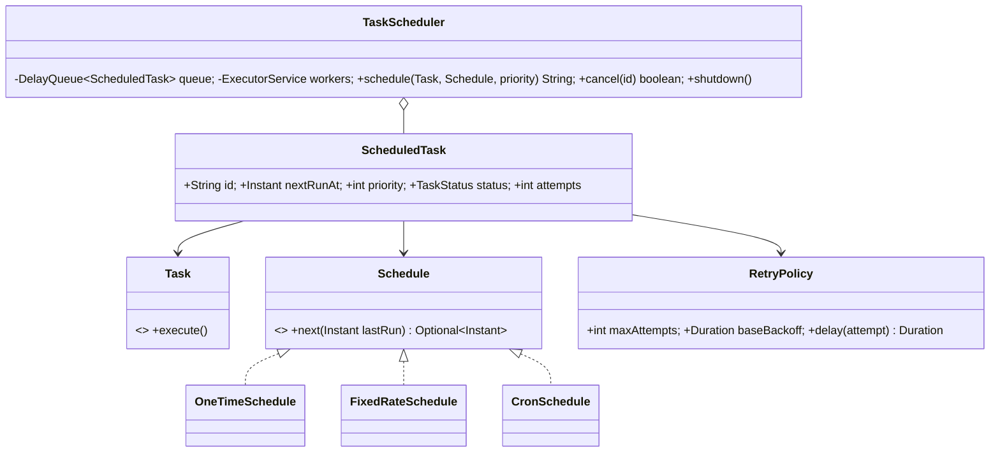

# 10 · Task Scheduler

## Interview question
Design a task scheduler: schedule tasks to run once at a time/after a delay, or periodically (fixed rate / cron). Support cancel, retries, priorities, and concurrency.

## Assumptions / clarification
- In-process library first (like `ScheduledExecutorService`), then distributed (like Quartz cluster / EventBridge Scheduler).
- Task types: one-time, fixed-rate, fixed-delay, cron.
- Configurable worker pool size.
- At-least-once execution; tasks should be idempotent.
- Priority breaks ties for tasks due at the same time.

## Functional requirements
1. `schedule(task, runAt)`, `scheduleAtFixedRate(task, initialDelay, period)`, `scheduleCron(task, expr)`.
2. `cancel(taskId)`, `status(taskId)`.
3. Retry on failure with backoff; max attempts.
4. Timeout per task.
5. (Distributed) survive node crash; no double execution by 2 nodes.

## Non-functional requirements
- Timing accuracy within ~10 ms (in-process), ~1 s (distributed).
- Scales to millions of scheduled tasks (distributed).
- No busy-waiting.

## CAP / consistency
- Distributed: task ownership must be exclusive → **CP** for the claim step (DB row lease via conditional update, or ZooKeeper/etcd lease). Execution itself is at-least-once.

## Core entities
`Task` (Runnable + metadata), `ScheduledTask` (id, nextRunAt, priority, schedule, attempts, status), `Schedule` (OneTime, FixedRate, Cron), `RetryPolicy`, `TaskScheduler`, `WorkerPool`, `TaskStore`.

## IS-A / HAS-A
- `OneTimeSchedule`, `FixedRateSchedule`, `CronSchedule` **IS-A** `Schedule`.
- `ScheduledTask` **HAS-A** `Task`, `Schedule`, `RetryPolicy`.
- `TaskScheduler` **HAS-A** `PriorityBlockingQueue<ScheduledTask>` / `DelayQueue`, worker `ExecutorService`.

## Mermaid UML class diagram


## APIs
```
String schedule(Task t, Schedule s, int priority)
boolean cancel(String taskId)
TaskStatus status(String taskId)
REST (distributed): POST /tasks {callbackUrl|queueArn, cron|runAt, payload}, DELETE /tasks/{id}
```

## Design patterns
- **Command** – `Task` encapsulates the work.
- **Strategy** – `Schedule`, `RetryPolicy`.
- **State** – SCHEDULED → RUNNING → COMPLETED / FAILED / CANCELLED (and back to SCHEDULED for recurring).
- **Producer–consumer** – dispatcher thread + worker pool.
- **Observer** – task listeners (metrics, alerting).

## SOLID mapping
- **S**: dispatcher (timing) vs workers (execution) vs schedule (next time).
- **O**: add `CronSchedule` without touching the scheduler.
- **L**: all schedules return `next()`.
- **I**: `Task` is one method.
- **D**: scheduler depends on `Schedule`/`Task` abstractions and injected `Clock`.

## High-level flow
```
schedule() → compute nextRunAt → put into DelayQueue (ordered by time, then priority)
dispatcher thread: queue.take() (blocks until due) → skip if cancelled → submit to worker pool
worker: RUNNING → execute with timeout
   success → next = schedule.next(now) → re-enqueue or COMPLETED
   failure → attempts < max → re-enqueue at now + backoff ; else FAILED
```

## Concurrency
- `DelayQueue` blocks the dispatcher without polling.
- Status in `AtomicReference<TaskStatus>` → `cancel()` uses CAS SCHEDULED→CANCELLED; a running task can be interrupted via its `Future`.
- Worker pool bounded; long tasks don't starve dispatcher.
- **Distributed**: tasks table `(id, next_run_at, status, owner, lease_until)`; each node runs `UPDATE ... SET owner=me, lease_until=now+30s WHERE id IN (SELECT ... WHERE next_run_at <= now AND (owner IS NULL OR lease_until < now) LIMIT 100 FOR UPDATE SKIP LOCKED)`. Crashed node's lease expires → another node picks it up. Or partition tasks by hash to nodes; time-bucketed (per minute) partitions for scale.

## Edge cases
- Task runs longer than period (fixed rate) → skip overlapping run or queue it (policy).
- System clock jumps → use monotonic time for delays.
- Cancel while running → interrupt if allowed.
- Scheduler shutdown → graceful drain vs immediate.
- Thundering herd at 00:00 cron → jitter.
- Misfire (node down when due) → run immediately once, or skip (policy).

## End-to-end Java implementation
```java
import java.time.*;
import java.util.*;
import java.util.concurrent.*;
import java.util.concurrent.atomic.*;

enum TaskStatus { SCHEDULED, RUNNING, COMPLETED, FAILED, CANCELLED }

@FunctionalInterface interface Task { void execute() throws Exception; }

interface Schedule { Optional<Instant> next(Instant lastRun); Instant first(Instant now); }

record OneTimeSchedule(Duration delay) implements Schedule {
    public Instant first(Instant now) { return now.plus(delay); }
    public Optional<Instant> next(Instant last) { return Optional.empty(); }
}
record FixedRateSchedule(Duration initialDelay, Duration period) implements Schedule {
    public Instant first(Instant now) { return now.plus(initialDelay); }
    public Optional<Instant> next(Instant lastScheduled) { return Optional.of(lastScheduled.plus(period)); }
}

record RetryPolicy(int maxAttempts, Duration baseBackoff) {
    Duration delay(int attempt) { return baseBackoff.multipliedBy(1L << Math.min(attempt - 1, 10)); }
}

final class ScheduledTask implements Delayed {
    private static final AtomicLong SEQ = new AtomicLong();
    final String id = UUID.randomUUID().toString();
    final Task task; final Schedule schedule; final RetryPolicy retry; final int priority;
    final long seq = SEQ.incrementAndGet();
    final AtomicReference<TaskStatus> status = new AtomicReference<>(TaskStatus.SCHEDULED);
    volatile Instant nextRunAt; int attempts;

    ScheduledTask(Task t, Schedule s, RetryPolicy r, int priority, Instant firstRun) {
        this.task = t; this.schedule = s; this.retry = r; this.priority = priority; this.nextRunAt = firstRun;
    }
    public long getDelay(TimeUnit unit) {
        return unit.convert(Duration.between(Instant.now(), nextRunAt).toNanos(), TimeUnit.NANOSECONDS);
    }
    public int compareTo(Delayed o) {
        ScheduledTask other = (ScheduledTask) o;
        int c = nextRunAt.compareTo(other.nextRunAt);
        if (c != 0) return c;
        c = Integer.compare(other.priority, priority);             // higher priority first
        return c != 0 ? c : Long.compare(seq, other.seq);          // FIFO tie-break
    }
}

final class TaskScheduler {
    private final DelayQueue<ScheduledTask> queue = new DelayQueue<>();
    private final Map<String, ScheduledTask> tasks = new ConcurrentHashMap<>();
    private final ExecutorService workers;
    private final Thread dispatcher;
    private volatile boolean running = true;

    TaskScheduler(int workerCount) {
        this.workers = Executors.newFixedThreadPool(workerCount);
        this.dispatcher = new Thread(this::dispatchLoop, "scheduler-dispatcher");
        this.dispatcher.start();
    }

    String schedule(Task t, Schedule s, int priority) {
        ScheduledTask st = new ScheduledTask(t, s, new RetryPolicy(3, Duration.ofMillis(100)), priority, s.first(Instant.now()));
        tasks.put(st.id, st);
        queue.put(st);
        return st.id;
    }

    boolean cancel(String id) {
        ScheduledTask st = tasks.get(id);
        if (st == null) return false;
        TaskStatus prev = st.status.getAndSet(TaskStatus.CANCELLED);
        queue.remove(st);
        return prev != TaskStatus.COMPLETED && prev != TaskStatus.FAILED;
    }

    TaskStatus status(String id) { return tasks.get(id).status.get(); }

    private void dispatchLoop() {
        while (running) {
            try {
                ScheduledTask st = queue.take();
                if (st.status.compareAndSet(TaskStatus.SCHEDULED, TaskStatus.RUNNING)) workers.submit(() -> run(st));
            } catch (InterruptedException e) { Thread.currentThread().interrupt(); return; }
        }
    }

    private void run(ScheduledTask st) {
        Instant scheduledFor = st.nextRunAt;
        try {
            st.task.execute();
            st.attempts = 0;
            Optional<Instant> next = st.schedule.next(scheduledFor);
            if (next.isPresent()) requeue(st, next.get());
            else st.status.compareAndSet(TaskStatus.RUNNING, TaskStatus.COMPLETED);
        } catch (Exception e) {
            if (++st.attempts < st.retry.maxAttempts()) requeue(st, Instant.now().plus(st.retry.delay(st.attempts)));
            else st.status.compareAndSet(TaskStatus.RUNNING, TaskStatus.FAILED);
        }
    }

    private void requeue(ScheduledTask st, Instant at) {
        st.nextRunAt = at;
        if (st.status.compareAndSet(TaskStatus.RUNNING, TaskStatus.SCHEDULED)) queue.put(st);
    }

    void shutdown() { running = false; dispatcher.interrupt(); workers.shutdown(); }
}

public class SchedulerDemo {
    public static void main(String[] args) throws Exception {
        TaskScheduler s = new TaskScheduler(4);
        s.schedule(() -> System.out.println("one-shot @" + Instant.now()), new OneTimeSchedule(Duration.ofMillis(200)), 5);
        String hb = s.schedule(() -> System.out.println("heartbeat"), new FixedRateSchedule(Duration.ZERO, Duration.ofMillis(300)), 1);
        AtomicInteger calls = new AtomicInteger();
        String flaky = s.schedule(() -> { if (calls.incrementAndGet() < 3) throw new RuntimeException("boom"); System.out.println("flaky ok on try " + calls); },
                new OneTimeSchedule(Duration.ofMillis(50)), 1);
        Thread.sleep(1200);
        s.cancel(hb);
        System.out.println("flaky=" + s.status(flaky) + " heartbeat=" + s.status(hb));
        s.shutdown();
    }
}
```

## New requirements → how the class diagram evolves
| New requirement | Change |
|---|---|
| Cron expressions | `CronSchedule` using a cron parser. |
| Task dependencies (B after A) | DAG: `ScheduledTask` HAS-A `List<String> dependsOn`; ready only when parents COMPLETED. |
| Rate-limit per task type | `ExecutionGate` (semaphore per type) before submit. |
| Persistence / distributed | `TaskStore` interface (DB with lease columns); dispatcher claims batches. |
| Timeouts | Worker wraps in `future.get(timeout)` → cancel. |
| Listeners / metrics | `TaskListener` observer (onStart, onSuccess, onFailure). |

## Amazon follow-up questions
1. Why `DelayQueue` over polling every 100 ms?
2. How do you make sure two scheduler nodes don't run the same job? (Lease with conditional update / `SKIP LOCKED`.)
3. A node crashes mid-execution — what happens? (Lease expires → re-run → idempotency needed.)
4. How would you schedule 100M one-time reminders? (Time-bucketed partitions, DynamoDB TTL/SQS delay ≤15 min + tiering, EventBridge Scheduler.)
5. Fixed rate vs fixed delay?
6. How do you handle a task that never finishes?
