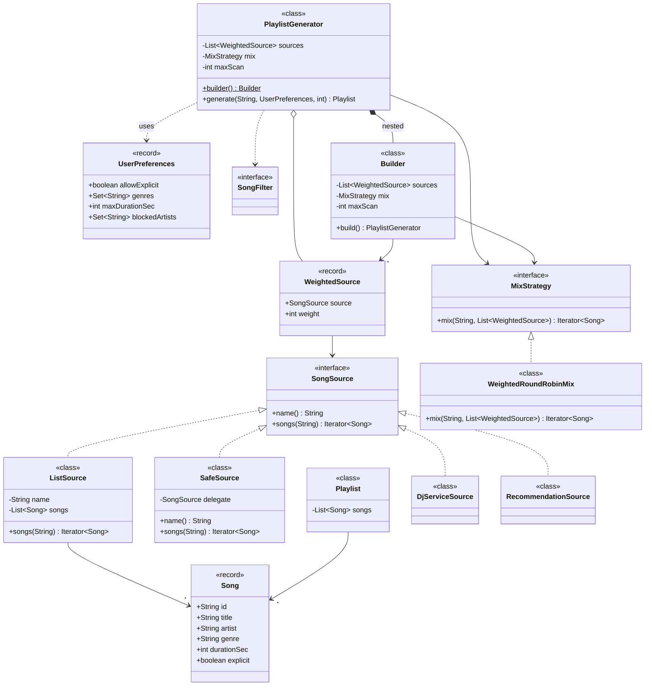
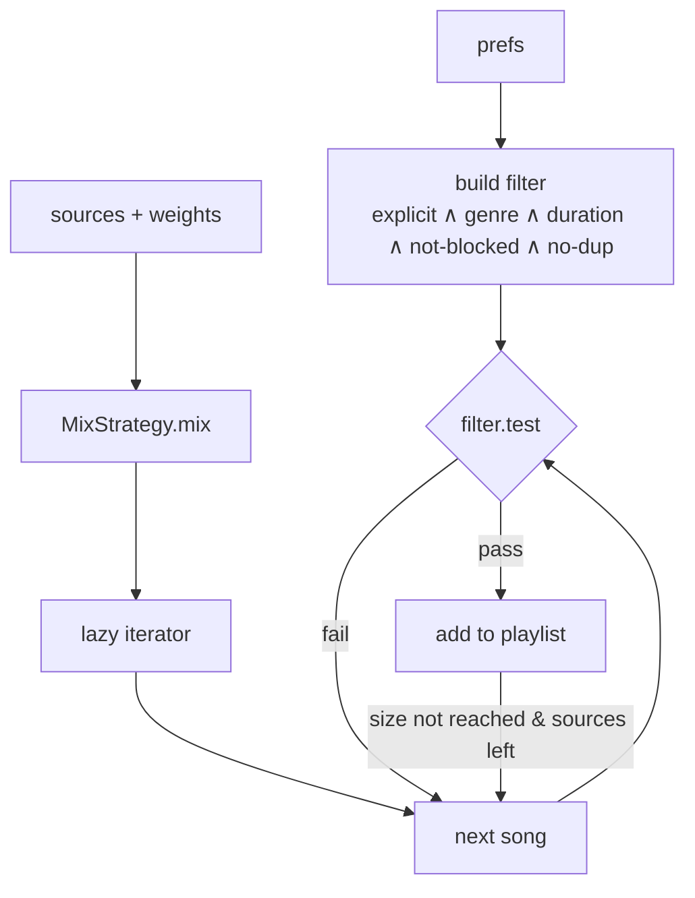

# 11 · Playlist Mixer (DJ Service + Recommendation Service)

## Interview question
Build a playlist by mixing songs from a **DJService** and a **RecommendationService**, in a custom proportion (e.g. 2:1) or equal proportion. Filters can be applied based on user preferences (explicit, genre, duration, already played…). Write production-ready classes (on paper) — 10 printed requirements.

## Assumptions / clarification (typical 10 requirements)
1. Both services return an ordered (possibly infinite/lazy) sequence of songs.
2. Mix ratio configurable: `dj:reco = a:b`; default 1:1.
3. Interleave, don't concatenate (e.g. 2:1 → D D R D D R …).
4. If one source runs out, continue with the other (configurable: stop vs fill).
5. No duplicate songs in the playlist.
6. Filters from user preferences: no explicit, allowed genres, max duration, exclude blocked artists.
7. Filters must be combinable and extensible.
8. Playlist size limit N.
9. Source failure (timeout) must not fail the playlist — degrade to the other source.
10. Easy to add a third source (e.g. "Trending") with its own weight.

## Functional requirements
- `Playlist generate(userId, size)` using the configured sources, weights, filters.

## Non-functional requirements
- Lazy (pull songs only as needed) — sources may be remote/paged.
- Deterministic order for the same inputs (testable).
- Thread-safe services; immutable models.

## CAP / consistency
Stateless mixing — N/A. Source services are separate; tolerate partial failure (availability over completeness).

## Core entities
`Song` (id, title, artist, genre, durationSec, explicit), `SongSource` (DJ, Reco), `WeightedSource`, `MixStrategy` (WeightedRoundRobin, Proportional random), `SongFilter` (Specification), `UserPreferences`, `PlaylistGenerator`, `Playlist`.

## IS-A / HAS-A
- `DjServiceSource`, `RecommendationSource` **IS-A** `SongSource`.
- `ExplicitFilter`, `GenreFilter`, `MaxDurationFilter`, `NoDuplicateFilter` **IS-A** `SongFilter`; `CompositeFilter` HAS-A filters.
- `PlaylistGenerator` **HAS-A** list of `WeightedSource`, `MixStrategy`, `SongFilter`.

## UML diagram


## APIs
```
Playlist generate(String userId, UserPreferences prefs, int size)
GET /users/{id}/playlist?size=30&ratio=dj:2,reco:1
```

## Design patterns
- **Iterator** – lazy song streams from each source.
- **Strategy** – mixing algorithm.
- **Specification / Composite** – filters.
- **Adapter** – wrap remote DJ / Reco clients as `SongSource`.
- **Builder** – `PlaylistGenerator.builder().source(dj,2).source(reco,1).filter(...)`.
- **Decorator** – `FallbackSource` / `TimeoutSource` wrapping a source.

## SOLID mapping
- **S**: sources fetch, strategy interleaves, filters decide, generator orchestrates.
- **O**: third source or new filter without modifying generator.
- **L**: any `SongSource` pluggable.
- **I**: `SongFilter` single method.
- **D**: generator depends on abstractions; remote clients hidden behind adapters.

## High-level flow


## Concurrency
- Prefetch both sources in parallel (`CompletableFuture`) with timeouts; on timeout treat source as empty.
- Generator is stateless per call → thread safe; `NoDuplicateFilter` created per call (holds state).

## Edge cases
- Ratio 0 for a source → skip it.
- Both sources empty → empty playlist (not exception).
- Filter rejects everything → bounded look-ahead to avoid infinite loop on infinite sources (`maxScan`).
- Duplicate song from both sources → dedupe by id.
- Source throws → treat as exhausted, log metric.

## End-to-end Java implementation
```java
import java.util.*;
import java.util.function.Predicate;

record Song(String id, String title, String artist, String genre, int durationSec, boolean explicit) {}

record UserPreferences(boolean allowExplicit, Set<String> genres, int maxDurationSec, Set<String> blockedArtists) {
    UserPreferences { genres = Set.copyOf(genres); blockedArtists = Set.copyOf(blockedArtists); }
}

interface SongSource {
    String name();
    Iterator<Song> songs(String userId);
}

/** Adapter over a list; real impl would page the remote DJ / Reco service lazily. */
final class ListSource implements SongSource {
    private final String name; private final List<Song> songs;
    ListSource(String name, List<Song> songs) { this.name = name; this.songs = List.copyOf(songs); }
    public String name() { return name; }
    public Iterator<Song> songs(String userId) { return songs.iterator(); }
}

/** Decorator: a failing source degrades to empty instead of failing the playlist. */
final class SafeSource implements SongSource {
    private final SongSource delegate;
    SafeSource(SongSource d) { this.delegate = d; }
    public String name() { return delegate.name(); }
    public Iterator<Song> songs(String userId) {
        Iterator<Song> it;
        try { it = delegate.songs(userId); } catch (RuntimeException e) { return Collections.emptyIterator(); }
        return new Iterator<>() {
            boolean dead;
            public boolean hasNext() { try { return !dead && it.hasNext(); } catch (RuntimeException e) { dead = true; return false; } }
            public Song next() { return it.next(); }
        };
    }
}

record WeightedSource(SongSource source, int weight) {
    WeightedSource { if (weight < 0) throw new IllegalArgumentException("weight >= 0"); }
}

interface MixStrategy { Iterator<Song> mix(String userId, List<WeightedSource> sources); }

/** dj:2, reco:1 → D D R D D R ... ; exhausted sources are skipped (fill mode). */
final class WeightedRoundRobinMix implements MixStrategy {
    public Iterator<Song> mix(String userId, List<WeightedSource> sources) {
        List<Iterator<Song>> its = new ArrayList<>();
        List<Integer> weights = new ArrayList<>();
        for (WeightedSource ws : sources) if (ws.weight() > 0) { its.add(ws.source().songs(userId)); weights.add(ws.weight()); }
        return new Iterator<>() {
            int idx = 0, usedInTurn = 0; Song buffered;
            public boolean hasNext() {
                if (buffered != null) return true;
                for (int tried = 0; tried <= its.size() * 2 && !its.isEmpty(); ) {
                    Iterator<Song> it = its.get(idx);
                    if (it.hasNext() && usedInTurn < weights.get(idx)) { buffered = it.next(); usedInTurn++; return true; }
                    idx = (idx + 1) % its.size(); usedInTurn = 0; tried++;
                }
                return false;
            }
            public Song next() {
                if (!hasNext()) throw new NoSuchElementException();
                Song s = buffered; buffered = null; return s;
            }
        };
    }
}

@FunctionalInterface
interface SongFilter extends Predicate<Song> {
    static SongFilter from(UserPreferences p) {
        SongFilter f = s -> p.allowExplicit() || !s.explicit();
        f = f.andAlso(s -> p.genres().isEmpty() || p.genres().contains(s.genre()));
        f = f.andAlso(s -> s.durationSec() <= p.maxDurationSec());
        return f.andAlso(s -> !p.blockedArtists().contains(s.artist()));
    }
    default SongFilter andAlso(SongFilter o) { return s -> test(s) && o.test(s); }
}

final class Playlist {
    private final List<Song> songs;
    Playlist(List<Song> songs) { this.songs = List.copyOf(songs); }
    List<Song> songs() { return songs; }
}

final class PlaylistGenerator {
    private final List<WeightedSource> sources; private final MixStrategy mix; private final int maxScan;

    private PlaylistGenerator(Builder b) { this.sources = List.copyOf(b.sources); this.mix = b.mix; this.maxScan = b.maxScan; }
    static Builder builder() { return new Builder(); }

    Playlist generate(String userId, UserPreferences prefs, int size) {
        Set<String> seen = new HashSet<>();
        SongFilter filter = SongFilter.from(prefs).andAlso(s -> seen.add(s.id()));   // no-dup last (stateful)
        List<Song> out = new ArrayList<>(size);
        Iterator<Song> it = mix.mix(userId, sources);
        for (int scanned = 0; it.hasNext() && out.size() < size && scanned < maxScan; scanned++) {
            Song s = it.next();
            if (filter.test(s)) out.add(s);
        }
        return new Playlist(out);
    }

    static final class Builder {
        private final List<WeightedSource> sources = new ArrayList<>();
        private MixStrategy mix = new WeightedRoundRobinMix();
        private int maxScan = 1_000;
        Builder source(SongSource s, int weight) { sources.add(new WeightedSource(new SafeSource(s), weight)); return this; }
        Builder mix(MixStrategy m) { this.mix = m; return this; }
        Builder maxScan(int n) { this.maxScan = n; return this; }
        PlaylistGenerator build() { if (sources.isEmpty()) throw new IllegalStateException("no sources"); return new PlaylistGenerator(this); }
    }
}

public class PlaylistDemo {
    public static void main(String[] args) {
        SongSource dj = new ListSource("DJ", List.of(
            new Song("d1", "Kesariya", "Arijit", "bollywood", 260, false),
            new Song("d2", "Explicit Banger", "X", "hiphop", 200, true),
            new Song("d3", "Tum Hi Ho", "Arijit", "bollywood", 250, false),
            new Song("d4", "Apna Bana Le", "Arijit", "bollywood", 240, false)));
        SongSource reco = new ListSource("RECO", List.of(
            new Song("r1", "Levitating", "Dua", "pop", 203, false),
            new Song("d1", "Kesariya", "Arijit", "bollywood", 260, false),   // duplicate
            new Song("r2", "Long Jam", "Band", "rock", 900, false)));
        UserPreferences prefs = new UserPreferences(false, Set.of(), 600, Set.of());

        PlaylistGenerator gen = PlaylistGenerator.builder().source(dj, 2).source(reco, 1).build();
        gen.generate("u1", prefs, 10).songs().forEach(s -> System.out.println(s.id() + " " + s.title()));
    }
}
```

## New requirements → how the class diagram evolves
| New requirement | Change |
|---|---|
| Third source (Trending) weight 1 | `.source(trending, 1)` — no class change. |
| Random proportional mix (not strict pattern) | `ProportionalRandomMix implements MixStrategy` (seeded `Random`). |
| No two songs by same artist back-to-back | `NoConsecutiveArtistFilter` (stateful, per call). |
| Ratio by duration instead of count | Mix strategy counts seconds. |
| Premium users get more reco | `RatioPolicy` strategy resolving weights by user tier. |
| Remote sources slow | `TimeoutSource` / `CachingSource` decorators. |

## Amazon follow-up questions

Tap a question to see a simple answer.

<details class="qa">
<summary><span class="qn">1</span>What if the DJ service is down? (Decorator degrades; playlist from reco only; emit metric.)</summary>

Wrap the DJ source in a Decorator that catches failures and returns an empty iterator. The mixer carries on with recommendations only, so the user still gets a playlist, and we log a metric so someone knows DJ is down. The playlist gets worse but never fails.

</details>

<details class="qa">
<summary><span class="qn">2</span>How do you guarantee the 2:1 ratio when filters drop songs? (Filter per source before mixing if ratio must hold on output.)</summary>

If filtering happens after mixing, dropped songs break the 2:1 ratio. Filter each source first, so the mixer only ever takes songs that already passed, then mix. That way it always takes exactly 2 from A then 1 from B.

</details>

<details class="qa">
<summary><span class="qn">3</span>Infinite source + filter that matches nothing — how do you avoid an infinite loop?</summary>

Set a limit on how many songs you'll look at, for example 1,000 attempts or 10× the requested size. When you hit it, stop and return what you have, even if the playlist is shorter than asked. Also watch a timeout.

</details>

<details class="qa">
<summary><span class="qn">4</span>Why Iterator instead of fetching full lists?</summary>

An iterator pulls songs only as needed. If the playlist needs 20 songs, you may read only 30 from the sources instead of downloading thousands. It also works for endless sources like radio, and uses little memory.

</details>

<details class="qa">
<summary><span class="qn">5</span>How would you unit test mixing? (Fake sources, deterministic order.)</summary>

Use fake sources that return a fixed list, like A1, A2, A3… and B1, B2… Run the mixer and check the output is exactly `A1, A2, B1, A3, A4, B2…`. No network or randomness (or a fixed random seed), so the result is the same every run.

</details>

<details class="qa">
<summary><span class="qn">6</span>How to add a new filter from a config file? (Filter factory by name.)</summary>

Keep a map from filter name to a small builder: `"explicit" → cfg -> new ExplicitFilter()`, `"maxDuration" → cfg -> new DurationFilter(cfg.get("seconds"))`. Read the config, look up each name, build the filters and combine them with AND. Adding a new filter means registering one new name.

</details>
