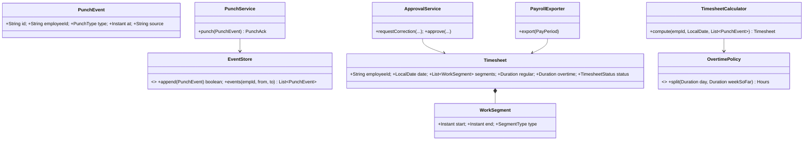

# 12 · Attendance Management System (Hourly Employees)

## Interview question
Design an attendance system for hourly employees. Interviewer gives almost no constraints — you must gather requirements, define assumptions, design APIs, data model, event flow, scalability, consistency, failure handling and observability.

## Assumptions / clarification (say these out loud)
- Users: hourly associates (e.g. Amazon FC workers), managers, payroll.
- Clock-in/out via badge kiosk, mobile app (geo-fenced), or biometric; kiosks may be **offline**.
- Shifts are scheduled; breaks (paid/unpaid); overtime rules (> 8 h/day or > 40 h/week → 1.5×).
- Hours feed **payroll** at the end of the pay period — correctness > latency.
- Scale: ~1M employees, 4 punches/day ⇒ ~4M events/day; spikes at shift change (50k punches in 10 minutes per region).
- Corrections (missed punch) require manager approval; full audit trail.

## Functional requirements
1. Clock in / out / break start / break end.
2. Compute worked hours per day/week, with overtime and break rules.
3. View timesheet (employee), approve/edit (manager) with reason.
4. Alerts: missed punch, late arrival, approaching overtime.
5. Export approved timesheets to payroll.

## Non-functional requirements
- Punch never lost (durability), even if kiosk offline.
- Punch API p99 < 200 ms; handle shift-change spikes.
- Idempotent punches (kiosk retries).
- Audit & compliance (labour law), data retention 7 years.
- Multi-region; employee data stays in region.

## CAP / consistency
- **Punch ingestion: AP** — accept at kiosk/edge, store locally, sync later; events are immutable.
- **Timesheet approval / payroll export: CP** — single source of truth per employee per pay period, versioned; export only after period is locked.

## Core entities
`Employee`, `Site`, `Shift`, `PunchEvent` (id, employeeId, type, deviceTime, receivedTime, source, siteId), `Timesheet` (employee, date, segments, totals, status), `WorkSegment`, `Correction`, `OvertimePolicy`, `BreakPolicy`, `PayPeriod`.

## IS-A / HAS-A
- `KioskSource`, `MobileSource` **IS-A** `PunchSource`.
- `DailyOvertimePolicy`, `WeeklyOvertimePolicy`, `CaliforniaOvertimePolicy` **IS-A** `OvertimePolicy`.
- `Timesheet` **HAS-A** list of `WorkSegment`, list of `Correction`.
- `Employee` **HAS-A** `Site`, list of `Shift`.

## Mermaid UML class diagram


## APIs
```
POST /punches  {punchId(uuid from device), employeeId, type: IN|OUT|BREAK_START|BREAK_END, deviceTime, siteId, source}
     → 202 {punchId, status: ACCEPTED|DUPLICATE}
GET  /employees/{id}/timesheets?from=2026-09-01&to=2026-09-15
POST /timesheets/{id}/corrections {punchType, time, reason}      (employee)
POST /corrections/{id}/approve | /reject                          (manager)
POST /payperiods/{id}/lock  → triggers payroll export
```

## Data model
```
punch_events (PK employee_id, SK device_time#punch_id)  -- DynamoDB / Cassandra, immutable, append-only
timesheets   (employee_id, work_date) PK, segments json, regular_min, ot_min, status, version
corrections  (id, employee_id, work_date, requested_by, approved_by, before, after, reason, status)
shifts       (employee_id, date, start, end, site_id)
```

## High-level flow / event flow
```
Kiosk (local SQLite queue) ──HTTPS──► API GW ─► PunchService ─► validate (employee active, geo-fence, dedupe)
                                                   └─► EventStore (append, idempotent on punchId)
                                                   └─► Kafka "punches" (partition by employeeId → ordered)
Kafka ─► TimesheetProjector: rebuild day timesheet from events + policies → timesheets table
      ─► AlertService: missing OUT after shift end + 1h, OT threshold
      ─► Analytics (S3/Redshift)
Manager approves corrections → Correction events → projector recomputes (version++)
Pay period end → lock → PayrollExporter reads APPROVED timesheets → file/API to payroll
```

## Design patterns
- **Event sourcing** – punches are facts; timesheets are projections (can recompute when policy changes).
- **Strategy** – overtime / break / rounding policies per region.
- **State** – Timesheet: OPEN → SUBMITTED → APPROVED → LOCKED.
- **Observer** – alerts off the event stream.
- **Chain of Responsibility** – punch validators (active employee, geofence, duplicate, sequence).
- **Outbox** – DB write + event publish atomically.

## SOLID mapping
- **S**: ingestion vs calculation vs approval vs export.
- **O**: new state/country rules = new `OvertimePolicy`.
- **L**: all policies interchangeable.
- **I**: `PunchValidator` single method.
- **D**: calculator depends on `OvertimePolicy` interface.

## Concurrency
- Per-employee ordering via Kafka partition key = employeeId; projector single consumer per partition → no lock needed.
- Idempotency: `punchId` generated on device; conditional put `attribute_not_exists`.
- Timesheet edits by manager use optimistic version to avoid overwriting a concurrent recompute.

## Failure handling
- Kiosk offline → local durable queue, sync with original device time + flag `delayed`.
- Duplicate submit → dedupe.
- Projector crash → replay from Kafka offset (idempotent projection).
- Payroll export failure → retry; export files are idempotent per period.
- Region outage → kiosks buffer; multi-AZ within region.

## Observability
- Metrics: punches/s, ingestion p99, duplicate rate, kiosk sync lag, projector consumer lag, missing-punch count, export success.
- Logs with punchId/employeeId (no PII in logs beyond IDs); traces across services.
- Alarms: consumer lag > 5 min, kiosk not synced > 30 min, error rate > 1 %.

## Edge cases
- Missing OUT punch → flag, don't guess silently; auto-close at shift end + require correction.
- Double IN → ignore second / flag.
- Overnight shift across midnight → assign to shift date, not calendar date.
- DST changes → compute in UTC, display in site zone.
- Employee terminated mid-period.
- Clock skew on kiosk → prefer server receive time if skew > threshold.

## End-to-end Java implementation (core calculation + ingestion)
```java
import java.time.*;
import java.util.*;
import java.util.concurrent.ConcurrentHashMap;

enum PunchType { IN, OUT, BREAK_START, BREAK_END }
enum TimesheetStatus { OPEN, SUBMITTED, APPROVED, LOCKED }

record PunchEvent(String punchId, String employeeId, PunchType type, Instant at, String source) {}
record PunchAck(String punchId, boolean duplicate) {}
record WorkSegment(Instant start, Instant end) { Duration length() { return Duration.between(start, end); } }
record Hours(Duration regular, Duration overtime) {}
record Timesheet(String employeeId, LocalDate date, List<WorkSegment> segments, Hours hours,
                 List<String> anomalies, TimesheetStatus status) {}

interface PunchValidator { void validate(PunchEvent e); }
interface EventStore { boolean append(PunchEvent e); List<PunchEvent> events(String empId, Instant from, Instant to); }
interface OvertimePolicy { Hours split(Duration workedToday); }

final class DailyOvertimePolicy implements OvertimePolicy {
    private final Duration threshold;
    DailyOvertimePolicy(Duration threshold) { this.threshold = threshold; }
    public Hours split(Duration worked) {
        return worked.compareTo(threshold) <= 0 ? new Hours(worked, Duration.ZERO)
                : new Hours(threshold, worked.minus(threshold));
    }
}

final class InMemoryEventStore implements EventStore {
    private final Map<String, PunchEvent> byId = new ConcurrentHashMap<>();
    public boolean append(PunchEvent e) { return byId.putIfAbsent(e.punchId(), e) == null; }
    public List<PunchEvent> events(String emp, Instant from, Instant to) {
        return byId.values().stream()
                .filter(e -> e.employeeId().equals(emp) && !e.at().isBefore(from) && e.at().isBefore(to))
                .sorted(Comparator.comparing(PunchEvent::at)).toList();
    }
}

final class PunchService {
    private final EventStore store; private final List<PunchValidator> validators;
    PunchService(EventStore store, List<PunchValidator> validators) { this.store = store; this.validators = List.copyOf(validators); }
    PunchAck punch(PunchEvent e) {
        validators.forEach(v -> v.validate(e));                       // chain of validators
        boolean fresh = store.append(e);                               // idempotent on punchId
        // if fresh → publish to Kafka (outbox) for projector/alerts
        return new PunchAck(e.punchId(), !fresh);
    }
}

final class TimesheetCalculator {
    private final OvertimePolicy overtime; private final ZoneId zone;
    TimesheetCalculator(OvertimePolicy overtime, ZoneId zone) { this.overtime = overtime; this.zone = zone; }

    Timesheet compute(String emp, LocalDate date, List<PunchEvent> events) {
        List<WorkSegment> segments = new ArrayList<>();
        List<String> anomalies = new ArrayList<>();
        Instant openedAt = null;
        for (PunchEvent e : events) {
            switch (e.type()) {
                case IN, BREAK_END -> {
                    if (openedAt != null) anomalies.add("Double " + e.type() + " at " + e.at());
                    else openedAt = e.at();
                }
                case OUT, BREAK_START -> {
                    if (openedAt == null) anomalies.add(e.type() + " without IN at " + e.at());
                    else { segments.add(new WorkSegment(openedAt, e.at())); openedAt = null; }
                }
            }
        }
        if (openedAt != null) anomalies.add("Missing OUT after " + openedAt);
        Duration worked = segments.stream().map(WorkSegment::length).reduce(Duration.ZERO, Duration::plus);
        return new Timesheet(emp, date, List.copyOf(segments), overtime.split(worked), List.copyOf(anomalies), TimesheetStatus.OPEN);
    }
}

public class AttendanceDemo {
    public static void main(String[] args) {
        ZoneId zone = ZoneId.of("Asia/Kolkata");
        EventStore store = new InMemoryEventStore();
        PunchValidator notFuture = e -> { if (e.at().isAfter(Instant.now().plusSeconds(300))) throw new IllegalArgumentException("future punch"); };
        PunchService svc = new PunchService(store, List.of(notFuture));

        LocalDate day = LocalDate.of(2026, 9, 25);
        Instant base = day.atTime(8, 0).atZone(zone).toInstant();
        svc.punch(new PunchEvent("p1", "E1", PunchType.IN, base, "KIOSK"));
        svc.punch(new PunchEvent("p2", "E1", PunchType.BREAK_START, base.plus(Duration.ofHours(4)), "KIOSK"));
        svc.punch(new PunchEvent("p3", "E1", PunchType.BREAK_END, base.plus(Duration.ofMinutes(270)), "KIOSK"));
        System.out.println(svc.punch(new PunchEvent("p3", "E1", PunchType.BREAK_END, base.plus(Duration.ofMinutes(270)), "KIOSK"))); // duplicate
        svc.punch(new PunchEvent("p4", "E1", PunchType.OUT, base.plus(Duration.ofHours(10)), "MOBILE"));

        var calc = new TimesheetCalculator(new DailyOvertimePolicy(Duration.ofHours(8)), zone);
        Instant from = day.atStartOfDay(zone).toInstant();
        System.out.println(calc.compute("E1", day, store.events("E1", from, from.plus(Duration.ofDays(1)))));
    }
}
```

## New requirements → how the class diagram evolves
| New requirement | Change |
|---|---|
| Weekly OT (> 40 h) | `WeeklyOvertimePolicy` needs week-to-date → `OvertimePolicy.split(day, weekSoFar)`; `CompositeOvertimePolicy`. |
| Punch rounding to 15 min | `RoundingPolicy` strategy applied before segmenting. |
| Face recognition to prevent buddy punching | New `PunchValidator` (biometric match). |
| Shift swap / PTO | `LeaveRequest` entity; calculator treats PTO as paid segment. |
| Multiple countries | Policy factory by `site.country`. |
| Real-time dashboard for managers | Stream aggregation (Kinesis/Flink) → Redis counts of who is on floor. |

## Amazon follow-up questions
1. Kiosk loses internet for 2 hours at shift change — what happens? How do you avoid losing or duplicating punches?
2. Why event sourcing here? What if overtime rules change retroactively?
3. How do you ensure payroll never pays twice for the same period?
4. How do you scale for 50k punches in 10 minutes? (Stateless API, partitioned writes, queue buffer.)
5. What would you monitor and alarm on?
6. Employee disputes hours — how do you prove what happened? (Immutable events + audit of corrections.)
