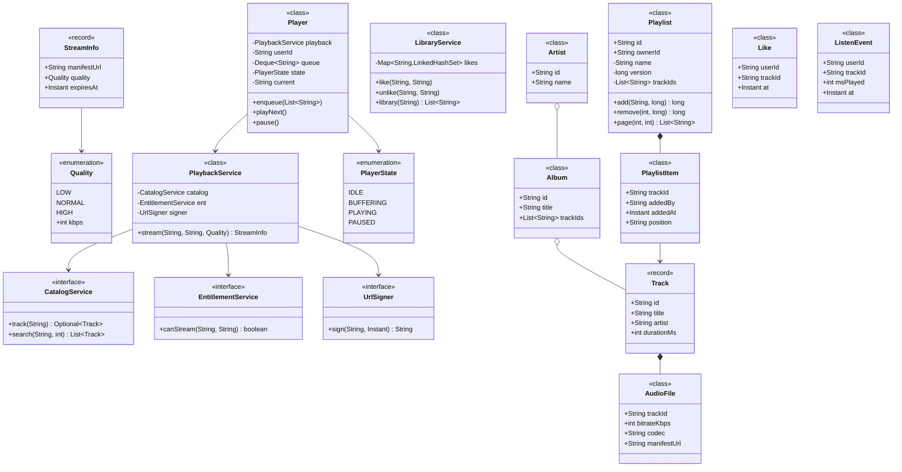
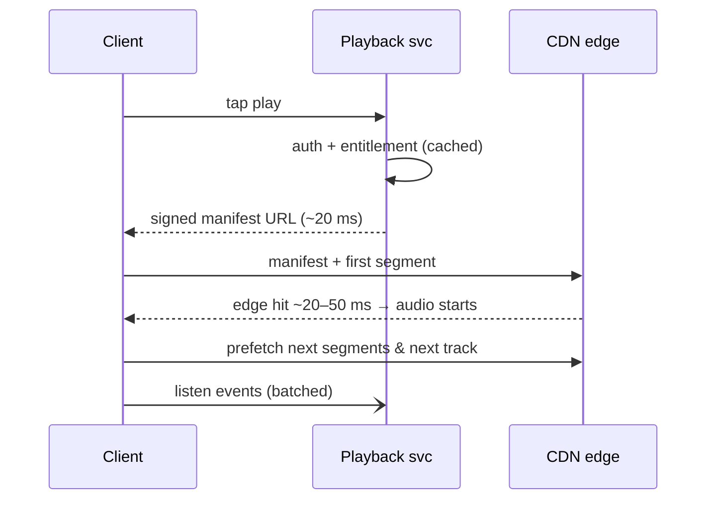

# 13 · Music Streaming Application (Spotify)

## Interview question
Design a music streaming platform for millions of users to discover, search and stream music. FR: search songs/artists/albums, playlists, like/save + library. NFR: playback starts in milliseconds, 99.99% availability, millions of concurrent listeners. Discuss API design, CDN, storage, DB choices, listening history, search, scaling, microservice boundaries.

## Assumptions / clarification
- 500M users, 100M DAU, peak 20M concurrent streams.
- 100M tracks, avg 4 MB per track per bitrate; 3–4 bitrates (96/160/320 kbps) → ~1.5 PB audio.
- Read-heavy: stream + browse ≫ write (likes, playlist edits).
- Premium vs free (ads) out of scope except as a flag.
- Offline download: mention, not deep.

## Functional requirements
1. Search songs, artists, albums (typo tolerant, prefix/autocomplete).
2. Stream a track (start fast, adaptive bitrate, seek).
3. Create/edit/share playlists.
4. Like/save songs; library view.
5. Record listening history for recommendations.

## Non-functional requirements
- Time-to-first-audio < 200 ms (p95).
- 99.99% availability for playback; search 99.9%.
- Horizontal scale; multi-region.
- Eventually consistent likes/history fine; playlists read-your-writes for the owner.

## CAP / consistency
- Audio files: immutable → cache anywhere; **AP**.
- Catalog metadata: read-mostly, **AP** with async replication.
- Playlists / library: **AP** with read-your-writes via session stickiness to home region; conflict = LWW per item.
- Payments/subscription: **CP** (separate service).

## Core entities
`User`, `Track` (id, title, duration, artistIds, albumId, audio manifests), `Artist`, `Album`, `Playlist` (owner, name, items, version), `PlaylistItem`, `Like`, `ListenEvent`, `AudioFile` (trackId, bitrate, codec, segmentUrls).

## IS-A / HAS-A
- `Track`, `Album`, `Artist` **IS-A** `CatalogEntity` (searchable).
- `UserPlaylist`, `GeneratedPlaylist` (Discover Weekly) **IS-A** `Playlist`.
- `Album` **HAS-A** tracks; `Playlist` **HAS-A** `PlaylistItem`s; `Track` **HAS-A** `AudioFile`s (per bitrate).

## Mermaid UML class diagram


## APIs
```
GET  /v1/search?q=arij&type=track,artist,album&limit=20&cursor=
GET  /v1/tracks/{id}                         -> metadata
GET  /v1/tracks/{id}/stream?quality=high     -> {manifestUrl (signed CDN URL, 1h expiry), licenseKey}
POST /v1/playlists {name}                    GET /v1/playlists/{id}?cursor=
POST /v1/playlists/{id}/items {trackIds[], position}   If-Match: version
DELETE /v1/playlists/{id}/items/{itemId}
PUT  /v1/me/tracks/{trackId}   (like)        DELETE /v1/me/tracks/{trackId}
GET  /v1/me/tracks?cursor=
POST /v1/me/listens [{trackId, msPlayed, ts}]  (batched from client)
```

## High-level architecture
```
Clients ─► DNS/GeoLB ─► API Gateway (auth, rate limit)
   ├─ Catalog Service ── Cassandra/DynamoDB (tracks/albums/artists) + Redis cache
   ├─ Search Service ─── Elasticsearch/OpenSearch (fed by CDC from catalog via Kafka)
   ├─ Playback Service ─ entitlement check → signed CDN URL for HLS/DASH manifest
   │        CDN (CloudFront/Akamai + own edge PoPs) ◄─ Origin: S3 (audio segments by bitrate)
   ├─ Playlist Service ─ DynamoDB (PK playlistId, SK position) / Cassandra
   ├─ Library Service ── DynamoDB (PK userId, SK likedAt#trackId)
   ├─ Listen/Event ingestion ─► Kafka ─► Stream processing ─► Data lake (S3) ─► Recommendation (batch + online features)
   └─ User/Subscription Service ── Aurora (relational, CP)
```

## Serving audio fast (the big follow-up)
- **Encode** each track into multiple bitrates (Ogg/AAC), chop into 5–10 s **segments** (HLS/DASH) → adaptive bitrate + seek + fast start (first segment small).
- **CDN**: popular tracks (power law — top 1 % = most plays) cached at edge; long tail served from regional origin shield → S3. Pre-warm new releases (Taylor Swift drop) to edges.
- **Signed URLs** with short expiry; DRM keys from license service.
- **Client tricks**: prefetch next track in queue, cache recently played on device, start with low bitrate then step up.
- **Multi-CDN** with health-based steering for availability.

## Storage & DB choices
| Data | Store | Why |
|---|---|---|
| Audio segments | S3 + CDN | Cheap, durable, immutable blobs |
| Catalog metadata | Cassandra/DynamoDB + Redis | Read-heavy key lookups, global replication |
| Search index | Elasticsearch | Full text, fuzzy, prefix (edge n-grams), ranking by popularity |
| Playlists | DynamoDB (PK playlistId) | Large lists, paginate by SK; version for optimistic concurrency |
| Likes/library | DynamoDB (PK userId, SK ts) | Per-user range reads |
| Listening history | Kafka → S3 (Parquet) + Cassandra last-N | Huge write volume, analytics |
| Users/billing | Aurora Postgres | Transactions |

## Search design
- Index docs: track(title, artist names, album, popularity), artist(name, followers), album(title, artist, year).
- Analyzers: lowercase, ascii-folding, edge-ngrams for autocomplete, phonetic/fuzzy (`fuzziness: AUTO`).
- Ranking: BM25 × popularity × personalization boost; separate autocomplete index; cache top queries in Redis.
- Update: catalog change → Kafka → indexer (near real-time, seconds).

## Design patterns
- **Microservices + API Gateway / BFF** (mobile vs web BFF).
- **CQRS** – writes to DB, reads via caches/search index.
- **Cache-aside** – metadata in Redis.
- **Event-driven** – listens/likes → Kafka → recommendations.
- **Strategy** – bitrate selection on client (ABR), CDN selection.
- LLD: **Iterator** for play queue, **State** for player (IDLE, BUFFERING, PLAYING, PAUSED).

## SOLID mapping (service level)
- **S**: each service owns one capability and its data.
- **O**: new content type (podcasts) = new catalog entity + indexer, playback reused.
- **D**: services talk through APIs/events, not shared DBs.

## High-level flow (press play)


## Concurrency
- Playlist collaborative edits: optimistic concurrency with `version`; fractional-index positions (`"a0"`, `"a0m"`) so concurrent inserts don't renumber.
- Like counts: sharded counters / async aggregation.
- Hot track at release: CDN absorbs; origin shield collapses requests.

## Edge cases
- Region-restricted licensing → entitlement per country.
- Track removed from catalog but in playlists → show greyed out.
- Network drop mid-song → buffered segments + retry, lower bitrate.
- Playlist with 10k songs → paginate.
- Duplicate listen events (retries) → event id dedupe.

## End-to-end Java implementation (core LLD: player queue, playlist, library)
```java
import java.time.Instant;
import java.util.*;
import java.util.concurrent.ConcurrentHashMap;

enum PlayerState { IDLE, BUFFERING, PLAYING, PAUSED }
enum Quality { LOW(96), NORMAL(160), HIGH(320); final int kbps; Quality(int k) { kbps = k; } }

record Track(String id, String title, String artist, int durationMs) {}
record StreamInfo(String manifestUrl, Quality quality, Instant expiresAt) {}

interface CatalogService { Optional<Track> track(String id); List<Track> search(String q, int limit); }
interface EntitlementService { boolean canStream(String userId, String trackId); }
interface UrlSigner { String sign(String path, Instant expiry); }

final class PlaybackService {
    private final CatalogService catalog; private final EntitlementService ent; private final UrlSigner signer;
    PlaybackService(CatalogService c, EntitlementService e, UrlSigner s) { catalog = c; ent = e; signer = s; }

    StreamInfo stream(String userId, String trackId, Quality q) {
        catalog.track(trackId).orElseThrow(() -> new NoSuchElementException("track"));
        if (!ent.canStream(userId, trackId)) throw new SecurityException("not entitled");
        Instant exp = Instant.now().plusSeconds(3600);
        return new StreamInfo(signer.sign("/audio/" + trackId + "/" + q.kbps + "/master.m3u8", exp), q, exp);
    }
}

final class Playlist {
    final String id, ownerId; private String name; private long version;
    private final List<String> trackIds = new ArrayList<>();
    Playlist(String id, String ownerId, String name) { this.id = id; this.ownerId = ownerId; this.name = name; }

    synchronized long add(String trackId, long expectedVersion) {
        if (expectedVersion != version) throw new IllegalStateException("412 version conflict");
        trackIds.add(trackId); return ++version;
    }
    synchronized long remove(int index, long expectedVersion) {
        if (expectedVersion != version) throw new IllegalStateException("412 version conflict");
        trackIds.remove(index); return ++version;
    }
    synchronized List<String> page(int from, int size) {
        return List.copyOf(trackIds.subList(Math.min(from, trackIds.size()), Math.min(from + size, trackIds.size())));
    }
    synchronized long version() { return version; }
}

final class LibraryService {
    private final Map<String, LinkedHashSet<String>> likes = new ConcurrentHashMap<>();
    void like(String user, String track)   { likes.computeIfAbsent(user, k -> new LinkedHashSet<>()).add(track); }   // idempotent
    void unlike(String user, String track) { likes.getOrDefault(user, new LinkedHashSet<>()).remove(track); }
    List<String> library(String user) { List<String> l = new ArrayList<>(likes.getOrDefault(user, new LinkedHashSet<>())); Collections.reverse(l); return l; }
}

final class Player {
    private final PlaybackService playback; private final String userId;
    private final Deque<String> queue = new ArrayDeque<>();
    private PlayerState state = PlayerState.IDLE; private String current;
    Player(PlaybackService p, String userId) { this.playback = p; this.userId = userId; }

    void enqueue(List<String> trackIds) { queue.addAll(trackIds); }
    void playNext() {
        current = queue.poll();
        if (current == null) { state = PlayerState.IDLE; return; }
        state = PlayerState.BUFFERING;
        StreamInfo info = playback.stream(userId, current, Quality.NORMAL);
        System.out.println("Fetching " + info.manifestUrl());
        state = PlayerState.PLAYING;
        if (!queue.isEmpty()) System.out.println("Prefetching next: " + queue.peek());
    }
    void pause() { if (state == PlayerState.PLAYING) state = PlayerState.PAUSED; }
    PlayerState state() { return state; }
}

public class MusicDemo {
    public static void main(String[] args) {
        Map<String, Track> db = Map.of("t1", new Track("t1", "Kesariya", "Arijit", 268000),
                                       "t2", new Track("t2", "Levitating", "Dua", 203000));
        CatalogService catalog = new CatalogService() {
            public Optional<Track> track(String id) { return Optional.ofNullable(db.get(id)); }
            public List<Track> search(String q, int n) {
                return db.values().stream().filter(t -> (t.title() + " " + t.artist()).toLowerCase().contains(q.toLowerCase())).limit(n).toList();
            }
        };
        PlaybackService playback = new PlaybackService(catalog, (u, t) -> true,
                (path, exp) -> "https://cdn.example.com" + path + "?exp=" + exp.getEpochSecond() + "&sig=abc");

        System.out.println(catalog.search("arij", 5));
        Playlist p = new Playlist("p1", "u1", "Road trip");
        long v = p.add("t1", 0); p.add("t2", v);
        Player player = new Player(playback, "u1");
        player.enqueue(p.page(0, 50));
        player.playNext();
        System.out.println(player.state());

        LibraryService lib = new LibraryService();
        lib.like("u1", "t2"); lib.like("u1", "t1"); lib.like("u1", "t1");
        System.out.println(lib.library("u1"));
    }
}
```

## New requirements → how the class diagram evolves
| New requirement | Change |
|---|---|
| Podcasts | `Episode` IS-A `Playable`; `Track` also `Playable`; player works on `Playable`. |
| Collaborative playlists | `Playlist` HAS-A collaborators; fractional positions; per-item author. |
| Offline downloads | `DownloadService` with DRM license + device limit. |
| Lyrics | `LyricsService` keyed by trackId, synced timestamps. |
| Shuffle / repeat | `QueueOrderStrategy` (Sequential, Shuffle, RepeatOne). |
| Ads for free tier | `AdInsertionStrategy` in player queue. |

## Amazon follow-up questions

Tap a question to see a simple answer.

<details class="qa">
<summary><span class="qn">1</span>How do you get playback to start in &lt; 200 ms globally?</summary>

Keep everything close to the user. Serve audio from a CDN edge near them, cache login and licence checks so starting is one fast call, start with a small, low-bitrate first segment, and preload the next track before the current one ends.

</details>

<details class="qa">
<summary><span class="qn">2</span>Monolith vs microservices — where do you draw boundaries, and what do you lose (transactions)?</summary>

Split by business area: playback, catalog, search, playlists, users, recommendations. Each owns its data and scales on its own (playback is huge, playlists small). You lose easy cross-area transactions, so you use events and design for 'eventually consistent', for example a new song shows in search a few seconds later.

</details>

<details class="qa">
<summary><span class="qn">3</span>Which DB for playlists and why not SQL?</summary>

Playlists are read by id, can be very long, and need to scale to billions, so a key-value or wide-column store (DynamoDB, Cassandra) with key = playlist id fits well. SQL works but sharding and huge playlists are harder, and we don't need joins here.

</details>

<details class="qa">
<summary><span class="qn">4</span>How is search kept up to date with the catalog?</summary>

The catalog publishes an event on every change (new song, edit, removal). A worker reads these events and updates the search index (Elasticsearch). Search is a few seconds behind, which is fine. A nightly full re-index fixes any drift.

</details>

<details class="qa">
<summary><span class="qn">5</span>A new album drops and 10M users press play in the same minute — what breaks?</summary>

Audio files are cached on the CDN, so it absorbs the play load. The weak points are the metadata and licence services, hit 10M times at once. Warm the caches before the release, cache album data aggressively, rate-limit or queue non-essential calls, and pre-scale servers for the launch time.

</details>

<details class="qa">
<summary><span class="qn">6</span>How do you store listening history for recommendations at 1B events/day?</summary>

Write events to Kafka, then to cheap storage like S3 in columnar files. Batch jobs build daily features for recommendations, and a small store (Cassandra or DynamoDB) keeps each user's recent history for quick lookups. Never write to a normal database per event at that scale.

</details>

<details class="qa">
<summary><span class="qn">7</span>How do you do 99.99%? (Multi-AZ, multi-region active-active for playback, multi-CDN, graceful degradation — search down shouldn't stop playback.)</summary>

Run in several availability zones and at least two regions, both serving traffic, and use more than one CDN. Most importantly, degrade gracefully: if search or recommendations fail, playback keeps working. Each part fails on its own without taking playback down.

</details>
