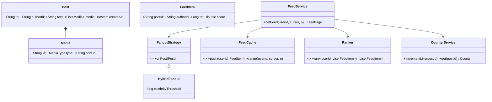

# 14 · Facebook-like News Feed at Scale

## Interview question
Design a social feed: users post text/images/videos, view posts in a feed, like/view counts visible in near real time, minimal latency. Feed must render almost instantly on login even with a cleared app cache. Discuss push vs pull, DB choice, caching/CDN, viral celebrity posts, rate limiting, sharding, async counters, monolith vs microservices.

## Assumptions / clarification
- 2B users, 500M DAU; avg 300 friends/follows; celebrities up to 100M followers.
- 100M new posts/day; feed reads ~10B/day (read ≫ write).
- Feed = ranked, paginated (20 items/page). Eventual consistency OK (post appears in friends' feeds within seconds).
- Counts may be approximate for a few seconds.

## Functional requirements
1. Create post with text / media.
2. Get home feed (paginated, ranked).
3. Like / unlike, record view.
4. Show like & view counts (near real-time).
5. Follow / unfollow.

## Non-functional requirements
- Feed p99 < 200 ms, even on cold client.
- High availability (feed degrades, never fails blank).
- Handle viral spikes (millions of likes/min on one post).
- Durable posts; media served via CDN.

## CAP / consistency
- Feed, counts: **AP**, eventual.
- Post creation: durable write to primary store before ack (author sees it immediately — read-your-writes by merging own posts client/server side).
- Likes: idempotent per (user, post) — the set of likers is the truth; counters are derived.

## Core entities
`User`, `Follow` (follower, followee), `Post` (id, authorId, text, mediaIds, createdAt), `Media` (id, type, url, variants), `FeedItem` (userId, postId, score, ts), `Like` (userId, postId), `Counter` (postId, likes, views).

## IS-A / HAS-A
- `TextPost`, `ImagePost`, `VideoPost` → better: `Post` **HAS-A** list of `Media` (composition), `Media` has `MediaType`.
- `PushFanout`, `PullFanout`, `HybridFanout` **IS-A** `FanoutStrategy`.
- `FeedService` **HAS-A** `FeedCache`, `FanoutStrategy`, `Ranker`.

## Mermaid UML class diagram


## APIs
```
POST /v1/media/uploads {type, size}        -> {mediaId, presignedUrl}
POST /v1/posts {text, mediaIds[]}          Idempotency-Key -> {postId}
GET  /v1/feed?cursor=<opaque>&limit=20     -> {items:[{post, author, counts, likedByMe}], nextCursor}
PUT  /v1/posts/{id}/like                   DELETE /v1/posts/{id}/like
POST /v1/posts/views  [{postId, ts}]       (batched)
GET  /v1/posts/{id}/counts
WS/SSE /v1/realtime  (count updates for posts on screen)
```

## Push vs Pull
| | Push (fan-out on write) | Pull (fan-out on read) |
|---|---|---|
| Write cost | O(followers) per post | O(1) |
| Read cost | O(1) — precomputed | O(followees) merge |
| Latency | Fast reads | Slow reads |
| Problem | Celebrity with 100M followers | Every read expensive |
**Hybrid (what FB/Twitter/Instagram do):** push for normal users into followers' feed caches; **don't** fan out celebrities — at read time merge the precomputed feed with recent posts from the (few) celebrities the user follows. Skip fan-out to inactive users (they pull when they return).

## High-level architecture
```
Client ─► CDN (media, static) 
       ─► API GW (auth, rate limit) ─► Post Service ─► Posts DB (Cassandra/DynamoDB, PK postId)
                                              └► Kafka "post-created"
         Fan-out workers ◄── Kafka: fetch followers (Graph svc) → append postId to each follower's feed list (Redis sorted set / Cassandra)
       ─► Feed Service: read feed cache → merge celebrity posts → rank → hydrate posts (post cache) + counts + author → page
       ─► Like Service: write like row (idempotent) → Kafka → counter aggregator (batch per second) → Counter store + Redis
       ─► Media Service: presigned S3 upload → transcoder (video) → CDN URLs
Graph Service (follows): sharded MySQL/TAO-style cache
```

## Cold start ("cleared cache, feed instant")
- Server keeps **precomputed feed** per active user (Redis, top 500 postIds) — client cache isn't needed.
- First page response is **fully hydrated** in one call (post + author + counts), from caches.
- Media: thumbnails/low-res first from CDN, progressive loading; lazy-load videos.
- Pre-generate on login event (warm feed for users about to open app — push notifications trigger warmup).
- Serve first page from edge/BFF with minimal payload; rest loads while scrolling.

## Databases
| Data | Store | Reason |
|---|---|---|
| Posts | Cassandra/DynamoDB | Huge write volume, key lookup, time-ordered per author |
| Social graph | Sharded MySQL + cache (TAO) or graph store | Adjacency lists, strong-ish consistency |
| Feed lists | Redis sorted sets (hot) + Cassandra (cold) | Fast range reads |
| Likes | Cassandra (PK postId, CK userId) + (PK userId, CK postId) | Idempotent, "did I like it" |
| Counters | Redis + periodic flush to DB | High write rate |
| Media | S3 + CDN | Blobs |

## Viral / celebrity problem
- **Writes (likes)**: don't `UPDATE count = count+1` on one row. Sharded counters (N sub-keys `likes:post:{shard}` randomly incremented, summed on read) or buffer in Kafka and aggregate in-memory per second per post, write once.
- **Reads (same post fetched by millions)**: post object in local in-process cache + Redis replicas; request coalescing; CDN for media.
- **Fan-out**: celebrities pulled at read time (no 100M writes).
- **Real-time counts**: push aggregated counts every 1–2 s via WebSocket only for posts currently on screen; show "1.2M" (approximate is fine).
- **Rate limit** per user for likes/posts to stop bots; partition hot keys by `postId+shard`.

## Design patterns
- **Strategy** – fan-out (push/pull/hybrid), ranking.
- **Observer / event-driven** – post created → fan-out, notifications, search index.
- **CQRS** – writes to stores, reads from precomputed views.
- **Cache-aside**, **Write-behind** for counters.
- **Facade / BFF** – feed API hydrates everything.

## SOLID mapping
- **S**: post storage, graph, fan-out, ranking, counters in separate services/classes.
- **O**: new ranking model = new `Ranker`.
- **D**: `FeedService` depends on `FeedCache` / `Ranker` interfaces.

## Concurrency
- Likes idempotent: `INSERT IF NOT EXISTS (postId, userId)` → only then emit +1 event → exactly the right count even with retries.
- Counter aggregator partitioned by postId (single consumer per partition, no locks).
- Feed list append is commutative (sorted by ts) → no ordering issues.

## Edge cases
- Delete post → tombstone; filtered at hydration time (lazy removal from feeds).
- Unfollow → filter at read; async cleanup.
- User follows 5k people incl. 200 celebrities → cap celebrity merge, cache celebrity recent posts.
- Privacy change after fan-out → re-check visibility at hydration.
- Duplicate posts on retry → idempotency key.

## Monolith vs microservices
- Start: modular monolith is fine for a small team.
- At this scale: microservices — Post, Media, Graph, Fan-out, Feed, Like/Counter, Notification, Ranking — because they scale **independently** (feed reads 100× posts), deploy independently, and fail independently (counter outage shouldn't break feed; show last known counts).

## End-to-end Java implementation (core feed LLD)
```java
import java.time.Instant;
import java.util.*;
import java.util.concurrent.*;
import java.util.concurrent.atomic.LongAdder;
import java.util.stream.Collectors;

record Post(String id, String authorId, String text, Instant createdAt) {}
record FeedItem(String postId, String authorId, long ts) {}
record Counts(long likes, long views) {}
record FeedEntry(Post post, Counts counts) {}

interface GraphService { Set<String> followers(String userId); Set<String> followees(String userId); long followerCount(String userId); }

final class PostStore {
    private final Map<String, Post> posts = new ConcurrentHashMap<>();
    private final Map<String, Deque<Post>> byAuthor = new ConcurrentHashMap<>();
    void save(Post p) { posts.put(p.id(), p); byAuthor.computeIfAbsent(p.authorId(), k -> new ConcurrentLinkedDeque<>()).addFirst(p); }
    Optional<Post> get(String id) { return Optional.ofNullable(posts.get(id)); }
    List<Post> recentBy(String author, int n) { return byAuthor.getOrDefault(author, new ArrayDeque<>()).stream().limit(n).toList(); }
}

final class FeedCache {
    private static final int MAX = 500;
    private final Map<String, ConcurrentSkipListSet<FeedItem>> feeds = new ConcurrentHashMap<>();
    private static final Comparator<FeedItem> NEWEST = Comparator.comparingLong(FeedItem::ts).reversed().thenComparing(FeedItem::postId);
    void push(String user, FeedItem item) {
        var set = feeds.computeIfAbsent(user, k -> new ConcurrentSkipListSet<>(NEWEST));
        set.add(item);
        while (set.size() > MAX) set.pollLast();
    }
    List<FeedItem> top(String user, int n) { return feeds.getOrDefault(user, new ConcurrentSkipListSet<>(NEWEST)).stream().limit(n).toList(); }
}

final class CounterService {
    private final Map<String, LongAdder> likes = new ConcurrentHashMap<>(), views = new ConcurrentHashMap<>();
    private final Set<String> likedBy = ConcurrentHashMap.newKeySet();
    boolean like(String user, String post) {
        if (!likedBy.add(user + "|" + post)) return false;            // idempotent
        likes.computeIfAbsent(post, k -> new LongAdder()).increment(); // LongAdder = striped counter (hot key friendly)
        return true;
    }
    void view(String post) { views.computeIfAbsent(post, k -> new LongAdder()).increment(); }
    Counts get(String post) {
        return new Counts(Optional.ofNullable(likes.get(post)).map(LongAdder::sum).orElse(0L),
                          Optional.ofNullable(views.get(post)).map(LongAdder::sum).orElse(0L));
    }
}

interface FanoutStrategy { void onPost(Post p); }

final class HybridFanout implements FanoutStrategy {
    private final GraphService graph; private final FeedCache cache; private final long celebrityThreshold;
    private final ExecutorService workers = Executors.newFixedThreadPool(4);
    HybridFanout(GraphService g, FeedCache c, long threshold) { graph = g; cache = c; celebrityThreshold = threshold; }
    boolean isCelebrity(String userId) { return graph.followerCount(userId) >= celebrityThreshold; }
    public void onPost(Post p) {
        if (isCelebrity(p.authorId())) return;                          // pulled at read time
        FeedItem item = new FeedItem(p.id(), p.authorId(), p.createdAt().toEpochMilli());
        for (String f : graph.followers(p.authorId())) workers.submit(() -> cache.push(f, item));
        cache.push(p.authorId(), item);                                 // read-your-own-post
    }
    void shutdown() throws InterruptedException { workers.shutdown(); workers.awaitTermination(1, TimeUnit.SECONDS); }
}

final class FeedService {
    private final PostStore posts; private final FeedCache cache; private final GraphService graph;
    private final HybridFanout fanout; private final CounterService counters;
    FeedService(PostStore p, FeedCache c, GraphService g, HybridFanout f, CounterService cs) { posts = p; cache = c; graph = g; fanout = f; counters = cs; }

    Post createPost(String author, String text) {
        Post p = new Post(UUID.randomUUID().toString(), author, text, Instant.now());
        posts.save(p);
        fanout.onPost(p);                       // in prod: Kafka event → fan-out workers
        return p;
    }

    List<FeedEntry> feed(String user, int limit) {
        List<FeedItem> merged = new ArrayList<>(cache.top(user, limit * 2));
        graph.followees(user).stream().filter(fanout::isCelebrity)          // pull celebrity posts
             .flatMap(c -> posts.recentBy(c, limit).stream())
             .forEach(p -> merged.add(new FeedItem(p.id(), p.authorId(), p.createdAt().toEpochMilli())));
        return merged.stream()
                .sorted(Comparator.comparingLong(FeedItem::ts).reversed())    // Ranker would go here
                .map(i -> posts.get(i.postId())).flatMap(Optional::stream)   // hydrate, drops deleted
                .distinct().limit(limit)
                .map(p -> new FeedEntry(p, counters.get(p.id())))
                .collect(Collectors.toList());
    }
}

public class NewsFeedDemo {
    public static void main(String[] args) throws Exception {
        Map<String, Set<String>> followers = Map.of("alice", Set.of("bob"), "srk", Set.of("bob", "carol"));
        GraphService graph = new GraphService() {
            public Set<String> followers(String u) { return followers.getOrDefault(u, Set.of()); }
            public Set<String> followees(String u) { return followers.entrySet().stream().filter(e -> e.getValue().contains(u)).map(Map.Entry::getKey).collect(Collectors.toSet()); }
            public long followerCount(String u) { return u.equals("srk") ? 100_000_000L : followers(u).size(); }
        };
        PostStore store = new PostStore(); FeedCache cache = new FeedCache(); CounterService counters = new CounterService();
        HybridFanout fanout = new HybridFanout(graph, cache, 1_000_000);
        FeedService feed = new FeedService(store, cache, graph, fanout, counters);

        Post a = feed.createPost("alice", "Hello from Alice");
        Thread.sleep(5);
        Post s = feed.createPost("srk", "New movie trailer!");
        counters.like("bob", s.id()); counters.like("bob", s.id()); counters.like("carol", s.id());
        fanout.shutdown();
        feed.feed("bob", 10).forEach(e -> System.out.println(e.post().authorId() + ": " + e.post().text() + " " + e.counts()));
    }
}
```

## New requirements → how the class diagram evolves
| New requirement | Change |
|---|---|
| ML ranking | `Ranker` interface: `ChronologicalRanker`, `MlRanker` (features: affinity, recency, engagement). |
| Stories (24 h expiry) | `Story` entity with TTL; separate tray service. |
| Comments | `CommentService`, counts via same counter pipeline. |
| Ads in feed | `FeedMixer` inserts ads every N items (Decorator on feed result). |
| Groups / pages | New `FeedSource`s merged at read time. |
| Close-friends visibility | `VisibilityPolicy` checked during hydration. |

## Amazon follow-up questions
1. Push vs pull — which, and how do you handle a user with 100M followers?
2. A post gets 5M likes in a minute — walk me through the write path.
3. How does the feed load instantly after the user clears app cache?
4. SQL or NoSQL for posts/likes/graph? Why a combination?
5. What do you cache, and how do you invalidate when a post is edited or deleted?
6. How do you shard the feed store? Hot shard for celebrities?
7. Why microservices here — which boundaries, and what goes wrong across them?
