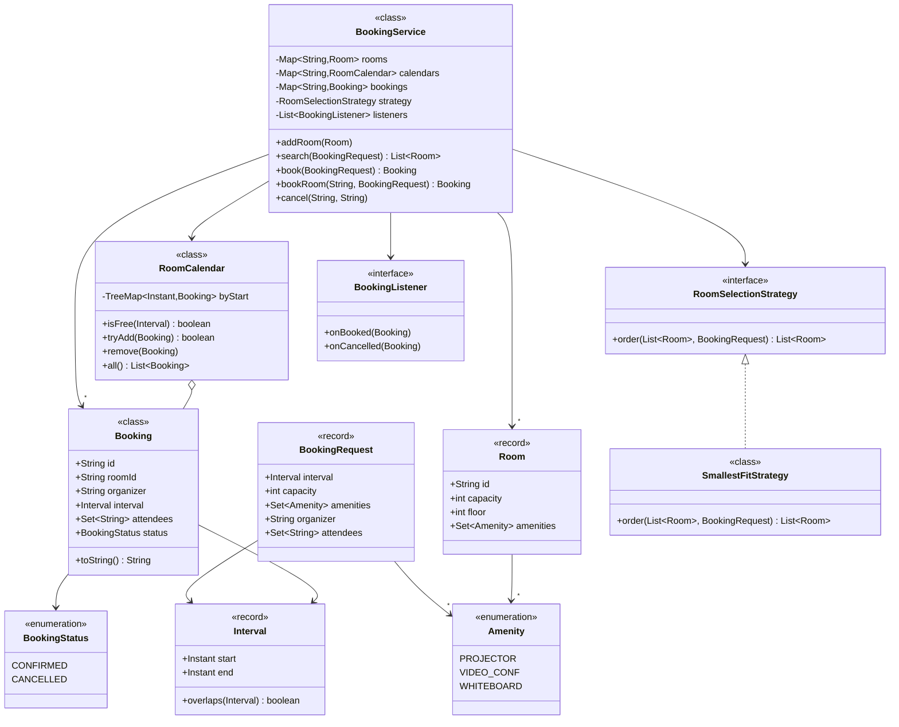
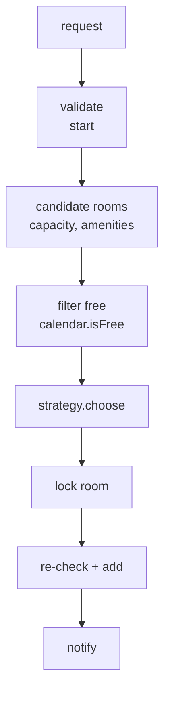

# 15 · Meeting Room Scheduler / Booking

## Interview question
Design and implement a meeting room scheduler: book rooms for time intervals, no double booking, find available rooms, cancel, notify attendees.

## Assumptions / clarification
- Rooms have capacity, building/floor, amenities (projector, VC).
- Bookings are `[start, end)` half-open intervals — back-to-back 10–11 and 11–12 is allowed.
- Booking granularity 15 min; max duration 8 h; up to 90 days ahead.
- Recurring meetings: follow-up.
- Single office first, then multiple buildings.

## Functional requirements
1. Add rooms.
2. Search available rooms for `[start,end)`, capacity ≥ N, amenities.
3. Book a room (atomic, no overlap).
4. Cancel / modify booking.
5. View room calendar / user bookings.
6. Notify attendees on book/cancel.

## Non-functional requirements
- No double booking under concurrency (correctness).
- Search < 100 ms for ~1000 rooms.
- Extensible selection (smallest fitting room, nearest floor).

## CAP / consistency
- Booking: **CP** (per-room serialization / DB exclusion constraint).
- Availability views/calendars: can be cached, eventually consistent.

## Core entities
`Room`, `Interval`, `Booking`, `User`, `RoomCalendar` (per room sorted intervals), `RoomSelectionStrategy`, `BookingService`, `NotificationService`.

## IS-A / HAS-A
- `SmallestFitStrategy`, `NearestFloorStrategy` **IS-A** `RoomSelectionStrategy`.
- `EmailNotifier`, `SlackNotifier` **IS-A** `BookingListener`.
- `RoomCalendar` **HAS-A** `TreeMap<Instant, Booking>`; `BookingService` **HAS-A** calendars, strategy, listeners.

## UML diagram


## APIs
```
GET  /rooms/available?start=..&end=..&capacity=6&amenities=VC
POST /bookings {roomId?, start, end, capacity, attendees[], title}   Idempotency-Key -> 201 Booking | 409 CONFLICT
DELETE /bookings/{id}
GET  /rooms/{id}/calendar?date=2026-09-28
```

## Design patterns
- **Strategy** – room selection.
- **Observer** – notifications / calendar sync.
- **Builder** – `BookingRequest`.
- **Facade** – `BookingService`.
- **Command** – booking/cancel operations (undo = cancel).

## SOLID mapping
- **S**: calendar (overlap logic) vs service (orchestration) vs notifier.
- **O**: new selection rule = new strategy.
- **L/I**: small interfaces.
- **D**: service depends on strategy and listener interfaces.

## High-level flow


## Overlap check in O(log n)
With a `TreeMap` keyed by start: the only bookings that can overlap `[s,e)` are the **floor** entry (start ≤ s) and the **ceiling** entry (start ≥ s). Conflict iff `floor.end > s` or `ceiling.start < e`.

## Concurrency
- Lock **per room** (`synchronized(calendar)` / `ReentrantLock`), never a global lock → bookings in different rooms are parallel.
- Check-then-insert must be inside the same lock.
- DB: Postgres `EXCLUDE USING gist (room_id WITH =, tstzrange(start,end) WITH &&)` — the DB rejects overlaps. Or slot table `(room_id, slot_15min)` unique constraint.
- Auto-pick room: try candidates in strategy order; if `tryBook` loses the race, move to next.

## Edge cases
- `start >= end`, in the past, beyond horizon → 400.
- Back-to-back meetings allowed (half-open).
- Time zones across buildings → store UTC.
- Cancel by non-organizer → 403.
- Room under maintenance → blocked interval.
- No-show release after 10 min (follow-up).

## End-to-end Java implementation
```java
import java.time.*;
import java.util.*;
import java.util.concurrent.*;
import java.util.stream.Collectors;

enum Amenity { PROJECTOR, VIDEO_CONF, WHITEBOARD }
enum BookingStatus { CONFIRMED, CANCELLED }

record Room(String id, int capacity, int floor, Set<Amenity> amenities) {
    Room { amenities = Set.copyOf(amenities); }
}

record Interval(Instant start, Instant end) {
    Interval {
        if (!start.isBefore(end)) throw new IllegalArgumentException("start must be before end");
    }
    boolean overlaps(Interval o) { return start.isBefore(o.end) && o.start.isBefore(end); }
}

final class Booking {
    final String id = UUID.randomUUID().toString();
    final String roomId, organizer; final Interval interval; final Set<String> attendees;
    volatile BookingStatus status = BookingStatus.CONFIRMED;
    Booking(String roomId, Interval i, String organizer, Set<String> attendees) {
        this.roomId = roomId; this.interval = i; this.organizer = organizer; this.attendees = Set.copyOf(attendees);
    }
    public String toString() { return "Booking[" + roomId + " " + interval.start() + "→" + interval.end() + " by " + organizer + "]"; }
}

record BookingRequest(Interval interval, int capacity, Set<Amenity> amenities, String organizer, Set<String> attendees) {}

final class RoomCalendar {
    private final TreeMap<Instant, Booking> byStart = new TreeMap<>();

    synchronized boolean isFree(Interval i) {
        Map.Entry<Instant, Booking> before = byStart.floorEntry(i.start());
        if (before != null && before.getValue().interval.end().isAfter(i.start())) return false;
        Map.Entry<Instant, Booking> after = byStart.ceilingEntry(i.start());
        return after == null || !after.getValue().interval.start().isBefore(i.end());
    }

    synchronized boolean tryAdd(Booking b) {           // check + insert atomically
        if (!isFree(b.interval)) return false;
        byStart.put(b.interval.start(), b);
        return true;
    }

    synchronized void remove(Booking b) { byStart.remove(b.interval.start(), b); }
    synchronized List<Booking> all() { return List.copyOf(byStart.values()); }
}

interface RoomSelectionStrategy { List<Room> order(List<Room> candidates, BookingRequest req); }

final class SmallestFitStrategy implements RoomSelectionStrategy {
    public List<Room> order(List<Room> c, BookingRequest r) {
        return c.stream().sorted(Comparator.comparingInt(Room::capacity).thenComparing(Room::id)).toList();
    }
}

interface BookingListener { void onBooked(Booking b); void onCancelled(Booking b); }

final class BookingService {
    private final Map<String, Room> rooms = new ConcurrentHashMap<>();
    private final Map<String, RoomCalendar> calendars = new ConcurrentHashMap<>();
    private final Map<String, Booking> bookings = new ConcurrentHashMap<>();
    private final RoomSelectionStrategy strategy;
    private final List<BookingListener> listeners;

    BookingService(RoomSelectionStrategy s, List<BookingListener> listeners) { this.strategy = s; this.listeners = List.copyOf(listeners); }

    void addRoom(Room r) { rooms.put(r.id(), r); calendars.put(r.id(), new RoomCalendar()); }

    List<Room> search(BookingRequest req) {
        List<Room> fit = rooms.values().stream()
                .filter(r -> r.capacity() >= req.capacity() && r.amenities().containsAll(req.amenities()))
                .filter(r -> calendars.get(r.id()).isFree(req.interval()))
                .collect(Collectors.toList());
        return strategy.order(fit, req);
    }

    Booking book(BookingRequest req) {
        for (Room r : search(req)) {                    // race lost on one room → try next
            Booking b = new Booking(r.id(), req.interval(), req.organizer(), req.attendees());
            if (calendars.get(r.id()).tryAdd(b)) {
                bookings.put(b.id, b);
                listeners.forEach(l -> l.onBooked(b));
                return b;
            }
        }
        throw new IllegalStateException("409 No room available");
    }

    Booking bookRoom(String roomId, BookingRequest req) {
        Booking b = new Booking(roomId, req.interval(), req.organizer(), req.attendees());
        if (!calendars.get(roomId).tryAdd(b)) throw new IllegalStateException("409 Room already booked");
        bookings.put(b.id, b);
        listeners.forEach(l -> l.onBooked(b));
        return b;
    }

    void cancel(String bookingId, String user) {
        Booking b = Optional.ofNullable(bookings.get(bookingId)).orElseThrow();
        if (!b.organizer.equals(user)) throw new SecurityException("403 only organizer can cancel");
        b.status = BookingStatus.CANCELLED;
        calendars.get(b.roomId).remove(b);
        listeners.forEach(l -> l.onCancelled(b));
    }
}

public class MeetingRoomDemo {
    public static void main(String[] args) throws Exception {
        BookingListener log = new BookingListener() {
            public void onBooked(Booking b) { System.out.println("Invite sent: " + b); }
            public void onCancelled(Booking b) { System.out.println("Cancelled: " + b); }
        };
        BookingService svc = new BookingService(new SmallestFitStrategy(), List.of(log));
        svc.addRoom(new Room("Everest", 10, 3, Set.of(Amenity.VIDEO_CONF)));
        svc.addRoom(new Room("K2", 4, 2, Set.of()));

        Instant ten = Instant.parse("2026-09-28T10:00:00Z");
        Interval slot = new Interval(ten, ten.plus(Duration.ofHours(1)));
        BookingRequest req = new BookingRequest(slot, 4, Set.of(), "amar", Set.of("gurubani"));

        // two people race for the same slot: smallest-fit picks K2 first, loser falls back to Everest
        ExecutorService pool = Executors.newFixedThreadPool(2);
        Future<Booking> f1 = pool.submit(() -> svc.book(req)), f2 = pool.submit(() -> svc.book(req));
        System.out.println(f1.get().roomId + " / " + f2.get().roomId);
        pool.shutdown();

        Booking backToBack = svc.bookRoom("K2", new BookingRequest(new Interval(slot.end(), slot.end().plus(Duration.ofMinutes(30))), 2, Set.of(), "amar", Set.of()));
        svc.cancel(backToBack.id, "amar");
        try { svc.book(req); } catch (IllegalStateException e) { System.out.println(e.getMessage()); }
    }
}
```

## New requirements → how the class diagram evolves
| New requirement | Change |
|---|---|
| Recurring meetings | `RecurrenceRule` (daily/weekly, until) → expand into occurrences; book all-or-none or skip conflicts. |
| Minimum rooms needed for N meetings (classic DSA) | Sort starts/ends or min-heap of end times. |
| Priority bumping (CEO meeting) | `ConflictResolutionPolicy`; bumped booking notified. |
| No-show auto-release | Check-in via tablet; scheduler releases after 10 min. |
| Multiple buildings / time zones | `Building` HAS-A rooms; strategy `NearestToUserStrategy`. |
| Google/Outlook calendar sync | `CalendarSyncListener` observer. |

## Amazon follow-up questions

Tap a question to see a simple answer.

<details class="qa">
<summary><span class="qn">1</span>How do you check overlap efficiently? Complexity?</summary>

Two meetings overlap if `start1 < end2 AND start2 < end1`. Keep each room's bookings in a sorted structure by start time (a `TreeMap`). To check a new meeting, look only at the booking just before and just after it, which is O(log n) instead of scanning all.

</details>

<details class="qa">
<summary><span class="qn">2</span>Two users book the same room at the same time — prove only one wins.</summary>

Both requests take the room's own lock. The first gets it, checks for overlap (none), saves the booking and releases the lock. The second then gets the lock, re-checks, now finds the overlap and is rejected. The check and the save happen together under the lock, so no gap exists.

</details>

<details class="qa">
<summary><span class="qn">3</span>Why per-room lock instead of <code>synchronized book()</code>?</summary>

One global `synchronized` blocks *every* booking while any one is in progress, even for different rooms. A lock per room lets bookings for different rooms run at the same time and only queues requests for the same room.

</details>

<details class="qa">
<summary><span class="qn">4</span>How would you enforce no-overlap in the DB?</summary>

In PostgreSQL, add an **exclusion constraint**: `EXCLUDE USING gist (room_id WITH =, tsrange(start, end) WITH &&)`. The database itself refuses any overlapping booking for the same room, even from buggy code. In other databases, split time into fixed slots and put a unique key on (room, slot).

</details>

<details class="qa">
<summary><span class="qn">5</span>How to support recurring meetings with exceptions ("this Tuesday moved")?</summary>

Store the series once with a rule, for example 'every Tuesday 10:00' (an RRULE). Store changes as exceptions: 'on 12 March, moved to 14:00' or 'on 19 March, cancelled'. When showing the calendar, expand the rule into dates and apply the exceptions on top.

</details>

<details class="qa">
<summary><span class="qn">6</span>Find the earliest slot when all attendees and a room are free (merge busy intervals).</summary>

Gather every attendee's busy times and the room's busy times, sort by start and merge overlapping ones into one list. Then walk the merged list looking for the first gap at least as long as the meeting, within working hours.

</details>
