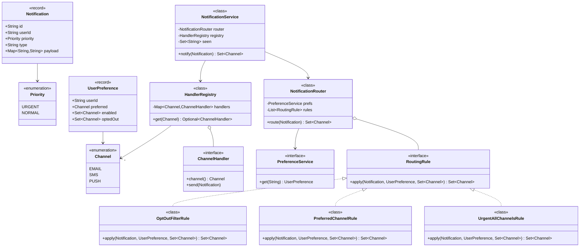
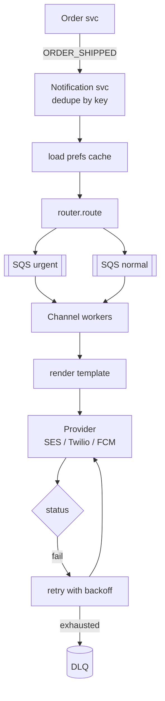

# 16 · Notification System + Notification Router (e-commerce)

## Interview question
(a) Route notifications for an e-commerce site: each user has a preferred channel (EMAIL, SMS, PUSH); notifications have priority (URGENT, NORMAL). URGENT → all channels; NORMAL → only the preferred channel. Handlers need not be implemented — **routing logic only**.
(b) General "Design a Notification System" (templates, retries, rate limits, preferences, scale).

## Assumptions / clarification
- A user may have several enabled channels; preferred is one of them. Missing contact info (no phone) → skip channel.
- URGENT = OTP, payment failure, fraud alert. NORMAL = shipped, offers.
- Quiet hours / opt-outs: follow-up.
- Senders (SES, SNS/Twilio, FCM/APNs) are external.

## Functional requirements
1. `route(notification)` → set of channels.
2. Dispatch to channel handlers.
3. User preferences (preferred channel, opt-outs).
4. (System) templates, retries, dedupe, rate limit per user, delivery status.

## Non-functional requirements
- Extensible: add WHATSAPP channel or a new routing rule without editing old code.
- Urgent notifications low latency (seconds); marketing can be delayed/batched.
- At-least-once delivery, dedupe on notificationId.
- Scale: 100M notifications/day, spikes during sales.

## CAP / consistency
- **AP**: queue-based, eventual. Preferences can be slightly stale (cached). Idempotency key prevents duplicates on retries.

## Core entities
`User`, `UserPreference` (preferred channel, enabled channels, contact info), `Notification` (id, userId, type, priority, payload), `Channel` enum, `RoutingRule`, `NotificationRouter`, `ChannelHandler`, `HandlerRegistry`, `Template`, `DeliveryAttempt`.

## IS-A / HAS-A
- `UrgentAllChannelsRule`, `PreferredChannelRule`, `QuietHoursRule` **IS-A** `RoutingRule`.
- `EmailHandler`, `SmsHandler`, `PushHandler` **IS-A** `ChannelHandler`.
- `NotificationRouter` **HAS-A** ordered `RoutingRule`s and `PreferenceService`.
- `NotificationService` **HAS-A** router, handler registry, retry policy.

## UML diagram


## APIs
```
Set<Channel> route(Notification n)
POST /v1/notifications {idempotencyKey, userId, type, priority, templateId, params} -> 202 {notificationId}
GET  /v1/notifications/{id}/status
PUT  /v1/users/{id}/preferences {preferred: "PUSH", optOut: ["SMS"], quietHours: "22:00-08:00"}
```

## Design patterns
- **Strategy / Chain of rules** – routing rules applied in order (pipeline), each can add/remove channels.
- **Factory / Registry** – channel → handler.
- **Observer** – services publish domain events (OrderShipped) → notification service subscribes.
- **Template Method** – base handler: render → validate contact → send → record.
- **Decorator** – `RetryingHandler`, `RateLimitedHandler` wrap any handler.
- **Builder** – `Notification.builder()`.

## SOLID mapping
- **S**: router decides *where*, handlers decide *how*.
- **O**: new rule (quiet hours) or channel (WhatsApp) = new class + registration.
- **L**: any handler substitutable.
- **I**: `RoutingRule` one method; handlers don't know about routing.
- **D**: router depends on `PreferenceService` interface.

## High-level flow


## Concurrency
- Stateless router → thread safe; rules immutable.
- Per-channel worker pools isolate slow providers (SMS outage doesn't block push).
- Separate high-priority queue so URGENT isn't stuck behind a marketing blast.
- Dedupe with `putIfAbsent(idempotencyKey)` / DynamoDB conditional write.

## Edge cases
- Preferred channel missing contact (no device token) → fallback to next enabled channel.
- User opted out of all channels → URGENT still goes via at least one (legal/transactional), NORMAL dropped.
- Unknown priority → treat as NORMAL.
- Handler missing for a channel → log, skip, don't fail others.
- Provider throttling → backoff.

## End-to-end Java implementation
```java
import java.util.*;
import java.util.concurrent.ConcurrentHashMap;

enum Channel { EMAIL, SMS, PUSH }
enum Priority { URGENT, NORMAL }

record Notification(String id, String userId, Priority priority, String type, Map<String, String> payload) {
    Notification { payload = Map.copyOf(payload); }
}

record UserPreference(String userId, Channel preferred, Set<Channel> enabled, Set<Channel> optedOut) {
    UserPreference { enabled = Set.copyOf(enabled); optedOut = Set.copyOf(optedOut); }
}

interface PreferenceService { UserPreference get(String userId); }

@FunctionalInterface
interface RoutingRule { Set<Channel> apply(Notification n, UserPreference p, Set<Channel> current); }

/** URGENT → every channel the user can be reached on. */
final class UrgentAllChannelsRule implements RoutingRule {
    public Set<Channel> apply(Notification n, UserPreference p, Set<Channel> cur) {
        if (n.priority() != Priority.URGENT) return cur;
        Set<Channel> out = EnumSet.noneOf(Channel.class); out.addAll(cur); out.addAll(p.enabled());
        return out;
    }
}

/** NORMAL → only the preferred channel (fallback to any enabled one). */
final class PreferredChannelRule implements RoutingRule {
    public Set<Channel> apply(Notification n, UserPreference p, Set<Channel> cur) {
        if (n.priority() != Priority.NORMAL) return cur;
        if (p.enabled().contains(p.preferred())) return EnumSet.of(p.preferred());
        return p.enabled().stream().findFirst().map(EnumSet::of).orElse(EnumSet.noneOf(Channel.class));
    }
}

/** Opt-outs apply to NORMAL only; URGENT (transactional) keeps at least one channel. */
final class OptOutFilterRule implements RoutingRule {
    public Set<Channel> apply(Notification n, UserPreference p, Set<Channel> cur) {
        Set<Channel> out = EnumSet.noneOf(Channel.class); out.addAll(cur); out.removeAll(p.optedOut());
        return (out.isEmpty() && n.priority() == Priority.URGENT && !cur.isEmpty()) ? cur : out;
    }
}

final class NotificationRouter {
    private final PreferenceService prefs; private final List<RoutingRule> rules;
    NotificationRouter(PreferenceService prefs, List<RoutingRule> rules) { this.prefs = prefs; this.rules = List.copyOf(rules); }
    Set<Channel> route(Notification n) {
        UserPreference p = prefs.get(n.userId());
        Set<Channel> channels = EnumSet.noneOf(Channel.class);
        for (RoutingRule r : rules) channels = r.apply(n, p, channels);
        return Collections.unmodifiableSet(channels);
    }
}

interface ChannelHandler { Channel channel(); void send(Notification n); }

final class HandlerRegistry {
    private final Map<Channel, ChannelHandler> handlers = new EnumMap<>(Channel.class);
    HandlerRegistry register(ChannelHandler h) { handlers.put(h.channel(), h); return this; }
    Optional<ChannelHandler> get(Channel c) { return Optional.ofNullable(handlers.get(c)); }
}

final class NotificationService {
    private final NotificationRouter router; private final HandlerRegistry registry;
    private final Set<String> seen = ConcurrentHashMap.newKeySet();
    NotificationService(NotificationRouter r, HandlerRegistry reg) { router = r; registry = reg; }

    Set<Channel> notify(Notification n) {
        if (!seen.add(n.id())) return Set.of();                     // idempotent
        Set<Channel> channels = router.route(n);
        for (Channel c : channels)
            registry.get(c).ifPresentOrElse(h -> {
                try { h.send(n); } catch (RuntimeException e) { System.out.println("retry later " + c + ": " + e.getMessage()); }
            }, () -> System.out.println("No handler for " + c));
        return channels;
    }
}

public class NotificationDemo {
    public static void main(String[] args) {
        Map<String, UserPreference> db = Map.of(
            "u1", new UserPreference("u1", Channel.PUSH, EnumSet.allOf(Channel.class), Set.of()),
            "u2", new UserPreference("u2", Channel.SMS, EnumSet.of(Channel.EMAIL), Set.of(Channel.EMAIL)));
        NotificationRouter router = new NotificationRouter(db::get,
                List.of(new UrgentAllChannelsRule(), new PreferredChannelRule(), new OptOutFilterRule()));

        HandlerRegistry reg = new HandlerRegistry();
        for (Channel c : Channel.values())
            reg.register(new ChannelHandler() {
                public Channel channel() { return c; }
                public void send(Notification n) { System.out.println("  [" + c + "] " + n.type() + " → " + n.userId()); }
            });
        NotificationService svc = new NotificationService(router, reg);

        System.out.println(svc.notify(new Notification("n1", "u1", Priority.URGENT, "PAYMENT_FAILED", Map.of())));   // all 3
        System.out.println(svc.notify(new Notification("n2", "u1", Priority.NORMAL, "SHIPPED", Map.of())));          // PUSH
        System.out.println(svc.notify(new Notification("n3", "u2", Priority.NORMAL, "OFFER", Map.of())));            // [] (opted out)
        System.out.println(svc.notify(new Notification("n4", "u2", Priority.URGENT, "OTP", Map.of())));              // EMAIL kept
        System.out.println(svc.notify(new Notification("n1", "u1", Priority.URGENT, "PAYMENT_FAILED", Map.of())));   // dedup []
    }
}
```

## New requirements → how the class diagram evolves
| New requirement | Change |
|---|---|
| New channel WHATSAPP | Add enum value + `WhatsAppHandler`; rules unchanged. |
| Quiet hours (no NORMAL at night) | `QuietHoursRule` → defers (schedule) instead of dropping. |
| Priority HIGH (preferred + one backup) | New enum + `HighPriorityRule`. |
| Per-type preferences (offers by email only) | `UserPreference` HAS-A `Map<type, Set<Channel>>`; `TypePreferenceRule`. |
| Rate limit (max 3 marketing/day) | `RateLimitRule` or `RateLimitedHandler` decorator. |
| Templates / i18n | `TemplateRenderer` strategy in handler (Template Method). |
| Delivery tracking | `DeliveryStatusRepository`, provider webhooks. |

## Amazon follow-up questions

Tap a question to see a simple answer.

<details class="qa">
<summary><span class="qn">1</span>How do you add a new channel without touching routing code?</summary>

Each channel (email, SMS, push, WhatsApp) implements the same `Channel` interface and registers itself by name. The router just looks up channels by name based on user preferences. Adding a channel means writing one new class and registering it. The routing code doesn't change.

</details>

<details class="qa">
<summary><span class="qn">2</span>How do you make sure an URGENT OTP isn't delayed behind 10M marketing emails? (Separate queues/priorities.)</summary>

Give urgent messages their own queue and workers, separate from bulk marketing. OTPs go to the 'urgent' queue, which always has spare capacity, so they're never stuck behind millions of emails.

</details>

<details class="qa">
<summary><span class="qn">3</span>Provider (Twilio) is down — what happens? (Retry with backoff, failover provider, DLQ.)</summary>

Retry with growing waits (1s, 2s, 4s…). If it keeps failing, switch to a backup provider (for example Twilio to MessageBird). If everything fails, the message goes to a dead-letter queue for later retry or investigation. A circuit breaker stops us hammering a provider that's clearly down.

</details>

<details class="qa">
<summary><span class="qn">4</span>How do you avoid sending duplicates? (Idempotency key at ingestion, provider-level dedupe.)</summary>

Every request carries an idempotency key, like `orderId + eventType + channel`. We record which keys have been sent, and a repeat is skipped. Many providers also accept a dedupe id. That covers retries and duplicate events.

</details>

<details class="qa">
<summary><span class="qn">5</span>How to support user timezone quiet hours?</summary>

Store each user's timezone and quiet hours (for example 22:00–08:00). Before sending non-urgent messages, check the user's local time. If it's quiet time, schedule the message for when quiet hours end. Urgent ones like OTPs or security alerts ignore quiet hours.

</details>

<details class="qa">
<summary><span class="qn">6</span>Scale to 100M/day — architecture? (Event bus → router → per-channel queues → workers → providers; prefs cached.)</summary>

Events go on a bus (Kafka or SNS). A router service reads them, checks preferences (cached) and puts one message per channel on that channel's queue. Workers per channel render the template and call the provider. Every stage scales by adding workers, and 100M a day is only about 1,200 a second on average.

</details>
