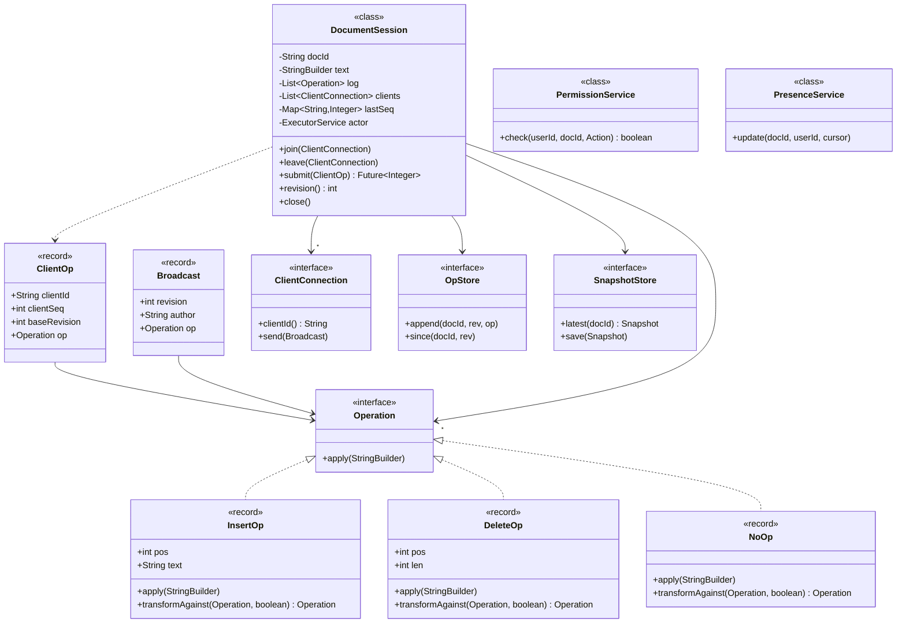
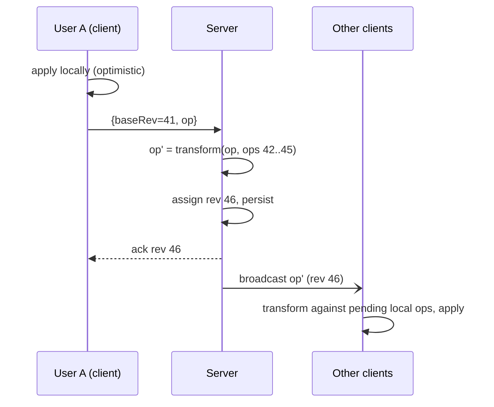

# 17 · Google Docs (Collaborative Document Editing)

## Interview question
Design Google Docs: real-time collaboration (OT vs CRDT), WebSockets, delta-based storage and versioning (snapshot + diff), scaling (shard by documentId, regional replication), presence (who's editing, cursors), permissions.

## Assumptions / clarification
- Rich text; for design, model as a sequence of characters + formatting ops.
- Up to ~100 concurrent editors per doc (Docs limits editors); thousands of viewers.
- Edits visible to others < 200 ms in the same region.
- Offline editing supported (sync later).
- Version history: restore any named version, view changes by user.

## Functional requirements
1. Create / open / edit document.
2. Real-time concurrent editing with convergence.
3. Presence: collaborators list, cursor & selection.
4. Comments / suggestions (follow-up).
5. Version history, restore.
6. Sharing: owner / editor / commenter / viewer; link sharing.

## Non-functional requirements
- Convergence: all clients end with the same text; user intent preserved.
- Low latency, durability (no acknowledged edit lost).
- Scale: billions of docs, mostly cold; hot docs few.
- High availability of editing.

## CAP / consistency
- Per document, a **single ordering authority** (the doc's session server) gives a total order of ops → strong consistency for the op log (CP per doc) while clients apply optimistically (local-first, AP feel).
- CRDT alternative: fully AP, convergence without central order (better for offline/P2P, more metadata).

## OT vs CRDT
| | OT (Google Docs) | CRDT (Figma-ish, Yjs, Automerge) |
|---|---|---|
| Idea | Transform concurrent op against ops it missed | Each char has unique id; ops commute |
| Needs central server | Yes (ordering) | No |
| Metadata | Small | Larger (ids, tombstones) |
| Complexity | Transform functions tricky (many op pairs) | Data structure tricky, GC of tombstones |
| Offline | Harder (long rebases) | Natural |

## Core entities
`Document` (id, ownerId, title, headRevision), `Operation` (Insert/Delete/Format, pos, text, baseRevision, clientId, clientSeq), `Revision` (number, op, author, ts), `Snapshot` (docId, revision, content), `Session` (docId, connected clients), `Presence` (userId, cursor, selection, color), `Permission` (docId, principal, role).

## IS-A / HAS-A
- `InsertOp`, `DeleteOp`, `FormatOp` **IS-A** `Operation`.
- `OtTransformer`, `CrdtMerger` **IS-A** `ConflictResolutionStrategy`.
- `DocumentSession` **HAS-A** current text, op log since snapshot, set of `ClientConnection`s, presence map.
- `Document` **HAS-A** snapshots, revisions, permissions.

## Mermaid UML class diagram


## APIs
```
POST /docs {title}                       GET /docs/{id}  -> {snapshot, revision}
GET  /docs/{id}/revisions?from=120       POST /docs/{id}/restore {revision}
POST /docs/{id}/permissions {principal, role}
WS   /docs/{id}/session
   client → {type:"op", baseRev, clientSeq, op}
   server → {type:"ack", rev, clientSeq}  | {type:"op", rev, op, author}
   client → {type:"presence", cursor, selection}
```

## High-level architecture
```
Client (editor + local op buffer)
  ⇅ WebSocket
Edge LB → Session Gateway (sticky by docId via consistent hashing / session registry in Redis/ZooKeeper)
   → Document Session Server (in-memory doc state, OT engine, single owner per doc)
        ├─ Op log (Bigtable/Spanner/DynamoDB: PK docId, SK revision) — append before ack
        ├─ Snapshot store (every N=100 ops or 1 min) → GCS/S3
        ├─ Presence (in-memory, broadcast; ephemeral)
        └─ Kafka → search indexing, history, notifications
Doc metadata + ACL service (Spanner/SQL, cached)
```

## Storage & versioning
- **Op log** (delta) append-only; each op tagged with revision, author, ts.
- **Snapshots** every N ops → load = latest snapshot + replay ops after it (bounded replay).
- History view: group ops by author/time windows; named versions = pinned snapshots.
- Cold docs: only snapshot + compacted log; session server unloads after idle.

## Design patterns
- **Command** – each op is a command (apply/invert → undo).
- **Strategy** – OT vs CRDT resolution.
- **Observer** – broadcast ops/presence to connected clients.
- **Memento** – snapshots.
- **Single-writer / Actor** – one session owner per doc serializes ops.
- **Proxy** – permission check before session.

## SOLID mapping
- **S**: session (ordering), transformer (math), stores (persistence), presence, ACL.
- **O**: new op type (FormatOp) = new class + transform rules.
- **D**: session depends on `OpStore`/`SnapshotStore` interfaces.

## High-level flow (one edit)


## Concurrency
- Per-doc single-threaded executor (actor) → no locks on doc state.
- Client holds at most **one in-flight op** (plus buffer) — simplifies OT (Jupiter/Google Wave model).
- Session ownership: lease in ZooKeeper/etcd; failover → new owner loads snapshot + log; clients reconnect & resend unacked ops (idempotent by clientId+clientSeq).

## Edge cases
- Concurrent inserts at same position → tie-break by clientId (deterministic).
- Delete range overlapping another delete → shrink.
- Client offline for hours → long transform chain; if too long, fetch snapshot & rebase.
- Permission revoked mid-session → server closes WebSocket.
- Huge paste (MBs) → chunk.
- Undo in collaborative context → invert own op and transform against later ops.

## End-to-end Java implementation (OT core for plain text)
```java
import java.util.*;
import java.util.concurrent.*;

sealed interface Operation permits InsertOp, DeleteOp, NoOp {
    void apply(StringBuilder doc);
    /** Transform this op so it applies after `other` (which was applied first). tieBreakLeft: this wins ties. */
    Operation transformAgainst(Operation other, boolean tieBreakLeft);
}

record NoOp() implements Operation {
    public void apply(StringBuilder d) {}
    public Operation transformAgainst(Operation o, boolean t) { return this; }
}

record InsertOp(int pos, String text) implements Operation {
    public void apply(StringBuilder d) { d.insert(pos, text); }
    public Operation transformAgainst(Operation o, boolean tieLeft) {
        if (o instanceof InsertOp i) {
            boolean shift = i.pos() < pos || (i.pos() == pos && !tieLeft);
            return shift ? new InsertOp(pos + i.text().length(), text) : this;
        }
        if (o instanceof DeleteOp d) {
            if (pos <= d.pos()) return this;
            if (pos >= d.pos() + d.len()) return new InsertOp(pos - d.len(), text);
            return new InsertOp(d.pos(), text);                    // inside deleted range → collapse to start
        }
        return this;
    }
}

record DeleteOp(int pos, int len) implements Operation {
    public void apply(StringBuilder d) { d.delete(pos, pos + len); }
    public Operation transformAgainst(Operation o, boolean tieLeft) {
        if (o instanceof InsertOp i) {
            if (i.pos() <= pos) return new DeleteOp(pos + i.text().length(), len);
            if (i.pos() >= pos + len) return this;
            return new DeleteOp(pos, len + i.text().length());      // simple: also delete inserted text (could split)
        }
        if (o instanceof DeleteOp d) {
            int start = pos, end = pos + len, oStart = d.pos(), oEnd = d.pos() + d.len();
            if (oEnd <= start) return new DeleteOp(start - d.len(), len);
            if (oStart >= end) return this;
            int newStart = Math.min(start, oStart);
            int overlap = Math.min(end, oEnd) - Math.max(start, oStart);
            int newLen = len - overlap;
            return newLen <= 0 ? new NoOp() : new DeleteOp(newStart, newLen);
        }
        return this;
    }
}

record ClientOp(String clientId, int clientSeq, int baseRevision, Operation op) {}
record Broadcast(int revision, String author, Operation op) {}

interface ClientConnection { String clientId(); void send(Broadcast b); }

final class DocumentSession {
    private final String docId;
    private final StringBuilder text;
    private final List<Operation> log = new ArrayList<>();          // log.get(i) = op that produced revision i+1
    private final List<ClientConnection> clients = new CopyOnWriteArrayList<>();
    private final Map<String, Integer> lastSeq = new ConcurrentHashMap<>();
    private final ExecutorService actor = Executors.newSingleThreadExecutor();   // serializes all ops

    DocumentSession(String docId, String initial) { this.docId = docId; this.text = new StringBuilder(initial); }

    void join(ClientConnection c) { clients.add(c); }
    void leave(ClientConnection c) { clients.remove(c); }

    Future<Integer> submit(ClientOp in) {
        return actor.submit(() -> {
            if (lastSeq.getOrDefault(in.clientId(), -1) >= in.clientSeq()) return log.size();   // duplicate resend
            Operation op = in.op();
            for (int r = in.baseRevision(); r < log.size(); r++)
                op = op.transformAgainst(log.get(r), false);         // server-ordered ops win ties
            op.apply(text);
            log.add(op);                                              // + persist to OpStore before ack
            lastSeq.put(in.clientId(), in.clientSeq());
            int rev = log.size();
            Broadcast b = new Broadcast(rev, in.clientId(), op);
            clients.forEach(c -> c.send(b));
            if (rev % 100 == 0) { /* snapshotStore.save(docId, rev, text.toString()) */ }
            return rev;
        });
    }

    String text() throws Exception { return actor.submit(text::toString).get(); }
    int revision() throws Exception { return actor.submit(log::size).get(); }
    void close() { actor.shutdown(); }
}

public class GoogleDocsDemo {
    public static void main(String[] args) throws Exception {
        DocumentSession doc = new DocumentSession("d1", "Hello World");
        doc.join(new ClientConnection() {
            public String clientId() { return "viewer"; }
            public void send(Broadcast b) { System.out.println("rev " + b.revision() + " by " + b.author() + ": " + b.op()); }
        });
        // Both Amar and Gurubani edit based on revision 0 concurrently.
        Future<Integer> a = doc.submit(new ClientOp("amar", 1, 0, new InsertOp(5, ",")));           // "Hello, World"
        Future<Integer> g = doc.submit(new ClientOp("gurubani", 1, 0, new InsertOp(11, "!")));      // "Hello World!"
        Future<Integer> d = doc.submit(new ClientOp("gurubani", 2, 0, new DeleteOp(0, 5)));         // delete "Hello" (based on rev 0)
        a.get(); g.get(); d.get();
        System.out.println("Final: '" + doc.text() + "' at rev " + doc.revision());                 // ", World!"
        doc.close();
    }
}
```

## New requirements → how the class diagram evolves
| New requirement | Change |
|---|---|
| Rich text formatting | `FormatOp(pos, len, attrs)` + transform rules; doc model = tree of paragraphs/runs. |
| Comments anchored to text | `Comment` with anchor range transformed like ops. |
| Suggestion mode | Ops flagged `suggestion=true`; accept = commit, reject = invert. |
| Offline-first | Switch to CRDT (`CrdtMerger` strategy) or long-rebase with snapshot fetch. |
| Presence | `PresenceService` broadcast cursor positions (transformed through ops), ephemeral, throttled to 10/s. |
| Export PDF/Docx | Async `ExportJob` from snapshot. |

## Amazon follow-up questions

Tap a question to see a simple answer.

<details class="qa">
<summary><span class="qn">1</span>Explain OT with an example of two concurrent inserts. How are ties broken?</summary>

The document is "ab". Alice inserts X at position 0, Bob inserts Y at position 2, at the same time. The server gets Alice's first, making "Xab". Bob's position 2 was based on the old text, so the server *transforms* it: Alice inserted before it, so shift it by 1, giving position 3 and "XabY". Everyone ends up the same. If both insert at the same spot, a rule like 'lower user id goes first' breaks the tie.

</details>

<details class="qa">
<summary><span class="qn">2</span>Why does OT need a central server? How does CRDT avoid it?</summary>

OT needs one agreed order of operations, which a central server provides: it decides which op came first and transforms the rest. CRDTs give every character a unique, ordered id, so edits can merge in any order and still end up the same. No central judge is needed, which suits offline and peer-to-peer editing.

</details>

<details class="qa">
<summary><span class="qn">3</span>How do you store history so opening a doc with 1M edits is fast? (Snapshot + tail.)</summary>

Don't replay 1M edits on open. Every so often (say every 1,000 ops) save a **snapshot** of the full document. To open, load the latest snapshot and replay only the few ops after it. The full op history stays in cheap storage for version history.

</details>

<details class="qa">
<summary><span class="qn">4</span>How do you route all editors of a doc to the same server? What if it dies?</summary>

Pick the server for a document by hashing its id (consistent hashing), and have a registry say 'doc 123 lives on server 7'. All editors connect there. If that server dies, the registry assigns the doc to another server, which loads snapshot + recent ops from storage, and clients reconnect and resend their unconfirmed edits.

</details>

<details class="qa">
<summary><span class="qn">5</span>How do you scale presence for 1000 viewers? (Viewers get throttled/batched updates, no cursor fan-out from them.)</summary>

Only active editors send cursor updates live. For viewers, send updates in batches (for example 2 per second) and show counts like '950 viewing' instead of everyone's cursor. Viewers don't broadcast their own positions.

</details>

<details class="qa">
<summary><span class="qn">6</span>How are permissions enforced in real time?</summary>

Check permission when someone connects and on every op the server receives. When access is removed, the server immediately closes that user's connection or marks them read-only, and rejects further edits. Permissions are cached on the doc server and refreshed when an access change event arrives.

</details>
