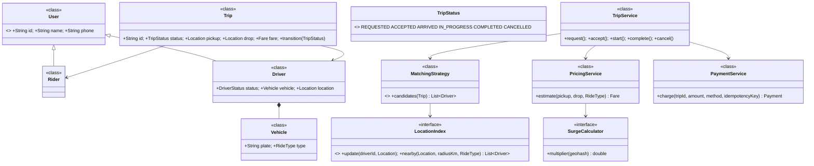
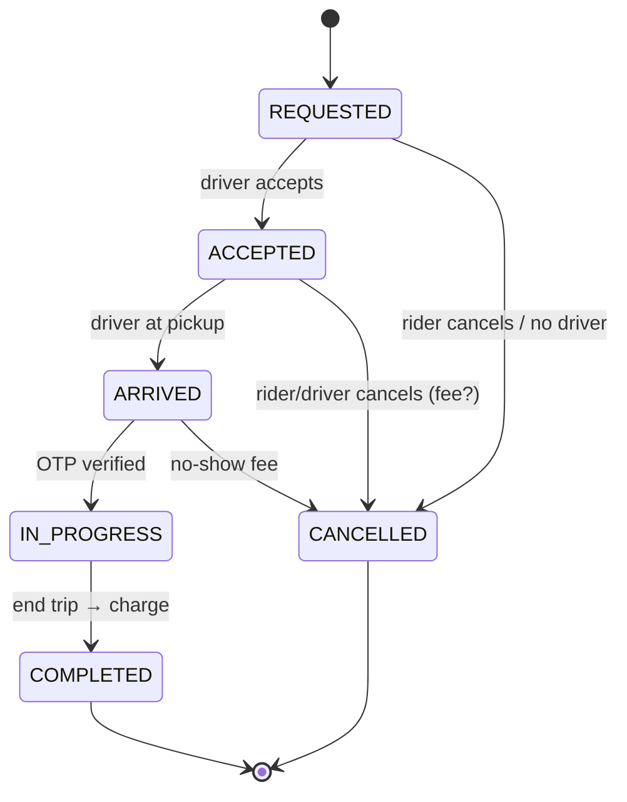
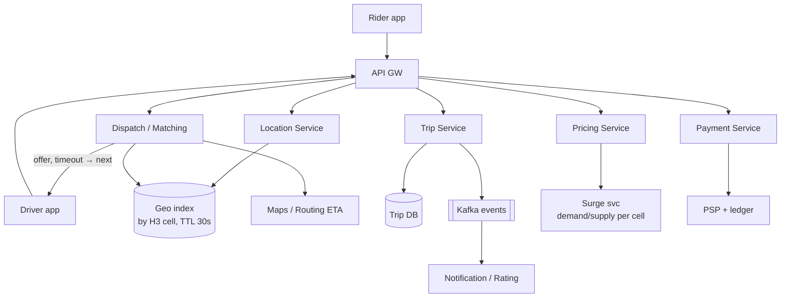

# 18 · Uber (Ride-Hailing)

## Interview question
Design Uber: class design (Rider, Driver, Trip, Payment, Location), trip state machine (requested → accepted → in_progress → completed / cancelled), driver matching (quadtree/geohash), surge pricing + fare calculation, payment integration (idempotency, retries, failures), REST APIs for booking, tracking, cancellation.

## Assumptions / clarification
- 100M riders, 5M drivers, 1M concurrent active drivers sending location every 4 s ⇒ 250k location writes/s.
- Ride types: MINI, SEDAN, SUV, AUTO.
- Match = nearest available driver of that type within radius, by ETA; driver may reject (timeout 15 s) → next driver.
- Payment charged at trip end; pre-auth at request (optional).
- City-level scope for matching (sharding by city/region).

## Functional requirements
1. Rider: fare estimate, request ride, cancel, track driver, pay, rate.
2. Driver: go online/offline, update location, accept/reject, start/end trip.
3. Matching nearby drivers.
4. Surge pricing per area.
5. Trip history, receipts.

## Non-functional requirements
- Match within seconds; location freshness ≤ 5 s.
- Driver must never be assigned two trips (consistency).
- Payment exactly-once from rider's perspective.
- High availability; region failover.

## CAP / consistency
- Driver locations: **AP** (in-memory, ephemeral, stale by seconds OK).
- Trip/driver assignment: **CP** — conditional update `driver.status AVAILABLE → ASSIGNED`.
- Payments: **CP** + idempotency keys; ledger is source of truth.

## Core entities
`Rider`, `Driver` (status, vehicle, location), `Vehicle` (type), `Location`, `Trip` (id, rider, driver, pickup, drop, status, fare), `FareEstimate`, `SurgeZone`, `Payment`, `PaymentMethod`, `Rating`.

## IS-A / HAS-A
- `Rider`, `Driver` **IS-A** `User`.
- `Requested`, `Accepted`, `InProgress`, … → modelled as enum + transition table (State pattern).
- `NearestDriverMatching`, `EtaBasedMatching` **IS-A** `MatchingStrategy`.
- `CardPayment`, `WalletPayment`, `CashPayment` **IS-A** `PaymentMethod`.
- `Trip` **HAS-A** `Rider`, `Driver`, `Fare`, `Payment`; `Driver` **HAS-A** `Vehicle`, `Location`.

## Mermaid UML class diagram


## Trip state machine


## APIs
```
POST /v1/fares/estimate {pickup, drop, rideType}               -> {fareId, amount, surge, expiresAt}
POST /v1/trips {fareId, paymentMethodId}  Idempotency-Key       -> 201 {tripId, status: REQUESTED}
GET  /v1/trips/{id}                                            -> status, driver, eta
WS   /v1/trips/{id}/track                                      -> driver location every 4 s
POST /v1/trips/{id}/cancel {reason}
POST /v1/drivers/me/location {lat, lng, heading, ts}            (or via WS/UDP-ish stream)
POST /v1/drivers/me/status {ONLINE|OFFLINE}
POST /v1/trips/{id}/accept | /arrive | /start {otp} | /complete
```

## High-level architecture


## Driver matching (geo)
- **Geohash**: driver's geohash (precision 6) → set of driver ids per cell in Redis; query cell + 8 neighbours; filter by type/status; compute ETA for top-K.
- **QuadTree**: in-memory tree per city, split when > K drivers; drivers move → remove/insert (cost), so rebuild periodically or use geohash grid.
- **H3 (Uber)**: hex cells, `kRing` expanding rings until enough candidates; supply/demand + surge computed per hex.
- Location updates go to the in-memory index (not the DB); history streamed to Kafka for analytics.

## Fare & surge
`fare = max(minFare, (base + perKm × km + perMin × min) × surge) + tolls + fees − promo`
- Surge per cell = f(open requests / available drivers) over last N minutes, smoothed and capped (e.g. 1.0–3.0), shown and **locked** in the estimate (fareId, expiry 2 min).

## Payment integration
- Idempotency key = `tripId` for the final charge → retries never double-charge.
- Pre-authorize at request; capture at completion; release on cancel.
- Failures: retry with exponential backoff for transient errors; hard decline → mark trip `PAYMENT_PENDING`, ask rider to update method, block new rides until paid.
- Outbox pattern: trip COMPLETED + payment-request event in same DB tx → payment worker.
- Daily reconciliation vs PSP reports.

## Design patterns
- **State** – trip lifecycle (transition table).
- **Strategy** – matching, pricing, payment method.
- **Observer** – trip events → notifications, receipts, analytics.
- **Factory** – `PaymentMethodFactory`.
- **Decorator** – fare components (surge, promo, tolls) layered on base fare.
- **Saga** – request → match → trip → payment with compensations.

## SOLID mapping
- **S**: TripService (lifecycle), Matching, Pricing, Payment, Location separate.
- **O**: new ride type / pricing component = new class.
- **L**: all payment methods substitutable.
- **I**: driver app sees `DriverActions` API, rider sees `RiderActions`.
- **D**: TripService depends on interfaces.

## Concurrency
- Assign driver atomically: `UPDATE drivers SET status='ASSIGNED', trip_id=? WHERE id=? AND status='AVAILABLE'` / `AtomicReference` CAS. Losing request tries next candidate.
- Trip transitions guarded: `UPDATE trips SET status=? WHERE id=? AND status=?` (compare-and-set on state).
- Rider double-tap "Request" → idempotency key.
- Offer to one driver at a time (or a few with first-accept-wins CAS).

## Edge cases
- No drivers → widen radius, then fail with message.
- Driver accepts after timeout → reject (trip already offered to other).
- Driver app goes offline mid-trip → keep trip, use last location, reconcile on reconnect.
- Both cancel simultaneously → state CAS decides.
- GPS jumps → filter noise (speed sanity check).
- Surge changes between estimate and request → honour locked estimate until expiry.

## End-to-end Java implementation
```java
import java.math.BigDecimal;
import java.math.RoundingMode;
import java.time.*;
import java.util.*;
import java.util.concurrent.*;
import java.util.concurrent.atomic.AtomicReference;

enum RideType { AUTO, MINI, SEDAN, SUV }
enum DriverStatus { OFFLINE, AVAILABLE, ASSIGNED }
enum TripStatus {
    REQUESTED, ACCEPTED, ARRIVED, IN_PROGRESS, COMPLETED, CANCELLED;
    private static final Map<TripStatus, Set<TripStatus>> NEXT = Map.of(
        REQUESTED, EnumSet.of(ACCEPTED, CANCELLED), ACCEPTED, EnumSet.of(ARRIVED, CANCELLED),
        ARRIVED, EnumSet.of(IN_PROGRESS, CANCELLED), IN_PROGRESS, EnumSet.of(COMPLETED),
        COMPLETED, EnumSet.noneOf(TripStatus.class), CANCELLED, EnumSet.noneOf(TripStatus.class));
    boolean canMoveTo(TripStatus s) { return NEXT.get(this).contains(s); }
}

record Location(double lat, double lng) {
    double km(Location o) {
        double dLat = Math.toRadians(o.lat - lat), dLng = Math.toRadians(o.lng - lng);
        double a = Math.sin(dLat / 2) * Math.sin(dLat / 2) + Math.cos(Math.toRadians(lat)) * Math.cos(Math.toRadians(o.lat)) * Math.sin(dLng / 2) * Math.sin(dLng / 2);
        return 12742 * Math.asin(Math.sqrt(a));
    }
}

final class Driver {
    final String id; final RideType type;
    final AtomicReference<DriverStatus> status = new AtomicReference<>(DriverStatus.OFFLINE);
    volatile Location location;
    Driver(String id, RideType type, Location loc) { this.id = id; this.type = type; this.location = loc; }
    boolean tryAssign() { return status.compareAndSet(DriverStatus.AVAILABLE, DriverStatus.ASSIGNED); }
    void free() { status.set(DriverStatus.AVAILABLE); }
}

record Fare(BigDecimal amount, double surge, Instant expiresAt) {}

final class Trip {
    final String id = UUID.randomUUID().toString(); final String riderId; final Location pickup, drop; final RideType type; final Fare fare;
    private final AtomicReference<TripStatus> status = new AtomicReference<>(TripStatus.REQUESTED);
    volatile Driver driver;
    Trip(String riderId, Location pickup, Location drop, RideType type, Fare fare) { this.riderId = riderId; this.pickup = pickup; this.drop = drop; this.type = type; this.fare = fare; }
    boolean transition(TripStatus from, TripStatus to) {
        if (!from.canMoveTo(to)) throw new IllegalStateException(from + " → " + to + " not allowed");
        return status.compareAndSet(from, to);
    }
    TripStatus status() { return status.get(); }
}

interface LocationIndex { void update(Driver d); List<Driver> nearby(Location l, double radiusKm, RideType t); }

final class GridLocationIndex implements LocationIndex {           // geohash-like fixed grid
    private final double cellDeg;
    private final Map<Long, Set<Driver>> cells = new ConcurrentHashMap<>();
    private final Map<String, Long> driverCell = new ConcurrentHashMap<>();
    GridLocationIndex(double cellDeg) { this.cellDeg = cellDeg; }
    private long cell(double lat, double lng) { return ((long) Math.floor(lat / cellDeg) << 32) ^ ((long) Math.floor(lng / cellDeg) & 0xffffffffL); }
    public void update(Driver d) {
        long c = cell(d.location.lat(), d.location.lng());
        Long old = driverCell.put(d.id, c);
        if (old != null && old != c) cells.getOrDefault(old, Set.of()).remove(d);
        cells.computeIfAbsent(c, k -> ConcurrentHashMap.newKeySet()).add(d);
    }
    public List<Driver> nearby(Location l, double radiusKm, RideType t) {
        List<Driver> out = new ArrayList<>();
        for (int dx = -1; dx <= 1; dx++) for (int dy = -1; dy <= 1; dy++)
            out.addAll(cells.getOrDefault(cell(l.lat() + dy * cellDeg, l.lng() + dx * cellDeg), Set.of()));
        return out.stream().filter(d -> d.type == t && d.status.get() == DriverStatus.AVAILABLE && d.location.km(l) <= radiusKm)
                .sorted(Comparator.comparingDouble(d -> d.location.km(l))).toList();
    }
}

interface SurgeCalculator { double multiplier(Location l); }

final class PricingService {
    private final Map<RideType, BigDecimal[]> rates = Map.of(          // base, perKm
        RideType.AUTO, new BigDecimal[]{bd(25), bd(12)}, RideType.MINI, new BigDecimal[]{bd(40), bd(15)},
        RideType.SEDAN, new BigDecimal[]{bd(60), bd(18)}, RideType.SUV, new BigDecimal[]{bd(90), bd(24)});
    private final SurgeCalculator surge; private final Clock clock;
    PricingService(SurgeCalculator s, Clock c) { surge = s; clock = c; }
    Fare estimate(Location from, Location to, RideType t) {
        double m = Math.min(3.0, Math.max(1.0, surge.multiplier(from)));
        BigDecimal[] r = rates.get(t);
        BigDecimal amt = r[0].add(r[1].multiply(BigDecimal.valueOf(from.km(to)))).multiply(BigDecimal.valueOf(m)).setScale(0, RoundingMode.CEILING);
        return new Fare(amt, m, clock.instant().plusSeconds(120));
    }
    private static BigDecimal bd(int v) { return BigDecimal.valueOf(v); }
}

interface PaymentGateway { String charge(String idempotencyKey, String riderId, BigDecimal amount); }

final class PaymentService {
    private final PaymentGateway psp; private final Map<String, String> done = new ConcurrentHashMap<>();
    PaymentService(PaymentGateway psp) { this.psp = psp; }
    String charge(Trip t) {
        return done.computeIfAbsent(t.id, key -> {                         // idempotent per trip
            for (int attempt = 1; ; attempt++) {
                try { return psp.charge(key, t.riderId, t.fare.amount()); }
                catch (RuntimeException e) {
                    if (attempt == 3) throw e;
                    try { Thread.sleep(50L * (1 << attempt)); } catch (InterruptedException ie) { Thread.currentThread().interrupt(); throw e; }
                }
            }
        });
    }
}

interface DriverOfferChannel { boolean offer(Driver d, Trip t); }   // push + wait up to 15 s

final class TripService {
    private final LocationIndex index; private final PricingService pricing; private final PaymentService payments;
    private final DriverOfferChannel offers; private final Clock clock;
    private final Map<String, Trip> trips = new ConcurrentHashMap<>();
    TripService(LocationIndex i, PricingService p, PaymentService pay, DriverOfferChannel o, Clock c) { index = i; pricing = p; payments = pay; offers = o; clock = c; }

    Trip request(String riderId, Location pickup, Location drop, RideType type, Fare lockedFare) {
        Fare fare = (lockedFare != null && lockedFare.expiresAt().isAfter(clock.instant())) ? lockedFare : pricing.estimate(pickup, drop, type);
        Trip trip = new Trip(riderId, pickup, drop, type, fare);
        trips.put(trip.id, trip);
        for (Driver d : index.nearby(pickup, 5, type)) {
            if (!d.tryAssign()) continue;                                   // someone else got this driver
            if (offers.offer(d, trip) && trip.transition(TripStatus.REQUESTED, TripStatus.ACCEPTED)) { trip.driver = d; return trip; }
            d.free();                                                       // rejected / timed out
        }
        trip.transition(TripStatus.REQUESTED, TripStatus.CANCELLED);
        throw new IllegalStateException("No drivers available");
    }

    void arrive(String id) { must(get(id).transition(TripStatus.ACCEPTED, TripStatus.ARRIVED)); }
    void start(String id)  { must(get(id).transition(TripStatus.ARRIVED, TripStatus.IN_PROGRESS)); }
    String complete(String id) {
        Trip t = get(id);
        must(t.transition(TripStatus.IN_PROGRESS, TripStatus.COMPLETED));
        t.driver.free();
        return payments.charge(t);                                          // prod: outbox → payment worker
    }
    void cancel(String id) {
        Trip t = get(id);
        for (TripStatus from : List.of(TripStatus.REQUESTED, TripStatus.ACCEPTED, TripStatus.ARRIVED))
            if (t.status() == from && t.transition(from, TripStatus.CANCELLED)) { if (t.driver != null) t.driver.free(); return; }
        throw new IllegalStateException("Cannot cancel in " + t.status());
    }
    private Trip get(String id) { return Optional.ofNullable(trips.get(id)).orElseThrow(); }
    private static void must(boolean ok) { if (!ok) throw new IllegalStateException("Concurrent state change"); }
}

public class UberDemo {
    public static void main(String[] args) {
        LocationIndex index = new GridLocationIndex(0.01);
        Driver d1 = new Driver("D1", RideType.MINI, new Location(12.9716, 77.5946));
        Driver d2 = new Driver("D2", RideType.MINI, new Location(12.9750, 77.5990));
        for (Driver d : List.of(d1, d2)) { d.status.set(DriverStatus.AVAILABLE); index.update(d); }

        PricingService pricing = new PricingService(loc -> 1.4, Clock.systemUTC());
        PaymentService pay = new PaymentService((key, rider, amt) -> "txn-" + key.substring(0, 8));
        DriverOfferChannel offers = (d, t) -> !d.id.equals("D1");           // D1 rejects
        TripService svc = new TripService(index, pricing, pay, offers, Clock.systemUTC());

        Location pickup = new Location(12.9720, 77.5950), drop = new Location(12.9352, 77.6245);
        Fare est = pricing.estimate(pickup, drop, RideType.MINI);
        System.out.println("Estimate ₹" + est.amount() + " surge " + est.surge());
        Trip t = svc.request("R1", pickup, drop, RideType.MINI, est);
        System.out.println("Driver " + t.driver.id + " status " + t.status());
        svc.arrive(t.id); svc.start(t.id);
        System.out.println("Paid " + svc.complete(t.id) + " / again " + pay.charge(t));   // same txn (idempotent)
    }
}
```

## New requirements → how the class diagram evolves
| New requirement | Change |
|---|---|
| Pool / shared rides | `Trip` HAS-A list of `RideRequest`; matching considers route detour. |
| Scheduled rides | `ScheduledTrip` + scheduler triggers matching 15 min before. |
| Driver incentives / heatmaps | Consume surge stream, `IncentiveService`. |
| Promo codes | `PromoDecorator` over fare. |
| Cancellation fee policy | `CancellationPolicy` strategy by state + elapsed time. |
| Split fare | `Payment` HAS-A many `PaymentShare`s. |

## Amazon follow-up questions
1. How do you find nearby drivers quickly? Why is a SQL `WHERE distance < r` too slow?
2. 1M drivers × every 4 s — where do location updates go? (In-memory sharded index, not DB; Kafka for history.)
3. How do you guarantee a driver isn't matched to two riders?
4. How is surge calculated and why lock it in the estimate?
5. Payment call timed out — did we charge? (Idempotency key, query PSP, reconciliation.)
6. Walk through every state transition and who is allowed to trigger it.
7. How do you shard? (By city/region; cross-city trips are rare.)
