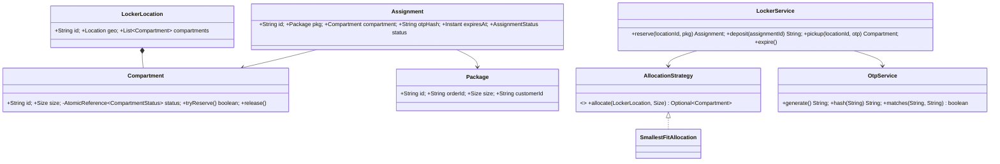
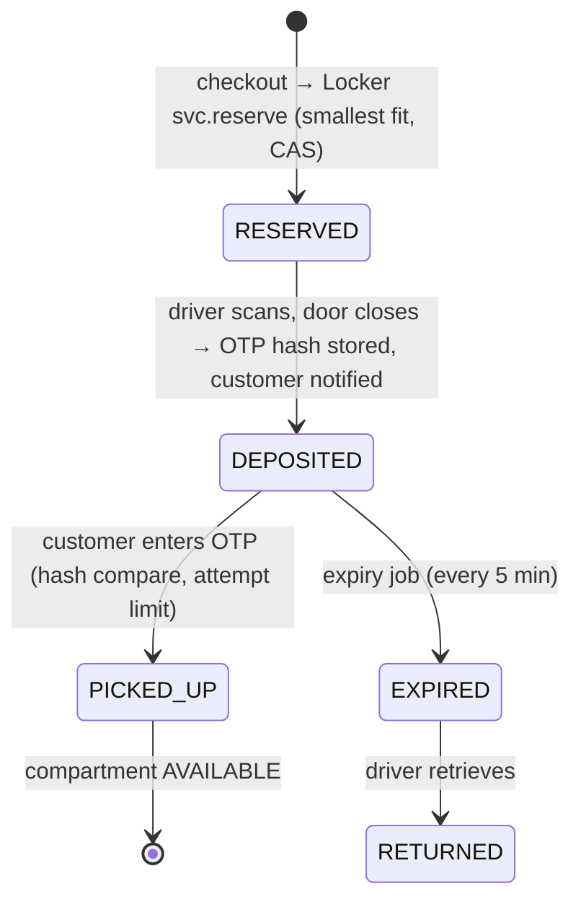

# 19 · Amazon Locker System

## Interview question
Delivery driver deposits a package into a locker; customer receives a code; customer unlocks with the code. Cover locker allocation, OTP validation, expiry, multiple sizes, scalability, availability, failure handling. Focus: API design, DB schema, concurrency, distributed locking, performance, notification flow, state transitions.

## Assumptions / clarification
- Locker **location** (e.g. a mall) has many **compartments** of sizes S/M/L/XL.
- Customer chooses a locker location at checkout → compartment **reserved** when the package is out for delivery (or at deposit time).
- Package fits a size; allocate the **smallest fitting** free compartment; can fall back to bigger.
- Pickup window: 3 days; after expiry → returned to sender, compartment freed.
- Codes: 6-digit OTP, single-use, hashed at rest, rate-limited attempts.
- Locker hardware (kiosk) talks to cloud; must work briefly offline.

## Functional requirements
1. Reserve compartment for an order at a locker location.
2. Driver deposits: scan package → compartment opens → close → DEPOSITED → OTP generated & sent.
3. Customer enters OTP → compartment opens → PICKED_UP → freed.
4. Expiry: not picked in 3 days → EXPIRED → driver retrieves for return.
5. Availability query per location per size.
6. Admin: compartment out of service.

## Non-functional requirements
- No double allocation of a compartment.
- Unlock latency < 2 s.
- Kiosk resilient to network loss (cached OTP hashes).
- Secure (brute force protection, OTP not stored plain).
- Scale: 100k locker locations, ~millions of packages/day.

## CAP / consistency
- Allocation per locker location: **CP** (conditional update per compartment/location).
- Kiosk offline validation: **AP** fallback using locally cached OTP hashes, reconciled later.

## Core entities
`LockerLocation` (id, geo, hours), `Compartment` (id, size, status), `Package` (id, orderId, size), `Reservation/Assignment` (compartment, package, otpHash, expiresAt, status), `Driver`, `Customer`, `AllocationStrategy`, `OtpService`, `NotificationService`.

## IS-A / HAS-A
- `SmallestFitAllocation`, `ExactSizeAllocation` **IS-A** `AllocationStrategy`.
- `SmsNotifier`, `EmailNotifier`, `PushNotifier` **IS-A** `Notifier`.
- `LockerLocation` **HAS-A** many `Compartment`; `Assignment` **HAS-A** `Package`, `Compartment`.

## Mermaid UML class diagram


## State transitions
```
Compartment:  AVAILABLE → RESERVED → OCCUPIED → AVAILABLE      (OUT_OF_SERVICE from any)
Assignment:   RESERVED → DEPOSITED → PICKED_UP
                         DEPOSITED → EXPIRED → RETURNED
              RESERVED → CANCELLED (order cancelled / driver failed)
```

## APIs
```
GET  /locations?lat=&lng=&size=M                    -> nearby lockers with availability
POST /locations/{id}/reservations {packageId, size}  Idempotency-Key: packageId -> {assignmentId, compartmentId}
POST /assignments/{id}/deposit   (driver, from kiosk)  -> opens door; OTP sent to customer
POST /locations/{id}/pickup {otp}                      -> {compartmentId} | 401 (attempts left) | 423 locked
POST /assignments/{id}/retrieve  (driver, expired)
PUT  /compartments/{id}/status {OUT_OF_SERVICE}
```

## DB schema
```sql
locker_location(id PK, lat, lng, geohash, address, open_time, close_time)
compartment(id PK, location_id FK, size, status, version, INDEX(location_id, size, status))
assignment(id PK, package_id UNIQUE, compartment_id FK, location_id, otp_hash, status,
           reserved_at, deposited_at, expires_at, picked_at, INDEX(location_id, status), INDEX(expires_at, status))
otp_attempts(location_id, window_start, count)   -- or Redis counter with TTL
```

## Design patterns
- **Strategy** – allocation, notification channel.
- **State** – compartment & assignment lifecycle.
- **Observer** – DEPOSITED event → notify customer; EXPIRED → notify + return flow.
- **Facade** – `LockerService`.
- **Command** – kiosk commands (open door) with ack.

## SOLID mapping
- **S**: allocation vs OTP vs notifications vs expiry job.
- **O**: new size (XL) / allocation rule without touching service.
- **D**: service depends on `AllocationStrategy`, `Notifier`, `Clock`.

## High-level flow


## Concurrency & distributed locking
- Compartment reservation: `UPDATE compartment SET status='RESERVED', version=version+1 WHERE id=? AND status='AVAILABLE'` — no distributed lock needed. Pick candidates with `SELECT ... WHERE location_id=? AND size=? AND status='AVAILABLE' LIMIT 5`, try each.
- Alternatively `SELECT ... FOR UPDATE SKIP LOCKED LIMIT 1` so concurrent requests take different rows.
- Distributed lock (Redis `SET NX PX` / DynamoDB lock table) only if you need to serialize a multi-step operation per location (e.g., rebalancing) — use fencing tokens.
- Idempotent reserve keyed by packageId (unique constraint).
- Pickup: assignment `DEPOSITED → PICKED_UP` CAS so two kiosk retries don't double-open/log.

## Performance & scalability
- Shard by `location_id` (all ops for a locker hit one partition).
- Availability counts cached per location/size (Redis), updated on events.
- Nearby lockers via geohash index (see #06).
- OTP lookup at pickup: index `(location_id, otp_hash)` or scan DEPOSITED assignments of that location (small set).

## Failure handling
- Kiosk offline: caches `(otp_hash → compartment)` for its DEPOSITED packages; validates locally; queues events; syncs later.
- Door didn't open / sensor says still closed → retry, mark compartment OUT_OF_SERVICE, reassign.
- Package doesn't fit → driver reports → reallocate bigger size.
- Notification failed → retry; customer can also see OTP in app.
- Double deposit command → idempotent by assignment state.

## Edge cases
- Wrong OTP 5 times → lock pickup for that assignment 15 min, alert.
- Customer arrives after expiry but before driver retrieval → configurable grace.
- Location closed (mall hours) → exclude from allocation for ETA outside hours.
- Multiple packages for same customer → one OTP opens all (follow-up).
- Clock drift on kiosk → server-issued expiry.

## End-to-end Java implementation
```java
import java.nio.charset.StandardCharsets;
import java.security.*;
import java.time.*;
import java.util.*;
import java.util.concurrent.*;
import java.util.concurrent.atomic.*;

enum Size { S, M, L, XL }
enum CompartmentStatus { AVAILABLE, RESERVED, OCCUPIED, OUT_OF_SERVICE }
enum AssignmentStatus { RESERVED, DEPOSITED, PICKED_UP, EXPIRED, CANCELLED }

final class Compartment {
    final String id; final Size size;
    private final AtomicReference<CompartmentStatus> status = new AtomicReference<>(CompartmentStatus.AVAILABLE);
    Compartment(String id, Size size) { this.id = id; this.size = size; }
    boolean move(CompartmentStatus from, CompartmentStatus to) { return status.compareAndSet(from, to); }
    CompartmentStatus status() { return status.get(); }
}

record LockerLocation(String id, List<Compartment> compartments) {}
record Package(String id, String customerId, Size size) {}

final class Assignment {
    final String id = UUID.randomUUID().toString(); final Package pkg; final Compartment compartment; final String locationId;
    final AtomicReference<AssignmentStatus> status = new AtomicReference<>(AssignmentStatus.RESERVED);
    volatile String otpHash; volatile Instant expiresAt; final AtomicInteger failedAttempts = new AtomicInteger();
    Assignment(Package p, Compartment c, String locationId) { this.pkg = p; this.compartment = c; this.locationId = locationId; }
}

interface AllocationStrategy { Optional<Compartment> allocate(LockerLocation loc, Size size); }

final class SmallestFitAllocation implements AllocationStrategy {
    public Optional<Compartment> allocate(LockerLocation loc, Size size) {
        return loc.compartments().stream()
                .filter(c -> c.size.ordinal() >= size.ordinal() && c.status() == CompartmentStatus.AVAILABLE)
                .sorted(Comparator.comparing((Compartment c) -> c.size))
                .filter(c -> c.move(CompartmentStatus.AVAILABLE, CompartmentStatus.RESERVED))   // CAS; loser tries next
                .findFirst();
    }
}

final class OtpService {
    private final SecureRandom random = new SecureRandom();
    String generate() { return String.format("%06d", random.nextInt(1_000_000)); }
    String hash(String otp, String salt) {
        try {
            byte[] d = MessageDigest.getInstance("SHA-256").digest((salt + ":" + otp).getBytes(StandardCharsets.UTF_8));
            return HexFormat.of().formatHex(d);
        } catch (NoSuchAlgorithmException e) { throw new IllegalStateException(e); }
    }
}

interface Notifier { void send(String customerId, String message); }

final class LockerService {
    private static final int MAX_ATTEMPTS = 5;
    private final Map<String, LockerLocation> locations = new ConcurrentHashMap<>();
    private final Map<String, Assignment> byId = new ConcurrentHashMap<>();
    private final Map<String, Assignment> byPackage = new ConcurrentHashMap<>();
    private final AllocationStrategy allocation; private final OtpService otp; private final Notifier notifier;
    private final Clock clock; private final Duration pickupWindow;

    LockerService(AllocationStrategy a, OtpService o, Notifier n, Clock c, Duration window) {
        allocation = a; otp = o; notifier = n; clock = c; pickupWindow = window;
    }

    void addLocation(LockerLocation l) { locations.put(l.id(), l); }

    Assignment reserve(String locationId, Package pkg) {
        return byPackage.computeIfAbsent(pkg.id(), k -> {              // idempotent per package
            LockerLocation loc = Objects.requireNonNull(locations.get(locationId), "location");
            Compartment c = allocation.allocate(loc, pkg.size()).orElseThrow(() -> new IllegalStateException("No compartment for " + pkg.size()));
            Assignment a = new Assignment(pkg, c, locationId);
            byId.put(a.id, a);
            return a;
        });
    }

    void deposit(String assignmentId) {
        Assignment a = get(assignmentId);
        if (!a.status.compareAndSet(AssignmentStatus.RESERVED, AssignmentStatus.DEPOSITED)) throw new IllegalStateException("Not RESERVED");
        a.compartment.move(CompartmentStatus.RESERVED, CompartmentStatus.OCCUPIED);
        String code = otp.generate();
        a.otpHash = otp.hash(code, a.locationId);
        a.expiresAt = clock.instant().plus(pickupWindow);
        notifier.send(a.pkg.customerId(), "Your package is in locker " + a.locationId + ". Code: " + code);   // code never stored
    }

    Compartment pickup(String locationId, String code) {
        String h = otp.hash(code, locationId);
        Assignment a = byId.values().stream()
                .filter(x -> x.locationId.equals(locationId) && x.status.get() == AssignmentStatus.DEPOSITED && h.equals(x.otpHash))
                .findFirst().orElseThrow(() -> new SecurityException("401 invalid code"));
        if (a.failedAttempts.get() >= MAX_ATTEMPTS) throw new SecurityException("423 locked");
        if (clock.instant().isAfter(a.expiresAt)) throw new IllegalStateException("410 expired");
        if (!a.status.compareAndSet(AssignmentStatus.DEPOSITED, AssignmentStatus.PICKED_UP)) throw new IllegalStateException("already picked");
        a.compartment.move(CompartmentStatus.OCCUPIED, CompartmentStatus.AVAILABLE);
        byPackage.remove(a.pkg.id());
        return a.compartment;                                           // kiosk opens this door
    }

    int expire() {
        Instant now = clock.instant(); int n = 0;
        for (Assignment a : byId.values())
            if (a.status.get() == AssignmentStatus.DEPOSITED && now.isAfter(a.expiresAt)
                    && a.status.compareAndSet(AssignmentStatus.DEPOSITED, AssignmentStatus.EXPIRED)) {
                notifier.send(a.pkg.customerId(), "Pickup window expired; package will be returned.");
                n++;                                                     // compartment freed after driver retrieval
            }
        return n;
    }

    long available(String locationId, Size s) {
        return locations.get(locationId).compartments().stream().filter(c -> c.size == s && c.status() == CompartmentStatus.AVAILABLE).count();
    }

    private Assignment get(String id) { return Optional.ofNullable(byId.get(id)).orElseThrow(); }
}

public class LockerDemo {
    public static void main(String[] args) throws Exception {
        Map<String, String> inbox = new ConcurrentHashMap<>();
        LockerService svc = new LockerService(new SmallestFitAllocation(), new OtpService(),
                (cust, msg) -> { System.out.println("to " + cust + ": " + msg); inbox.put(cust, msg.replaceAll(".*Code: ", "")); },
                Clock.systemUTC(), Duration.ofDays(3));
        svc.addLocation(new LockerLocation("BLR-MALL-1", List.of(new Compartment("C1", Size.S), new Compartment("C2", Size.M))));

        // two packages of size S race; one gets C1 (S), the other falls back to C2 (M)
        ExecutorService pool = Executors.newFixedThreadPool(2);
        Future<Assignment> f1 = pool.submit(() -> svc.reserve("BLR-MALL-1", new Package("P1", "amar", Size.S)));
        Future<Assignment> f2 = pool.submit(() -> svc.reserve("BLR-MALL-1", new Package("P2", "guru", Size.S)));
        Assignment a1 = f1.get(), a2 = f2.get(); pool.shutdown();
        System.out.println(a1.compartment.id + " / " + a2.compartment.id);

        svc.deposit(a1.id);
        System.out.println("Opened " + svc.pickup("BLR-MALL-1", inbox.get("amar")).id);
        System.out.println("Available S now: " + svc.available("BLR-MALL-1", Size.S));
    }
}
```

## New requirements → how the class diagram evolves
| New requirement | Change |
|---|---|
| Returns via locker (customer deposits) | `AssignmentType {DELIVERY, RETURN}`; reverse flow (see #06). |
| Temperature-controlled (groceries) | `Compartment` HAS-A `Capability` set; allocation filters. |
| One code for multiple packages | `PickupGroup` HAS-A assignments; one OTP. |
| Dynamic pricing / third-party use | `LockerRentalPolicy` strategy. |
| Pre-allocation at order time vs at delivery | Allocation timing policy; overbooking with buffer. |
| Predictive capacity | Forecast service reserves capacity per day. |

## Amazon follow-up questions
1. Two drivers try to reserve the last M compartment simultaneously — what happens in DB?
2. Do you need a distributed lock? When would you use one, and what's a fencing token?
3. How do you store and validate OTPs securely? Brute force?
4. Kiosk loses connectivity — can customers still pick up?
5. How does the expiry job scale to millions of assignments? (Index on `expires_at`, sharded scans, or delayed queue per assignment.)
6. What's in the notification flow and what if SMS fails?
7. Smallest-fit vs exact-size — impact on utilization?
