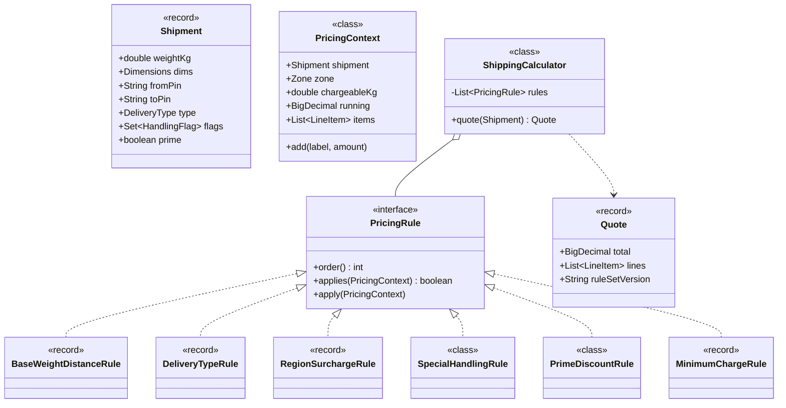
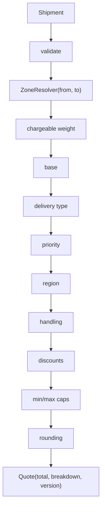

# 20 · Shipping Cost Calculator

## Interview question
Design a system to calculate shipping cost based on multiple dynamic conditions: weight, distance, delivery type (standard/express/same-day), priority shipping, region-based pricing, and special handling (fragile, hazardous, oversized).

## Assumptions / clarification
- Input: shipment (weight, dimensions, origin pincode, destination pincode, delivery type, flags, declared value, customer tier).
- Chargeable weight = max(actual, volumetric = L×W×H / 5000).
- Rules change often (festive surcharge, fuel surcharge %) → configurable without code change.
- Output: total + **itemised breakdown** (auditable).
- Currency INR; round to 2 decimals; BigDecimal only.

## Functional requirements
1. `quote(shipment)` → `Quote {total, lineItems}`.
2. Base cost by weight slab × distance zone.
3. Delivery type multiplier; priority add-on.
4. Region adjustments (remote/north-east +x%, metro discount).
5. Special handling fees (fragile flat, hazardous %, oversized).
6. Discounts (Prime free standard shipping), min/max caps.

## Non-functional requirements
- Deterministic and explainable.
- p99 < 50 ms (called on every checkout page).
- New rule without redeploy (rules from config/DB).

## CAP / consistency
Quotes are computed from cached rule sets (**AP**; versioned). Store `ruleSetVersion` in the quote so the order is charged what was shown.

## Core entities
`Shipment`, `Address/Zone`, `DeliveryType`, `HandlingFlag`, `Quote`, `LineItem`, `PricingRule` (interface), `PricingContext`, `ZoneResolver`, `RateCard`, `ShippingCalculator`.

## IS-A / HAS-A
- `BaseWeightDistanceRule`, `DeliveryTypeRule`, `RegionSurchargeRule`, `FragileRule`, `HazardousRule`, `PrimeDiscountRule`, `MinimumChargeRule` **IS-A** `PricingRule`.
- `ShippingCalculator` **HAS-A** ordered list of `PricingRule`, `ZoneResolver`.
- `Quote` **HAS-A** list of `LineItem`.

## Mermaid UML class diagram


## APIs
```
Quote quote(Shipment s)
POST /v1/shipping/quote {weightKg, dims, fromPin, toPin, deliveryType, flags[], prime} -> {total, breakdown[], ruleSetVersion, validUntil}
PUT  /v1/admin/rate-cards/{version}  (rules config JSON)
```

## Design patterns
- **Chain of Responsibility / Pipeline** – ordered rules each adjust the running total.
- **Strategy** – each rule; `ZoneResolver` strategy.
- **Decorator** (alternative) – `new FragileFee(new ExpressCost(new BaseCost()))`. Mention trade-off: decorators fix order at compile time; rule list is data-driven.
- **Specification** – `applies()` conditions.
- **Factory** – build rules from config (`RuleFactory.fromJson`).
- **Builder** – `Shipment.builder()`.

## SOLID mapping
- **S**: each rule computes one component.
- **O**: festive surcharge = new rule/config entry.
- **L**: any rule plugs in the chain.
- **I**: `PricingRule` small.
- **D**: calculator depends on `PricingRule` abstraction.

## High-level flow


## Concurrency
- Rules immutable; rule set swapped atomically (`AtomicReference<List<PricingRule>>`) on config change → lock-free reads.
- `PricingContext` is per-request.

## Edge cases
- Weight 0 / negative → 400.
- Volumetric > actual (big light box).
- Unserviceable pincode → error.
- Same-day not available for zone → reject or downgrade.
- Hazardous not allowed by air (express) → validation rule throws.
- Discount pushes below zero → floor at 0 / min charge.
- Rounding: slab rounding up to next 0.5 kg.

## End-to-end Java implementation
```java
import java.math.BigDecimal;
import java.math.RoundingMode;
import java.util.*;
import java.util.concurrent.atomic.AtomicReference;

enum DeliveryType { STANDARD, EXPRESS, SAME_DAY }
enum HandlingFlag { FRAGILE, HAZARDOUS, OVERSIZED }
enum Zone { LOCAL, REGIONAL, NATIONAL, REMOTE }

record Dimensions(double lCm, double wCm, double hCm) { double volumetricKg() { return lCm * wCm * hCm / 5000.0; } }

record Shipment(double weightKg, Dimensions dims, String fromPin, String toPin, DeliveryType type,
                Set<HandlingFlag> flags, boolean priority, boolean prime, BigDecimal declaredValue) {
    Shipment {
        if (weightKg <= 0) throw new IllegalArgumentException("weight must be > 0");
        flags = flags.isEmpty() ? EnumSet.noneOf(HandlingFlag.class) : EnumSet.copyOf(flags);
    }
}

record LineItem(String label, BigDecimal amount) {}
record Quote(BigDecimal total, List<LineItem> lines, String ruleSetVersion) {}

final class PricingContext {
    final Shipment shipment; final Zone zone; final double chargeableKg;
    private BigDecimal running = BigDecimal.ZERO;
    private final List<LineItem> items = new ArrayList<>();
    PricingContext(Shipment s, Zone z) {
        shipment = s; zone = z;
        chargeableKg = Math.ceil(Math.max(s.weightKg(), s.dims().volumetricKg()) * 2) / 2.0;   // round up to 0.5 kg
    }
    void add(String label, BigDecimal amt) { amt = amt.setScale(2, RoundingMode.HALF_UP); running = running.add(amt); items.add(new LineItem(label, amt)); }
    BigDecimal running() { return running; }
    Quote toQuote(String version) { return new Quote(running.max(BigDecimal.ZERO), List.copyOf(items), version); }
}

interface PricingRule {
    int order();
    default boolean applies(PricingContext c) { return true; }
    void apply(PricingContext c);
}

interface ZoneResolver { Zone resolve(String fromPin, String toPin); }

record BaseWeightDistanceRule(Map<Zone, BigDecimal> firstHalfKg, Map<Zone, BigDecimal> perAdditionalHalfKg) implements PricingRule {
    public int order() { return 10; }
    public void apply(PricingContext c) {
        long extraSlabs = Math.max(0, Math.round(c.chargeableKg / 0.5) - 1);
        c.add("Base (" + c.zone + ", " + c.chargeableKg + " kg)",
              firstHalfKg.get(c.zone).add(perAdditionalHalfKg.get(c.zone).multiply(BigDecimal.valueOf(extraSlabs))));
    }
}

record DeliveryTypeRule(Map<DeliveryType, BigDecimal> multiplier) implements PricingRule {
    public int order() { return 20; }
    public boolean applies(PricingContext c) { return c.shipment.type() != DeliveryType.STANDARD; }
    public void apply(PricingContext c) {
        if (c.shipment.type() == DeliveryType.SAME_DAY && c.zone != Zone.LOCAL) throw new IllegalArgumentException("Same-day only for LOCAL zone");
        c.add(c.shipment.type() + " surcharge", c.running().multiply(multiplier.get(c.shipment.type()).subtract(BigDecimal.ONE)));
    }
}

record PriorityRule(BigDecimal flatFee) implements PricingRule {
    public int order() { return 30; }
    public boolean applies(PricingContext c) { return c.shipment.priority(); }
    public void apply(PricingContext c) { c.add("Priority handling", flatFee); }
}

record RegionSurchargeRule(Map<Zone, BigDecimal> percent) implements PricingRule {
    public int order() { return 40; }
    public boolean applies(PricingContext c) { return percent.containsKey(c.zone); }
    public void apply(PricingContext c) { c.add("Region surcharge " + c.zone, c.running().multiply(percent.get(c.zone)).movePointLeft(2)); }
}

final class SpecialHandlingRule implements PricingRule {
    public int order() { return 50; }
    public boolean applies(PricingContext c) { return !c.shipment.flags().isEmpty(); }
    public void apply(PricingContext c) {
        for (HandlingFlag f : c.shipment.flags()) switch (f) {
            case FRAGILE -> c.add("Fragile handling", new BigDecimal("49"));
            case OVERSIZED -> c.add("Oversized", new BigDecimal("150"));
            case HAZARDOUS -> {
                if (c.shipment.type() != DeliveryType.STANDARD) throw new IllegalArgumentException("Hazardous goods: ground only");
                c.add("Hazardous (2% of declared value)", c.shipment.declaredValue().multiply(new BigDecimal("0.02")));
            }
        }
    }
}

final class PrimeDiscountRule implements PricingRule {
    public int order() { return 90; }
    public boolean applies(PricingContext c) { return c.shipment.prime() && c.shipment.type() == DeliveryType.STANDARD; }
    public void apply(PricingContext c) { c.add("Prime free delivery", c.running().negate()); }
}

record MinimumChargeRule(BigDecimal min) implements PricingRule {
    public int order() { return 100; }
    public boolean applies(PricingContext c) { return !c.shipment.prime() && c.running().compareTo(min) < 0; }
    public void apply(PricingContext c) { c.add("Minimum charge top-up", min.subtract(c.running())); }
}

final class ShippingCalculator {
    private record RuleSet(String version, List<PricingRule> rules) {}
    private final AtomicReference<RuleSet> ruleSet = new AtomicReference<>();
    private final ZoneResolver zones;

    ShippingCalculator(ZoneResolver zones, String version, List<PricingRule> rules) { this.zones = zones; reload(version, rules); }

    void reload(String version, List<PricingRule> rules) {
        List<PricingRule> sorted = new ArrayList<>(rules);
        sorted.sort(Comparator.comparingInt(PricingRule::order));
        ruleSet.set(new RuleSet(version, List.copyOf(sorted)));            // atomic swap, readers never see half
    }

    Quote quote(Shipment s) {
        RuleSet rs = ruleSet.get();
        PricingContext ctx = new PricingContext(s, zones.resolve(s.fromPin(), s.toPin()));
        for (PricingRule r : rs.rules()) if (r.applies(ctx)) r.apply(ctx);
        return ctx.toQuote(rs.version());
    }
}

public class ShippingDemo {
    public static void main(String[] args) {
        ZoneResolver zones = (from, to) -> from.substring(0, 3).equals(to.substring(0, 3)) ? Zone.LOCAL
                : to.startsWith("79") ? Zone.REMOTE : from.charAt(0) == to.charAt(0) ? Zone.REGIONAL : Zone.NATIONAL;
        Map<Zone, BigDecimal> first = Map.of(Zone.LOCAL, bd("30"), Zone.REGIONAL, bd("45"), Zone.NATIONAL, bd("60"), Zone.REMOTE, bd("80"));
        Map<Zone, BigDecimal> extra = Map.of(Zone.LOCAL, bd("10"), Zone.REGIONAL, bd("15"), Zone.NATIONAL, bd("20"), Zone.REMOTE, bd("30"));
        ShippingCalculator calc = new ShippingCalculator(zones, "v2026-09", List.of(
                new BaseWeightDistanceRule(first, extra),
                new DeliveryTypeRule(Map.of(DeliveryType.EXPRESS, bd("1.5"), DeliveryType.SAME_DAY, bd("2.0"))),
                new PriorityRule(bd("25")),
                new RegionSurchargeRule(Map.of(Zone.REMOTE, bd("20"))),
                new SpecialHandlingRule(), new PrimeDiscountRule(), new MinimumChargeRule(bd("40"))));

        Shipment s = new Shipment(2.2, new Dimensions(40, 30, 20), "560001", "791001", DeliveryType.EXPRESS,
                EnumSet.of(HandlingFlag.FRAGILE), true, false, bd("5000"));
        Quote q = calc.quote(s);
        q.lines().forEach(l -> System.out.printf("%-35s %10s%n", l.label(), l.amount()));
        System.out.println("TOTAL " + q.total() + " (" + q.ruleSetVersion() + ")");
    }
    private static BigDecimal bd(String v) { return new BigDecimal(v); }
}
```

## New requirements → how the class diagram evolves
| New requirement | Change |
|---|---|
| Festive surcharge 10% Oct–Nov | `DateWindowSurchargeRule(from, to, pct)` — config only. |
| Fuel surcharge updated weekly | Rule reads % from `RateCard` reloaded via `reload()`. |
| COD fee | `CodFeeRule` (flag `paymentMode`). |
| Carrier selection (cheapest of Delhivery/BlueDart) | `CarrierRateProvider` strategy; calculator runs per carrier and picks min — Composite. |
| Seller-specific contract rates | `RateCardResolver` by sellerId. |
| Rules authored by business users | JSON/DSL → `RuleFactory` (Interpreter). |

## Amazon follow-up questions

Tap a question to see a simple answer.

<details class="qa">
<summary><span class="qn">1</span>Decorator vs rule chain — which did you choose and why?</summary>

A **rule chain**: an ordered list of small rules, each adding its part (base, express, fragile…) to the quote. Decorators would work too, but the order is hidden in how you wrap objects, which is hard to see and to load from config. A list is easy to read, reorder, test and switch on or off.

</details>

<details class="qa">
<summary><span class="qn">2</span>How do you add a new surcharge without deploying?</summary>

Make rules data-driven: a rule 'type' such as percentage surcharge, flat fee or weight band is code, but its settings (which region, how much, from when) live in a database table. Adding a 'monsoon surcharge 5% in Kerala' is a new row, and servers reload rules every few minutes.

</details>

<details class="qa">
<summary><span class="qn">3</span>How to make sure the order is charged the price quoted 10 minutes ago? (Quote id + version + expiry.)</summary>

When we quote, we save the quote with an id, the rule version used and an expiry (say 30 minutes). At checkout, the order passes the quote id. If it's still valid we charge exactly that amount, otherwise we re-quote and show the new price.

</details>

<details class="qa">
<summary><span class="qn">4</span>Order of rules matters (discount before/after surcharge) — how do you make it explicit?</summary>

Give each rule an explicit `order()` number (base = 100, surcharges = 200, discounts = 500, caps = 800, rounding = 900) and always sort by it. The order is then written down and visible in one place, not an accident of how the code was put together.

</details>

<details class="qa">
<summary><span class="qn">5</span>How would you test 50 rule combinations? (Rule unit tests + golden quote snapshots.)</summary>

Unit-test each rule on its own. Then keep a set of 'golden' shipments with their expected quote (total and line-by-line breakdown) saved as files. Any change that alters a saved quote fails the test, and you either fix the bug or approve the new numbers on purpose.

</details>

<details class="qa">
<summary><span class="qn">6</span>How would you scale to 50k quotes/s? (Stateless, cached rules and zone map, horizontal.)</summary>

The calculator is stateless and pure CPU. Keep rules and the zone map in memory (refreshed in the background), so a quote never hits a database. Then add more servers behind a load balancer: 50k a second is just many machines doing quick maths.

</details>
