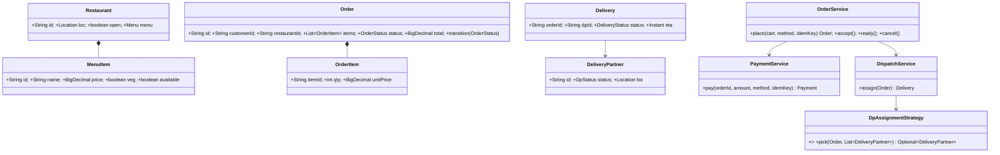

# 21 · Food Delivery Platform (Zomato / Swiggy)

## Interview question
Design the core architecture for a food delivery platform: restaurant onboarding & menu management, search & discovery, order placement & payments, delivery assignment & real-time tracking, notifications.

## Assumptions / clarification
- 3-sided marketplace: customers, restaurants, delivery partners (DPs).
- 50M MAU, 3M orders/day, peak dinner 3× average (~100 orders/s avg, 300–500/s peak); 300k active DPs pinging location every 5 s (60k writes/s).
- Serviceability radius ~7 km per restaurant.
- Payments: UPI/card/wallet/COD via gateway.
- One restaurant per order (cart).

## Functional requirements
1. Restaurant onboarding (KYC, documents), menu CRUD, availability toggles, open/close hours.
2. Search restaurants/dishes near me; filters (veg, rating, cuisine, delivery time); ranking.
3. Cart → checkout → payment → order placed.
4. Restaurant accepts/rejects, marks food ready.
5. Assign DP, pickup, deliver; live tracking with ETA.
6. Notifications at each state; ratings.

## Non-functional requirements
- Search p99 < 300 ms; order placement highly available and consistent.
- No double-charge; no lost orders.
- Tracking updates within a few seconds.
- Peak-hour elasticity.

## CAP / consistency
- Orders & payments: **CP** (Postgres/Aurora, transactions, idempotency).
- Menus/search index: **AP**, eventually consistent (seconds).
- DP locations: **AP**, in-memory, ephemeral.

## Core entities
`Restaurant`, `Menu`, `MenuItem` (price, veg, available, addons), `Customer`, `Address`, `Cart`, `Order` (status, items, amounts), `OrderItem`, `Payment`, `DeliveryPartner` (status, location), `Delivery` (orderId, dpId, status, eta), `Rating`.

## IS-A / HAS-A
- `Customer`, `DeliveryPartner`, `RestaurantOwner` **IS-A** `User`.
- `NearestIdleDpStrategy`, `BatchedAssignmentStrategy` **IS-A** `DpAssignmentStrategy`.
- `UpiPayment`, `CardPayment`, `CodPayment` **IS-A** `PaymentMethod`.
- `Restaurant` **HAS-A** `Menu` → `MenuItem`s; `Order` **HAS-A** `OrderItem`s, `Payment`, `Delivery`.

## Mermaid UML class diagram


## Order state machine
```
CREATED → PAYMENT_PENDING → PLACED → ACCEPTED → PREPARING → READY → PICKED_UP → DELIVERED
           ↘ PAYMENT_FAILED        ↘ REJECTED (refund)       ↘ CANCELLED (policy-based refund)
```

## APIs
```
Restaurant:  POST /restaurants (onboard)  PUT /restaurants/{id}/menu  PATCH /menu-items/{id} {available:false}
             POST /orders/{id}/accept {prepMinutes} | /reject | /ready
Customer:    GET /search?lat&lng&q=biryani&veg=true&sort=eta&cursor=
             GET /restaurants/{id}/menu
             POST /carts/{id}/items ; POST /orders {cartId, addressId, paymentMethod} Idempotency-Key → {orderId, paymentIntent}
             GET /orders/{id}  ; WS /orders/{id}/track
DP:          POST /dp/location {lat,lng}  ; POST /deliveries/{id}/accept | /picked | /delivered {otp}
```

## High-level architecture
```
Apps (customer, restaurant, DP) → API GW / BFFs
  Restaurant & Menu svc (Postgres) ──CDC/Kafka──► Search indexer → Elasticsearch (geo_distance + text + filters)
  Search/Discovery svc: ES query + ranking (rating, ETA, personalisation, ads) + Redis cache per geohash
  Cart svc (Redis) → Order svc (Postgres, state machine, outbox) → Kafka "order-events"
  Payment svc → PSP (Razorpay/Stripe) webhooks; ledger; idempotency; refunds
  Dispatch svc: DP location index (Redis GEO/H3 in-memory) → assignment (when food ~ready - travel time) → offer DP
  Tracking svc: DP pings → WebSocket fan-out to customer; ETA svc (maps + ML)
  Notification svc: consumes order-events → push/SMS/email
```

## Design patterns
- **State** – order lifecycle.
- **Strategy** – DP assignment, ranking, payment method.
- **Observer / event-driven** – order events drive notifications, dispatch, analytics.
- **Saga (orchestrated)** – place order: reserve → pay → notify restaurant → assign DP; compensations (refund) on failure.
- **Outbox** – reliable events from Order DB.
- **CQRS** – menu writes in Postgres, reads from ES/cache.

## SOLID mapping
- **S**: each microservice has one reason to change.
- **O**: new payment method / assignment algorithm plug in.
- **D**: OrderService depends on `PaymentGateway`, `DispatchService` interfaces.

## High-level flow
```
search → menu → cart → POST /orders (idem key) → Order CREATED → payment intent → PSP → webhook success
  → PLACED → restaurant tablet notified → ACCEPTED (prep 15 min)
  → Dispatch schedules assignment at (readyTime − DP travel time) → nearest idle DP accepts (CAS)
  → READY → PICKED_UP → live tracking → DELIVERED (OTP) → payouts & ratings
```

## Concurrency
- Order transitions via CAS on status (`UPDATE ... WHERE status = :expected`).
- DP assignment: `dp.status AVAILABLE → ASSIGNED` CAS; one DP can't take two orders (unless batching).
- Payment webhook + client callback race → idempotent on paymentId.
- Item availability toggled while in cart → validate at checkout.

## Edge cases
- Restaurant doesn't accept in 3 min → auto-cancel, refund.
- No DP available → widen radius, surge pay for DPs, delay ETA.
- DP cancels after pickup → reassign with handover (rare) / escalation.
- Payment succeeded but order creation failed → reconciliation refunds.
- Restaurant closes mid-order → honour accepted orders.
- Address outside serviceability → block at cart.

## End-to-end Java implementation (order + dispatch core)
```java
import java.math.BigDecimal;
import java.util.*;
import java.util.concurrent.*;
import java.util.concurrent.atomic.AtomicReference;

enum OrderStatus {
    CREATED, PLACED, ACCEPTED, READY, PICKED_UP, DELIVERED, REJECTED, CANCELLED, PAYMENT_FAILED;
    private static final Map<OrderStatus, Set<OrderStatus>> NEXT = new EnumMap<>(Map.of(
        CREATED, EnumSet.of(PLACED, PAYMENT_FAILED), PLACED, EnumSet.of(ACCEPTED, REJECTED, CANCELLED),
        ACCEPTED, EnumSet.of(READY, CANCELLED), READY, EnumSet.of(PICKED_UP), PICKED_UP, EnumSet.of(DELIVERED)));
    boolean canMoveTo(OrderStatus n) { return NEXT.getOrDefault(this, Set.of()).contains(n); }
}
enum DpStatus { OFFLINE, AVAILABLE, ASSIGNED }

record Location(double lat, double lng) { double dist(Location o) { return Math.hypot(lat - o.lat, lng - o.lng) * 111; } }
record MenuItem(String id, String name, BigDecimal price, boolean veg, boolean available) {}
record Restaurant(String id, String name, Location loc, Map<String, MenuItem> menu) {}
record CartLine(String itemId, int qty) {}
record OrderItem(String itemId, int qty, BigDecimal unitPrice) {}

final class Order {
    final String id = UUID.randomUUID().toString(); final String customerId; final Restaurant restaurant;
    final List<OrderItem> items; final BigDecimal total; final Location dropAt;
    private final AtomicReference<OrderStatus> status = new AtomicReference<>(OrderStatus.CREATED);
    volatile String dpId;
    Order(String c, Restaurant r, List<OrderItem> items, Location drop) {
        customerId = c; restaurant = r; this.items = List.copyOf(items); dropAt = drop;
        total = items.stream().map(i -> i.unitPrice().multiply(BigDecimal.valueOf(i.qty()))).reduce(BigDecimal.ZERO, BigDecimal::add);
    }
    boolean transition(OrderStatus from, OrderStatus to) {
        if (!from.canMoveTo(to)) throw new IllegalStateException(from + "→" + to);
        return status.compareAndSet(from, to);
    }
    OrderStatus status() { return status.get(); }
}

final class DeliveryPartner {
    final String id; volatile Location loc;
    final AtomicReference<DpStatus> status = new AtomicReference<>(DpStatus.AVAILABLE);
    DeliveryPartner(String id, Location loc) { this.id = id; this.loc = loc; }
}

interface PaymentGateway { boolean charge(String idempotencyKey, BigDecimal amount); }
interface EventBus { void publish(String type, Order o); }
interface DpAssignmentStrategy { List<DeliveryPartner> rank(Order o, Collection<DeliveryPartner> dps); }

final class NearestIdleDpStrategy implements DpAssignmentStrategy {
    public List<DeliveryPartner> rank(Order o, Collection<DeliveryPartner> dps) {
        return dps.stream().filter(d -> d.status.get() == DpStatus.AVAILABLE && d.loc.dist(o.restaurant.loc()) < 5)
                  .sorted(Comparator.comparingDouble(d -> d.loc.dist(o.restaurant.loc()))).toList();
    }
}

final class DispatchService {
    private final Map<String, DeliveryPartner> dps = new ConcurrentHashMap<>();
    private final DpAssignmentStrategy strategy;
    DispatchService(DpAssignmentStrategy s) { strategy = s; }
    void upsert(DeliveryPartner d) { dps.put(d.id, d); }
    Optional<DeliveryPartner> assign(Order o) {
        for (DeliveryPartner d : strategy.rank(o, dps.values()))
            if (d.status.compareAndSet(DpStatus.AVAILABLE, DpStatus.ASSIGNED)) { o.dpId = d.id; return Optional.of(d); }
        return Optional.empty();
    }
    void release(String dpId) { Optional.ofNullable(dps.get(dpId)).ifPresent(d -> d.status.set(DpStatus.AVAILABLE)); }
}

final class OrderService {
    private final Map<String, Order> orders = new ConcurrentHashMap<>();
    private final Map<String, Order> byIdemKey = new ConcurrentHashMap<>();
    private final PaymentGateway payments; private final DispatchService dispatch; private final EventBus events;
    OrderService(PaymentGateway p, DispatchService d, EventBus e) { payments = p; dispatch = d; events = e; }

    Order place(String customerId, Restaurant r, List<CartLine> cart, Location drop, String idemKey) {
        return byIdemKey.computeIfAbsent(idemKey, k -> {
            List<OrderItem> items = cart.stream().map(l -> {
                MenuItem m = Optional.ofNullable(r.menu().get(l.itemId())).filter(MenuItem::available)
                        .orElseThrow(() -> new IllegalStateException("Item unavailable: " + l.itemId()));
                return new OrderItem(m.id(), l.qty(), m.price());          // price snapshot at order time
            }).toList();
            Order o = new Order(customerId, r, items, drop);
            orders.put(o.id, o);
            if (payments.charge(k, o.total)) { o.transition(OrderStatus.CREATED, OrderStatus.PLACED); events.publish("ORDER_PLACED", o); }
            else { o.transition(OrderStatus.CREATED, OrderStatus.PAYMENT_FAILED); events.publish("PAYMENT_FAILED", o); }
            return o;
        });
    }

    void accept(String id) { must(get(id).transition(OrderStatus.PLACED, OrderStatus.ACCEPTED)); events.publish("ACCEPTED", get(id)); }

    void ready(String id) {
        Order o = get(id);
        must(o.transition(OrderStatus.ACCEPTED, OrderStatus.READY));
        dispatch.assign(o).ifPresentOrElse(dp -> events.publish("DP_ASSIGNED:" + dp.id, o), () -> events.publish("DP_SEARCH_RETRY", o));
    }
    void pickedUp(String id)  { must(get(id).transition(OrderStatus.READY, OrderStatus.PICKED_UP)); events.publish("PICKED_UP", get(id)); }
    void delivered(String id) {
        Order o = get(id);
        must(o.transition(OrderStatus.PICKED_UP, OrderStatus.DELIVERED));
        dispatch.release(o.dpId);
        events.publish("DELIVERED", o);
    }
    private Order get(String id) { return Optional.ofNullable(orders.get(id)).orElseThrow(); }
    private static void must(boolean ok) { if (!ok) throw new IllegalStateException("concurrent update"); }
}

public class FoodDeliveryDemo {
    public static void main(String[] args) {
        Restaurant r = new Restaurant("R1", "Meghana Biryani", new Location(12.97, 77.60), Map.of(
                "b1", new MenuItem("b1", "Chicken Biryani", new BigDecimal("320"), false, true),
                "p1", new MenuItem("p1", "Paneer 65", new BigDecimal("240"), true, true)));
        DispatchService dispatch = new DispatchService(new NearestIdleDpStrategy());
        dispatch.upsert(new DeliveryPartner("DP1", new Location(12.971, 77.601)));
        OrderService orders = new OrderService((key, amt) -> true, dispatch,
                (type, o) -> System.out.println("[event] " + type + " order=" + o.id.substring(0, 8) + " status=" + o.status()));

        Order o = orders.place("C1", r, List.of(new CartLine("b1", 2), new CartLine("p1", 1)), new Location(12.93, 77.62), "idem-123");
        Order again = orders.place("C1", r, List.of(new CartLine("b1", 2)), new Location(12.93, 77.62), "idem-123");
        System.out.println("total ₹" + o.total + ", duplicate request same order: " + (o == again));
        orders.accept(o.id); orders.ready(o.id); orders.pickedUp(o.id); orders.delivered(o.id);
    }
}
```

## New requirements → how the class diagram evolves
| New requirement | Change |
|---|---|
| Order batching (1 DP, 2 orders same route) | `BatchedAssignmentStrategy`; `Delivery` HAS-A multiple orders. |
| Scheduled orders | `scheduledFor` + scheduler triggers PLACED flow. |
| Coupons | `DiscountRule` chain (see #20) in pricing. |
| Grocery / Instamart | New catalogue + inventory (see #05); dispatch reused. |
| Surge delivery fee in rain | `DeliveryFeePolicy` with weather/demand input. |
| Group ordering | `Cart` HAS-A participants. |

## Amazon follow-up questions
1. Walk through the order saga; what happens if payment succeeds but the restaurant rejects?
2. When do you assign a DP — at order time or near ready time? Trade-offs.
3. How do you serve search for "biryani near me" fast? (ES geo + text, cached per geohash.)
4. How do you track 300k DPs in real time and push to customers?
5. How are menu changes propagated to search? (CDC → Kafka → indexer.)
6. How would you handle a 3× dinner peak?
