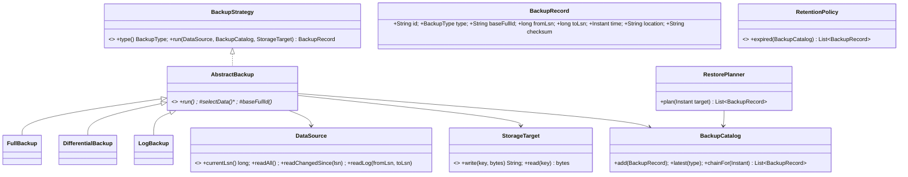

# 22 · Backup System (Full, Differential, Log backups)

## Interview question
Design a backup system with three backup types: **full**, **differential**, and **log** (transaction-log) backups. Support scheduling, restore to a point in time, retention, and extensibility.

## Assumptions / clarification
- Source: a database (like SQL Server/Postgres) or a file system; abstracted as `DataSource`.
- **Full**: complete copy. **Differential**: everything changed since the **last full**. **Log**: transaction log since the **last log (or full)** backup → enables point-in-time recovery (PITR).
- Typical schedule: full weekly, diff daily, log every 15 min.
- Target storage: local disk / S3 / Glacier (pluggable), compressed + encrypted.
- Restore chain = latest full ≤ T + latest diff after that full ≤ T + all logs after that up to T.

## Functional requirements
1. Take full / diff / log backups on schedule or on demand.
2. Catalog of backups with metadata (type, start/end LSN or timestamp, base full id, size, checksum).
3. Restore to latest or to point in time T.
4. Retention policies (keep 4 fulls, 14 days of diffs/logs); never delete a backup another depends on.
5. Verify backups (checksum, test restore).

## Non-functional requirements
- Minimal impact on source (throttling, snapshot-based).
- Durability (multi-region storage), encryption at rest & in transit.
- RPO ≤ 15 min (log interval), RTO within SLA.
- Idempotent, resumable jobs.

## CAP / consistency
- Backup catalog must be **strongly consistent** (restore planning depends on it; single DB).
- Backup blobs are immutable, replicated asynchronously (eventual) to DR region.

## Core entities
`DataSource`, `BackupJob`, `BackupType` (FULL/DIFF/LOG), `BackupRecord` (catalog entry: id, type, baseFullId, fromLsn, toLsn, time, location, checksum, status), `BackupStrategy` (per type), `StorageTarget`, `BackupCatalog`, `RestorePlanner`, `RetentionPolicy`, `Scheduler`.

## IS-A / HAS-A
- `FullBackup`, `DifferentialBackup`, `LogBackup` **IS-A** `BackupStrategy` (share a Template Method in `AbstractBackup`).
- `S3Storage`, `LocalStorage` **IS-A** `StorageTarget`.
- `CountBasedRetention`, `TimeBasedRetention` **IS-A** `RetentionPolicy`.
- `BackupService` **HAS-A** strategies, catalog, storage; `BackupRecord` **HAS-A** reference to base full.

## Mermaid UML class diagram


## APIs
```
BackupRecord backup(BackupType type)
List<BackupRecord> plan(Instant target)
void restore(Instant target, DataSink sink)
POST /v1/backups {sourceId, type}        GET /v1/backups?sourceId=&type=
POST /v1/restores {sourceId, pointInTime, targetInstance}
PUT  /v1/policies/{sourceId} {fullCron, diffCron, logEvery, retention}
```

## Design patterns
- **Strategy** – backup type, storage target, retention, compression/encryption.
- **Template Method** – `AbstractBackup.run()`: validate prerequisites → select data → compress → encrypt → write → checksum → record in catalog.
- **Chain / Composite** – restore chain (full → diff → logs).
- **Command** – `BackupJob` queued & retried.
- **Decorator** – `EncryptingStorage(CompressingStorage(S3Storage))`.
- **Observer** – job events → alerts/metrics.

## SOLID mapping
- **S**: what to back up (strategy) vs where (storage) vs when (scheduler) vs what to keep (retention).
- **O**: add INCREMENTAL backup type by a new strategy.
- **L**: all strategies produce `BackupRecord`.
- **I**: `DataSource` read methods separate from `DataSink`.
- **D**: service depends on interfaces.

## High-level flow
```
Scheduler fires (FULL Sun 1am, DIFF daily 1am, LOG every 15 min)
  → BackupService.backup(type) → strategy.run:
       FULL: read all at LSN X → store → record(base=self, 0..X)
       DIFF: need last FULL F → changed pages since F.toLsn → record(base=F, F.toLsn..now)
       LOG : need a FULL existing → log from lastLog.toLsn (or F.toLsn) → now → record
Restore(T): full F (time ≤ T, latest) → latest diff D with base F and time ≤ T → logs covering (D or F).toLsn .. T in order → replay logs stopping at T
```

## Concurrency
- One backup job per source per type at a time (per-source lock / job lease), but **log backups may run while a full is running** (as in SQL Server) — they chain from the previous log.
- Catalog writes transactional; record added only after blob write + checksum succeed (no dangling entries).
- Retention runs with a lock so it doesn't delete a full that a running diff is using as base.

## Edge cases
- DIFF or LOG requested with no FULL → force a FULL first (or reject).
- Gap in log chain (a log backup missing/corrupt) → PITR impossible past the gap; alert immediately.
- Retention must keep the full + diffs + logs needed for any restore point within the window.
- Source restored/reset (LSN goes backwards) → start a new chain with a new full.
- Partial upload failure → retry idempotently (same key), multipart cleanup.
- Clock skew → order by LSN, not wall clock.

## End-to-end Java implementation
```java
import java.nio.charset.StandardCharsets;
import java.security.MessageDigest;
import java.time.*;
import java.util.*;
import java.util.concurrent.*;
import java.util.concurrent.atomic.AtomicLong;
import java.util.stream.Collectors;

enum BackupType { FULL, DIFF, LOG }

record Change(long lsn, String key, String value, Instant at) {}

/** Toy source: key-value DB with an LSN-ordered change log. */
final class KvDataSource {
    private final Map<String, String> data = new ConcurrentHashMap<>();
    private final List<Change> log = new CopyOnWriteArrayList<>();
    private final AtomicLong lsn = new AtomicLong();
    private final Clock clock;
    KvDataSource(Clock clock) { this.clock = clock; }
    synchronized void put(String k, String v) { long l = lsn.incrementAndGet(); data.put(k, v); log.add(new Change(l, k, v, clock.instant())); }
    long currentLsn() { return lsn.get(); }
    Map<String, String> readAll() { return Map.copyOf(data); }
    Map<String, String> changedSince(long fromLsn) {
        Map<String, String> m = new TreeMap<>();
        log.stream().filter(c -> c.lsn() > fromLsn).forEach(c -> m.put(c.key(), c.value()));   // latest value per key
        return m;
    }
    List<Change> logBetween(long fromLsn, long toLsn) { return log.stream().filter(c -> c.lsn() > fromLsn && c.lsn() <= toLsn).toList(); }
}

record BackupRecord(String id, BackupType type, String baseFullId, long fromLsn, long toLsn, Instant time, String location, String checksum) {}

interface StorageTarget { void write(String key, Object payload); Object read(String key); }

final class InMemoryStorage implements StorageTarget {
    private final Map<String, Object> blobs = new ConcurrentHashMap<>();
    public void write(String k, Object p) { blobs.put(k, p); }
    public Object read(String k) { return blobs.get(k); }
}

final class BackupCatalog {
    private final List<BackupRecord> records = new CopyOnWriteArrayList<>();
    void add(BackupRecord r) { records.add(r); }
    Optional<BackupRecord> latest(BackupType t) { return records.stream().filter(r -> r.type() == t).max(Comparator.comparingLong(BackupRecord::toLsn)); }
    Optional<BackupRecord> latestLogOrFull() {
        return records.stream().filter(r -> r.type() != BackupType.DIFF).max(Comparator.comparingLong(BackupRecord::toLsn));
    }
    List<BackupRecord> all() { return List.copyOf(records); }
}

abstract class AbstractBackup {
    protected final KvDataSource source; protected final BackupCatalog catalog; protected final StorageTarget storage; protected final Clock clock;
    AbstractBackup(KvDataSource s, BackupCatalog c, StorageTarget st, Clock clock) { source = s; catalog = c; storage = st; this.clock = clock; }

    abstract BackupType type();
    protected abstract String baseFullId(long toLsn, String selfId);
    protected abstract long fromLsn();
    protected abstract Object selectData(long fromLsn, long toLsn);

    /** Template method. */
    final BackupRecord run() {
        long to = source.currentLsn(), from = fromLsn();
        String id = type() + "-" + UUID.randomUUID().toString().substring(0, 8);
        Object payload = selectData(from, to);
        String key = "backups/" + id;
        storage.write(key, payload);                                  // compress + encrypt via storage decorators
        BackupRecord r = new BackupRecord(id, type(), baseFullId(to, id), from, to, clock.instant(), key, checksum(payload));
        catalog.add(r);                                               // only after successful write
        return r;
    }

    protected BackupRecord requireFull() {
        return catalog.latest(BackupType.FULL).orElseThrow(() -> new IllegalStateException(type() + " needs a FULL backup first"));
    }
    private static String checksum(Object p) {
        try { return HexFormat.of().formatHex(MessageDigest.getInstance("SHA-256").digest(p.toString().getBytes(StandardCharsets.UTF_8))).substring(0, 12); }
        catch (Exception e) { throw new IllegalStateException(e); }
    }
}

final class FullBackup extends AbstractBackup {
    FullBackup(KvDataSource s, BackupCatalog c, StorageTarget st, Clock k) { super(s, c, st, k); }
    BackupType type() { return BackupType.FULL; }
    protected String baseFullId(long to, String self) { return self; }
    protected long fromLsn() { return 0; }
    protected Object selectData(long from, long to) { return source.readAll(); }
}

final class DifferentialBackup extends AbstractBackup {
    DifferentialBackup(KvDataSource s, BackupCatalog c, StorageTarget st, Clock k) { super(s, c, st, k); }
    BackupType type() { return BackupType.DIFF; }
    protected String baseFullId(long to, String self) { return requireFull().id(); }
    protected long fromLsn() { return requireFull().toLsn(); }         // cumulative since last FULL
    protected Object selectData(long from, long to) { return source.changedSince(from); }
}

final class LogBackup extends AbstractBackup {
    LogBackup(KvDataSource s, BackupCatalog c, StorageTarget st, Clock k) { super(s, c, st, k); }
    BackupType type() { return BackupType.LOG; }
    protected String baseFullId(long to, String self) { return requireFull().id(); }
    protected long fromLsn() { requireFull(); return catalog.latestLogOrFull().orElseThrow().toLsn(); }   // since previous log
    protected Object selectData(long from, long to) { return source.logBetween(from, to); }
}

final class RestorePlanner {
    private final BackupCatalog catalog;
    RestorePlanner(BackupCatalog c) { catalog = c; }

    List<BackupRecord> plan(Instant target) {
        List<BackupRecord> all = catalog.all();
        BackupRecord full = all.stream().filter(r -> r.type() == BackupType.FULL && !r.time().isAfter(target))
                .max(Comparator.comparingLong(BackupRecord::toLsn)).orElseThrow(() -> new IllegalStateException("No full before target"));
        Optional<BackupRecord> diff = all.stream().filter(r -> r.type() == BackupType.DIFF && r.baseFullId().equals(full.id()) && !r.time().isAfter(target))
                .max(Comparator.comparingLong(BackupRecord::toLsn));
        long covered = diff.map(BackupRecord::toLsn).orElse(full.toLsn());
        List<BackupRecord> logs = all.stream().filter(r -> r.type() == BackupType.LOG && r.toLsn() > covered)
                .sorted(Comparator.comparingLong(BackupRecord::fromLsn)).collect(Collectors.toList());
        List<BackupRecord> chain = new ArrayList<>(); chain.add(full); diff.ifPresent(chain::add);
        long expectedFrom = covered;
        for (BackupRecord l : logs) {
            if (l.fromLsn() > expectedFrom) throw new IllegalStateException("Gap in log chain at LSN " + expectedFrom);
            chain.add(l); expectedFrom = l.toLsn();
            if (l.time().isAfter(target)) break;                        // this log contains T; replay stops at T
        }
        return chain;
    }

    @SuppressWarnings("unchecked")
    Map<String, String> restore(Instant target, StorageTarget storage) {
        Map<String, String> db = new TreeMap<>();
        for (BackupRecord r : plan(target)) {
            Object p = storage.read(r.location());
            switch (r.type()) {
                case FULL, DIFF -> db.putAll((Map<String, String>) p);
                case LOG -> ((List<Change>) p).stream().filter(c -> !c.at().isAfter(target)).forEach(c -> db.put(c.key(), c.value()));
            }
        }
        return db;
    }
}

public class BackupDemo {
    public static void main(String[] args) {
        MutableClock clock = new MutableClock(Instant.parse("2026-09-27T00:00:00Z"));
        KvDataSource db = new KvDataSource(clock);
        BackupCatalog catalog = new BackupCatalog(); StorageTarget s3 = new InMemoryStorage();
        var full = new FullBackup(db, catalog, s3, clock); var diff = new DifferentialBackup(db, catalog, s3, clock); var log = new LogBackup(db, catalog, s3, clock);

        db.put("a", "1"); db.put("b", "1");
        System.out.println(full.run());
        clock.plus(60); db.put("a", "2");
        System.out.println(log.run());
        clock.plus(60); db.put("c", "1");
        System.out.println(diff.run());
        clock.plus(60); db.put("b", "2");
        Instant beforeMistake = clock.instant();
        clock.plus(60); db.put("a", "DROPPED!");
        System.out.println(log.run());

        System.out.println("Plan: " + new RestorePlanner(catalog).plan(beforeMistake).stream().map(BackupRecord::id).toList());
        System.out.println("Restored @" + beforeMistake + " = " + new RestorePlanner(catalog).restore(beforeMistake, s3));
    }

    static final class MutableClock extends Clock {
        private Instant now; MutableClock(Instant n) { now = n; }
        void plus(long sec) { now = now.plusSeconds(sec); }
        public ZoneId getZone() { return ZoneOffset.UTC; }
        public Clock withZone(ZoneId z) { return this; }
        public Instant instant() { return now; }
    }
}
```
Expected restore: `{a=2, b=2, c=1}` — the mistaken write `a=DROPPED!` is after T and skipped.

## New requirements → how the class diagram evolves
| New requirement | Change |
|---|---|
| Incremental (since last any backup) | `IncrementalBackup` strategy; planner applies chain of incrementals. |
| Cross-region copy | `ReplicatingStorage` decorator. |
| Encryption / compression | `EncryptingStorage`, `CompressingStorage` decorators. |
| Dedup (block-level) | Content-addressed chunk store (see #08). |
| Backup verification | `VerificationJob` restoring into sandbox weekly. |
| Multiple sources (fleet) | `BackupPolicy` per source; scheduler shards jobs across workers with leases (see #10). |

## Amazon follow-up questions
1. Differential vs incremental vs log — restore cost vs backup cost trade-offs?
2. What's the restore chain for T = Wednesday 10:07?
3. How do you ensure retention never breaks a restore chain?
4. How do you detect a gap in log backups?
5. How do you back up a 10 TB database without hurting production? (Snapshots, replicas, throttling.)
6. RPO vs RTO — how does your schedule map to them?
