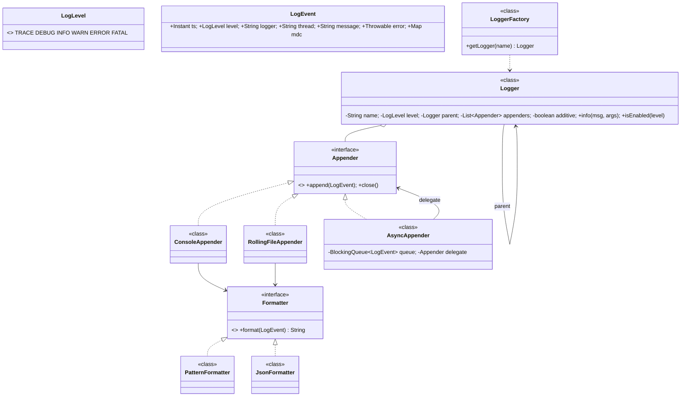
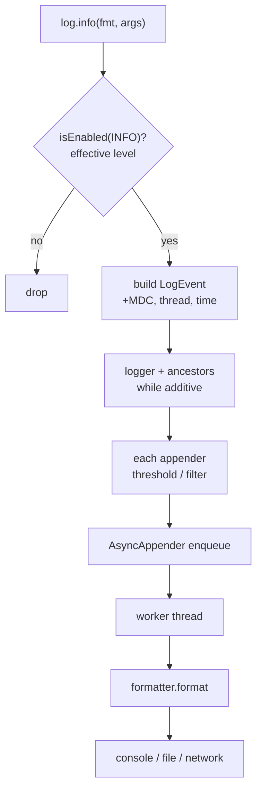

# 23 · Logging Framework (like Log4j / SLF4J+Logback)

## Interview question
Design a logging framework. **No explicit requirements given** — you must drive requirement gathering.

## Assumptions / clarification (ask these)
- Log levels: TRACE < DEBUG < INFO < WARN < ERROR < FATAL; messages below configured level are dropped.
- Multiple destinations (appenders): console, file (with rotation), remote (Kafka/CloudWatch).
- Per-logger level (hierarchical names `com.amazon.cart` inherits from `com.amazon`).
- Formats: plain text pattern, JSON.
- Thread-safe; async option so logging doesn't slow the app.
- Context (requestId/traceId) via MDC.
- Config from file, changeable at runtime.

## Functional requirements
1. `Logger log = LoggerFactory.getLogger(MyClass.class)`; `log.info("msg {}", arg)`.
2. Level filtering (global + per logger).
3. Multiple appenders per logger; each with its own formatter & min level.
4. Log rotation by size/time.
5. MDC context fields.
6. Async logging with bounded buffer.

## Non-functional requirements
- Very low overhead when level disabled (no string building).
- Thread safe; no interleaved lines.
- Never crash the app if an appender fails.
- Extensible appenders/formatters.

## CAP / consistency
Local library. For centralized logging (ELK/CloudWatch), shipping is **AP** — best-effort, buffered; ordering per host by timestamp + sequence.

## Core entities
`LogLevel`, `LogEvent` (timestamp, level, loggerName, thread, message, args, throwable, mdc), `Logger`, `LoggerFactory` / `LoggerRegistry`, `Appender`, `Formatter`, `Filter`, `LoggerConfig`, `AsyncAppender`, `MDC`.

## IS-A / HAS-A
- `ConsoleAppender`, `FileAppender`, `RollingFileAppender`, `AsyncAppender` **IS-A** `Appender`.
- `PatternFormatter`, `JsonFormatter` **IS-A** `Formatter`.
- `Logger` **HAS-A** list of `Appender`s, parent `Logger`; `Appender` **HAS-A** `Formatter`; `AsyncAppender` **HAS-A** delegate `Appender` + queue.

## Mermaid UML class diagram


## APIs
```java
Logger log = LoggerFactory.getLogger("com.amazon.cart");
log.info("Order {} placed by {}", orderId, userId);
log.error("Payment failed", exception);
MDC.put("requestId", rid);
LoggerFactory.configure(config);   // levels, appenders
```

## Design patterns
- **Chain of Responsibility** – event goes up logger hierarchy (additivity) / through filters.
- **Strategy** – formatters, rolling policies.
- **Observer** – appenders are subscribers of a logger.
- **Decorator** – `AsyncAppender` wraps any appender.
- **Singleton / Flyweight** – `LoggerFactory` caches one logger per name.
- **Factory** – appender creation from config.
- **Builder** – `LogEvent`.

## SOLID mapping
- **S**: logger filters & dispatches, appender writes, formatter formats.
- **O**: new `KafkaAppender` or `XmlFormatter` without changes.
- **L**: any appender swappable.
- **I**: `Appender` minimal.
- **D**: logger depends on `Appender` interface.

## High-level flow


## Concurrency
- Logger registry: `ConcurrentHashMap.computeIfAbsent`.
- Appenders: `synchronized append` or single writer thread (async) → no interleaved lines.
- Async queue bounded: policy when full — block, drop DEBUG/INFO, or discard oldest; count dropped events.
- MDC via `ThreadLocal` (copy into event at creation; propagate across executors explicitly).
- Level changes at runtime: `volatile` fields.

## Edge cases
- Appender throws (disk full) → catch, report to internal status logger, continue.
- `null` message/args; fewer args than `{}`.
- Exception as last arg → print stack trace.
- Shutdown → flush async queue (shutdown hook).
- Log rotation while writing → under the appender's lock.
- Expensive toString in args → only formatted if enabled.

## End-to-end Java implementation
```java
import java.io.*;
import java.nio.file.*;
import java.time.Instant;
import java.util.*;
import java.util.concurrent.*;
import java.util.concurrent.atomic.AtomicLong;

enum LogLevel { TRACE, DEBUG, INFO, WARN, ERROR, FATAL }

record LogEvent(Instant ts, LogLevel level, String logger, String thread, String message, Throwable error, Map<String, String> mdc) {}

final class MDC {
    private static final ThreadLocal<Map<String, String>> CTX = ThreadLocal.withInitial(HashMap::new);
    private MDC() {}
    static void put(String k, String v) { CTX.get().put(k, v); }
    static void clear() { CTX.get().clear(); }
    static Map<String, String> copy() { return Map.copyOf(CTX.get()); }
}

interface Formatter { String format(LogEvent e); }

final class PatternFormatter implements Formatter {
    public String format(LogEvent e) {
        StringBuilder sb = new StringBuilder().append(e.ts()).append(' ').append(String.format("%-5s", e.level()))
                .append(" [").append(e.thread()).append("] ").append(e.logger());
        if (!e.mdc().isEmpty()) sb.append(' ').append(e.mdc());
        sb.append(" - ").append(e.message());
        if (e.error() != null) { StringWriter sw = new StringWriter(); e.error().printStackTrace(new PrintWriter(sw)); sb.append('\n').append(sw); }
        return sb.toString();
    }
}

final class JsonFormatter implements Formatter {
    public String format(LogEvent e) {
        return String.format("{\"ts\":\"%s\",\"level\":\"%s\",\"logger\":\"%s\",\"thread\":\"%s\",\"msg\":\"%s\",\"mdc\":%s%s}",
                e.ts(), e.level(), e.logger(), e.thread(), esc(e.message()), mdcJson(e.mdc()),
                e.error() == null ? "" : ",\"error\":\"" + esc(e.error().toString()) + "\"");
    }
    private static String esc(String s) { return s.replace("\\", "\\\\").replace("\"", "\\\""); }
    private static String mdcJson(Map<String, String> m) {
        StringJoiner j = new StringJoiner(",", "{", "}");
        m.forEach((k, v) -> j.add("\"" + esc(k) + "\":\"" + esc(v) + "\""));
        return j.toString();
    }
}

interface Appender extends AutoCloseable {
    void append(LogEvent e);
    default void close() {}
}

final class ConsoleAppender implements Appender {
    private final Formatter f; private final LogLevel threshold;
    ConsoleAppender(Formatter f, LogLevel threshold) { this.f = f; this.threshold = threshold; }
    public synchronized void append(LogEvent e) {
        if (e.level().compareTo(threshold) < 0) return;
        (e.level().compareTo(LogLevel.WARN) >= 0 ? System.err : System.out).println(f.format(e));
    }
}

final class RollingFileAppender implements Appender {
    private final Path file; private final long maxBytes; private final int maxFiles; private final Formatter f;
    private Writer out; private long written;
    RollingFileAppender(Path file, long maxBytes, int maxFiles, Formatter f) throws IOException {
        this.file = file; this.maxBytes = maxBytes; this.maxFiles = maxFiles; this.f = f; open();
    }
    private void open() throws IOException {
        out = Files.newBufferedWriter(file, StandardOpenOption.CREATE, StandardOpenOption.APPEND);
        written = Files.size(file);
    }
    public synchronized void append(LogEvent e) {
        try {
            String line = f.format(e) + System.lineSeparator();
            if (written + line.length() > maxBytes) roll();
            out.write(line); out.flush(); written += line.length();
        } catch (IOException ex) { System.err.println("[logging] file appender failed: " + ex); }   // never throw to app
    }
    private void roll() throws IOException {
        out.close();
        for (int i = maxFiles - 1; i >= 1; i--) {
            Path src = Paths.get(file + "." + i), dst = Paths.get(file + "." + (i + 1));
            if (Files.exists(src)) Files.move(src, dst, StandardCopyOption.REPLACE_EXISTING);
        }
        Files.move(file, Paths.get(file + ".1"), StandardCopyOption.REPLACE_EXISTING);
        open();
    }
    public synchronized void close() { try { out.close(); } catch (IOException ignored) {} }
}

/** Decorator: moves I/O off the caller thread. Drops TRACE..INFO when full, blocks for WARN+. */
final class AsyncAppender implements Appender {
    private final BlockingQueue<LogEvent> queue; private final Appender delegate; private final Thread worker;
    private final AtomicLong dropped = new AtomicLong(); private volatile boolean running = true;
    AsyncAppender(Appender delegate, int capacity) {
        this.delegate = delegate; this.queue = new ArrayBlockingQueue<>(capacity);
        worker = new Thread(this::drain, "async-log"); worker.setDaemon(true); worker.start();
    }
    public void append(LogEvent e) {
        if (e.level().compareTo(LogLevel.WARN) >= 0) {
            try { queue.put(e); } catch (InterruptedException ie) { Thread.currentThread().interrupt(); }
        } else if (!queue.offer(e)) dropped.incrementAndGet();
    }
    private void drain() {
        while (running || !queue.isEmpty()) {
            try { LogEvent e = queue.poll(100, TimeUnit.MILLISECONDS); if (e != null) delegate.append(e); }
            catch (InterruptedException ie) { running = false; }
            catch (RuntimeException ex) { System.err.println("[logging] appender error " + ex); }
        }
    }
    public void close() {
        running = false;
        try { worker.join(2000); } catch (InterruptedException e) { Thread.currentThread().interrupt(); }
        delegate.close();
    }
    long dropped() { return dropped.get(); }
}

final class Logger {
    private final String name; private final Logger parent;
    private volatile LogLevel level;                      // null = inherit
    private final List<Appender> appenders = new CopyOnWriteArrayList<>();
    private volatile boolean additive = true;

    Logger(String name, Logger parent) { this.name = name; this.parent = parent; }

    void setLevel(LogLevel l) { level = l; }
    void addAppender(Appender a) { appenders.add(a); }
    void setAdditive(boolean a) { additive = a; }

    LogLevel effectiveLevel() { for (Logger l = this; l != null; l = l.parent) if (l.level != null) return l.level; return LogLevel.INFO; }
    boolean isEnabled(LogLevel l) { return l.compareTo(effectiveLevel()) >= 0; }

    void trace(String m, Object... a) { log(LogLevel.TRACE, m, a); }
    void debug(String m, Object... a) { log(LogLevel.DEBUG, m, a); }
    void info(String m, Object... a)  { log(LogLevel.INFO, m, a); }
    void warn(String m, Object... a)  { log(LogLevel.WARN, m, a); }
    void error(String m, Object... a) { log(LogLevel.ERROR, m, a); }

    private void log(LogLevel lvl, String msg, Object... args) {
        if (!isEnabled(lvl)) return;                                         // cheap path: no formatting
        Throwable t = (args.length > 0 && args[args.length - 1] instanceof Throwable th) ? th : null;
        LogEvent e = new LogEvent(Instant.now(), lvl, name, Thread.currentThread().getName(), interpolate(msg, args), t, MDC.copy());
        for (Logger l = this; l != null; l = l.additive ? l.parent : null)
            for (Appender a : l.appenders) {
                try { a.append(e); } catch (RuntimeException ex) { System.err.println("[logging] " + ex); }
            }
    }

    private static String interpolate(String msg, Object[] args) {
        if (msg == null) return "null";
        StringBuilder sb = new StringBuilder(); int argIdx = 0, i = 0;
        while (i < msg.length()) {
            int j = msg.indexOf("{}", i);
            if (j < 0 || argIdx >= args.length || args[argIdx] instanceof Throwable) { sb.append(msg, i, msg.length()); break; }
            sb.append(msg, i, j).append(args[argIdx++]); i = j + 2;
        }
        return sb.toString();
    }
}

final class LoggerFactory {
    private static final Map<String, Logger> LOGGERS = new ConcurrentHashMap<>();
    private static final Logger ROOT = new Logger("ROOT", null);
    static { ROOT.setLevel(LogLevel.INFO); }
    private LoggerFactory() {}
    static Logger root() { return ROOT; }
    static Logger getLogger(Class<?> c) { return getLogger(c.getName()); }
    static Logger getLogger(String name) {
        return LOGGERS.computeIfAbsent(name, n -> {
            int dot = n.lastIndexOf('.');
            Logger parent = dot < 0 ? ROOT : getLogger(n.substring(0, dot));
            return new Logger(n, parent);
        });
    }
}

public class LoggingDemo {
    public static void main(String[] args) throws Exception {
        Path file = Files.createTempFile("app", ".log");
        AsyncAppender asyncFile = new AsyncAppender(new RollingFileAppender(file, 10_000, 3, new JsonFormatter()), 1024);
        LoggerFactory.root().addAppender(new ConsoleAppender(new PatternFormatter(), LogLevel.TRACE));
        LoggerFactory.root().addAppender(asyncFile);
        LoggerFactory.getLogger("com.amazon.cart").setLevel(LogLevel.DEBUG);

        Logger log = LoggerFactory.getLogger("com.amazon.cart.CheckoutService");
        MDC.put("requestId", "req-42");
        log.debug("Cart has {} items", 3);                 // enabled via parent com.amazon.cart
        log.info("Order {} placed by {}", "O-1", "amar");
        log.error("Payment failed for {}", "O-1", new IllegalStateException("card declined"));
        LoggerFactory.getLogger("com.amazon.search").debug("hidden (root is INFO)");

        asyncFile.close();
        System.out.println("--- file ---\n" + Files.readString(file));
    }
}
```

## New requirements → how the class diagram evolves
| New requirement | Change |
|---|---|
| Ship to Kafka/CloudWatch | `KafkaAppender` (batching, retries) wrapped by `AsyncAppender`. |
| Filter by marker/regex | `Filter` interface (ACCEPT/DENY/NEUTRAL) chain on appender. |
| Time-based rotation + gzip | `RollingPolicy` strategy (`SizeBased`, `TimeBased`, `Composite`). |
| Runtime config reload | `ConfigWatcher` re-applies levels (volatile fields). |
| Sampling (log 1% of DEBUG) | `SamplingFilter`. |
| PII masking | `MaskingFormatter` decorator. |

## Amazon follow-up questions
1. How do you avoid cost when DEBUG is disabled? (Level check before building; `{}` placeholders; suppliers.)
2. How do you guarantee lines don't interleave across threads?
3. What happens when the async queue is full? Trade-offs.
4. How does logger hierarchy / additivity work?
5. How do you propagate requestId across thread pools? (MDC copy into tasks.)
6. What if the disk is full — should the app crash?
7. How would you build centralized logging for 10k hosts? (Agent → Kafka → ES/S3; sampling; retention tiers.)
