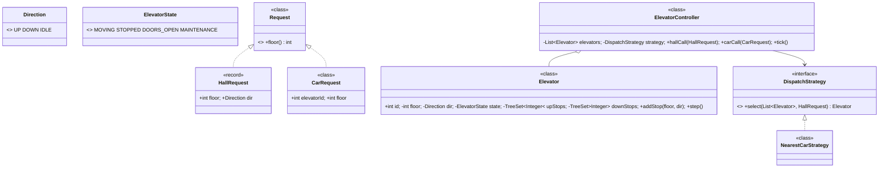
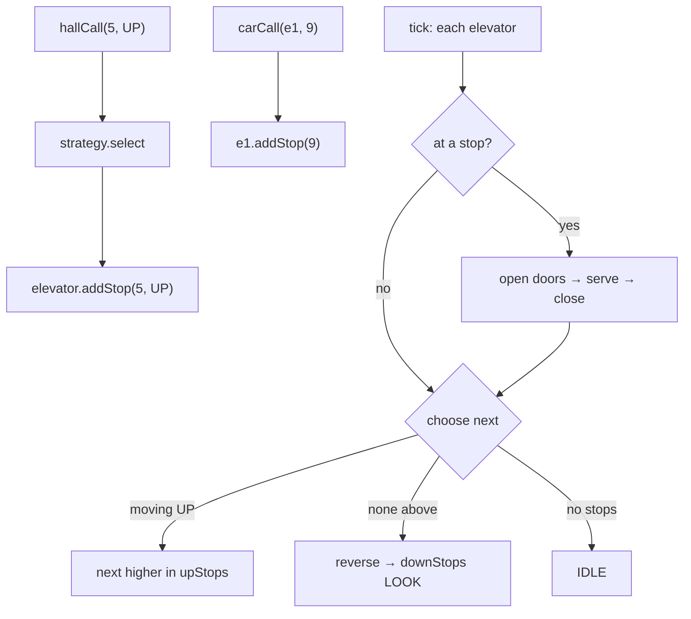

# 24 · Elevator System

## Interview question
Design an elevator system for a building with N floors and M elevators: hall calls (up/down buttons), car calls (floor buttons inside), dispatching, direction, doors, and emergencies.

## Assumptions / clarification
- N floors (0..N-1), M elevators, each with capacity.
- Hall call: floor + direction. Car call: destination floor from inside a specific elevator.
- Dispatcher assigns each hall call to one elevator.
- Elevator serves requests with **LOOK** algorithm (keep direction while requests ahead, then reverse).
- Simulation driven by ticks (`step()`); real system would be event/timer driven.
- Maintenance / emergency mode stops elevator.

## Functional requirements
1. Press hall button (floor, UP/DOWN) → an elevator arrives.
2. Press car button → elevator goes to that floor.
3. Display current floor & direction.
4. Door open/close with timeouts; obstruction reopens.
5. Maintenance / fire mode.

## Non-functional requirements
- Minimize average wait time; no starvation.
- Safe: never move with door open; respect capacity.
- Extensible dispatch strategies (nearest, least-loaded, zoning).

## CAP / consistency
Single controller (embedded); not distributed. Controller state is authoritative.

## Core entities
`Building`, `Elevator` (id, currentFloor, direction, state, stops up/down sets), `Direction`, `ElevatorState`, `Request` (HallRequest, CarRequest), `Dispatcher` (strategy), `ElevatorController`, `Door`, `Display`.

## IS-A / HAS-A
- `HallRequest`, `CarRequest` **IS-A** `Request`.
- `NearestCarStrategy`, `LeastLoadedStrategy`, `ZoneStrategy` **IS-A** `DispatchStrategy`.
- `ElevatorController` **HAS-A** list of `Elevator`, a `DispatchStrategy`; `Elevator` **HAS-A** `Door`, `TreeSet` up stops, down stops.

## Mermaid UML class diagram


## APIs
```
void hallCall(int floor, Direction dir)
void carCall(int elevatorId, int floor)
void tick()                           // advance simulation one step
ElevatorStatus status(int elevatorId) // floor, direction, state
void setMaintenance(int elevatorId, boolean on)
```

## Design patterns
- **Strategy** – dispatch algorithm.
- **State** – elevator state (MOVING, STOPPED, DOORS_OPEN, MAINTENANCE) determines allowed actions.
- **Observer** – displays/panels subscribe to elevator status.
- **Command** – requests as objects (queueable, loggable).
- **Singleton** – controller per building (via DI).

## SOLID mapping
- **S**: elevator moves & serves stops; controller routes requests; strategy decides assignment.
- **O**: new dispatch rule = new strategy.
- **L**: all strategies interchangeable.
- **I**: display listens via `ElevatorListener` only.
- **D**: controller depends on `DispatchStrategy`.

## High-level flow


## LOOK scheduling
- Keep `upStops` (ascending) and `downStops` (descending).
- While going up, serve `upStops` ≥ current floor in order; when none remain, switch to DOWN and serve `downStops`; pickups that are "behind" wait for next sweep → no starvation, bounded wait.

## Dispatch cost (NearestCar with direction awareness)
- Idle elevator: `|floor - req|`.
- Moving toward request in same direction: `|floor - req|`.
- Otherwise: distance to turn around + back (penalized).
- Skip MAINTENANCE / full elevators.

## Concurrency
- Button presses arrive from many threads → controller methods `synchronized` or requests go through a `BlockingQueue` consumed by the controller loop (single-threaded state mutation, simplest and safest).
- Each elevator could have its own thread; stops sets guarded by elevator lock.

## Edge cases
- Request for current floor while doors open → just keep doors open.
- Same hall call pressed repeatedly → dedupe (set).
- Invalid floor → reject.
- All elevators in maintenance → queue requests.
- Overweight → doors stay open, no movement.
- Fire mode → all go to ground floor, ignore hall calls.

## End-to-end Java implementation
```java
import java.util.*;
import java.util.concurrent.*;

enum Direction { UP, DOWN, IDLE }
enum ElevatorState { MOVING, DOORS_OPEN, IDLE, MAINTENANCE }

record HallRequest(int floor, Direction dir) {}

interface ElevatorListener { void onStatus(int id, int floor, Direction dir, ElevatorState state); }

final class Elevator {
    final int id;
    private int floor; private Direction dir = Direction.IDLE; private ElevatorState state = ElevatorState.IDLE;
    private final TreeSet<Integer> upStops = new TreeSet<>(), downStops = new TreeSet<>();
    private final List<ElevatorListener> listeners;

    Elevator(int id, int startFloor, List<ElevatorListener> listeners) { this.id = id; this.floor = startFloor; this.listeners = listeners; }

    synchronized void addStop(int target, Direction requested) {
        if (state == ElevatorState.MAINTENANCE) throw new IllegalStateException("in maintenance");
        if (target == floor && dir != Direction.DOWN && dir != Direction.UP) { state = ElevatorState.DOORS_OPEN; notifyListeners(); return; }
        Direction d = requested != Direction.IDLE ? requested : (target > floor ? Direction.UP : Direction.DOWN);
        if (d == Direction.UP && target > floor || d == Direction.UP && dir != Direction.UP) upStops.add(target);
        else if (d == Direction.DOWN && target < floor || d == Direction.DOWN && dir != Direction.DOWN) downStops.add(target);
        else (target > floor ? upStops : downStops).add(target);        // behind us → next sweep in that direction
        if (dir == Direction.IDLE) dir = target > floor ? Direction.UP : Direction.DOWN;
    }

    /** One simulation tick: close doors / move one floor / open doors on arrival. LOOK. */
    synchronized void step() {
        if (state == ElevatorState.MAINTENANCE) return;
        if (state == ElevatorState.DOORS_OPEN) state = ElevatorState.IDLE;              // doors close
        if (dir == Direction.UP && upStops.ceiling(floor) == null) dir = downStops.isEmpty() ? (upStops.isEmpty() ? Direction.IDLE : Direction.DOWN) : Direction.DOWN;
        if (dir == Direction.DOWN && downStops.floor(floor) == null) dir = upStops.isEmpty() ? (downStops.isEmpty() ? Direction.IDLE : Direction.UP) : Direction.UP;
        if (dir == Direction.IDLE) { state = ElevatorState.IDLE; notifyListeners(); return; }

        floor += dir == Direction.UP ? 1 : -1;
        state = ElevatorState.MOVING;
        boolean stop = dir == Direction.UP ? upStops.remove(floor) : downStops.remove(floor);
        if (!stop && (dir == Direction.UP ? upStops.isEmpty() && downStops.remove(floor) : downStops.isEmpty() && upStops.remove(floor))) stop = true;
        if (stop) state = ElevatorState.DOORS_OPEN;
        notifyListeners();
    }

    synchronized void setMaintenance(boolean on) {
        state = on ? ElevatorState.MAINTENANCE : ElevatorState.IDLE;
        if (on) { upStops.clear(); downStops.clear(); dir = Direction.IDLE; }
    }

    synchronized int floor() { return floor; }
    synchronized Direction direction() { return dir; }
    synchronized ElevatorState state() { return state; }
    synchronized int pendingStops() { return upStops.size() + downStops.size(); }
    private void notifyListeners() { listeners.forEach(l -> l.onStatus(id, floor, dir, state)); }
}

interface DispatchStrategy { Optional<Elevator> select(List<Elevator> elevators, HallRequest r); }

final class NearestCarStrategy implements DispatchStrategy {
    private final int floors;
    NearestCarStrategy(int floors) { this.floors = floors; }
    public Optional<Elevator> select(List<Elevator> es, HallRequest r) {
        return es.stream().filter(e -> e.state() != ElevatorState.MAINTENANCE)
                 .min(Comparator.comparingInt((Elevator e) -> cost(e, r)).thenComparingInt(Elevator::pendingStops));
    }
    private int cost(Elevator e, HallRequest r) {
        int f = e.floor(), d = Math.abs(f - r.floor());
        return switch (e.direction()) {
            case IDLE -> d;
            case UP -> (r.floor() >= f && r.dir() == Direction.UP) ? d : d + 2 * floors;      // penalize turn-around
            case DOWN -> (r.floor() <= f && r.dir() == Direction.DOWN) ? d : d + 2 * floors;
        };
    }
}

final class ElevatorController {
    private final int floors; private final List<Elevator> elevators; private final DispatchStrategy strategy;
    private final Queue<HallRequest> pending = new ConcurrentLinkedQueue<>();

    ElevatorController(int floors, List<Elevator> elevators, DispatchStrategy strategy) {
        this.floors = floors; this.elevators = List.copyOf(elevators); this.strategy = strategy;
    }

    synchronized void hallCall(int floor, Direction dir) {
        validate(floor);
        HallRequest r = new HallRequest(floor, dir);
        strategy.select(elevators, r).ifPresentOrElse(e -> e.addStop(floor, dir), () -> pending.add(r));
    }

    synchronized void carCall(int elevatorId, int floor) {
        validate(floor);
        elevators.get(elevatorId).addStop(floor, Direction.IDLE);
    }

    synchronized void tick() {
        for (Iterator<HallRequest> it = pending.iterator(); it.hasNext(); ) {
            HallRequest r = it.next();
            strategy.select(elevators, r).ifPresent(e -> { e.addStop(r.floor(), r.dir()); it.remove(); });
        }
        elevators.forEach(Elevator::step);
    }

    private void validate(int floor) { if (floor < 0 || floor >= floors) throw new IllegalArgumentException("bad floor " + floor); }
}

public class ElevatorDemo {
    public static void main(String[] args) {
        ElevatorListener display = (id, f, d, s) -> { if (s == ElevatorState.DOORS_OPEN) System.out.println("E" + id + " doors open @" + f + " (" + d + ")"); };
        List<Elevator> es = List.of(new Elevator(0, 0, List.of(display)), new Elevator(1, 10, List.of(display)));
        ElevatorController ctl = new ElevatorController(15, es, new NearestCarStrategy(15));

        ctl.hallCall(3, Direction.UP);      // E0 (at 0) is nearest
        ctl.hallCall(9, Direction.DOWN);    // E1 (at 10)
        for (int t = 0; t < 4; t++) ctl.tick();
        ctl.carCall(0, 7);                  // passenger in E0 goes to 7
        ctl.carCall(1, 2);                  // passenger in E1 goes to 2
        ctl.hallCall(5, Direction.DOWN);
        for (int t = 0; t < 15; t++) ctl.tick();
    }
}
```

## New requirements → how the class diagram evolves
| New requirement | Change |
|---|---|
| Capacity / weight sensor | `Elevator` HAS-A `LoadSensor`; dispatch skips full cars. |
| Destination dispatch (enter floor in lobby) | Hall request carries destination; `DestinationDispatchStrategy` groups passengers. |
| Express elevators / zones | `ZoneStrategy`: elevator serves floor range. |
| VIP / service elevator | Priority requests; `ElevatorType`. |
| Fire mode | Controller `EmergencyState` → all elevators to ground, ignore calls (State pattern at controller level). |
| Energy saving (park idle cars) | `ParkingPolicy` when idle. |

## Amazon follow-up questions
1. Why LOOK over FCFS? What's SCAN vs LOOK?
2. How does your dispatcher pick an elevator? How do you avoid starvation?
3. How do you handle concurrent button presses safely?
4. How do you add capacity constraints?
5. Where would the State pattern help? Show the transitions.
6. How would you test this? (Deterministic ticks.)
