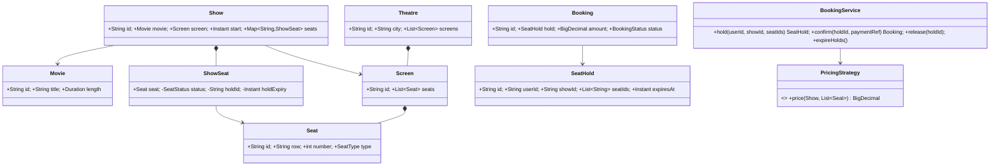
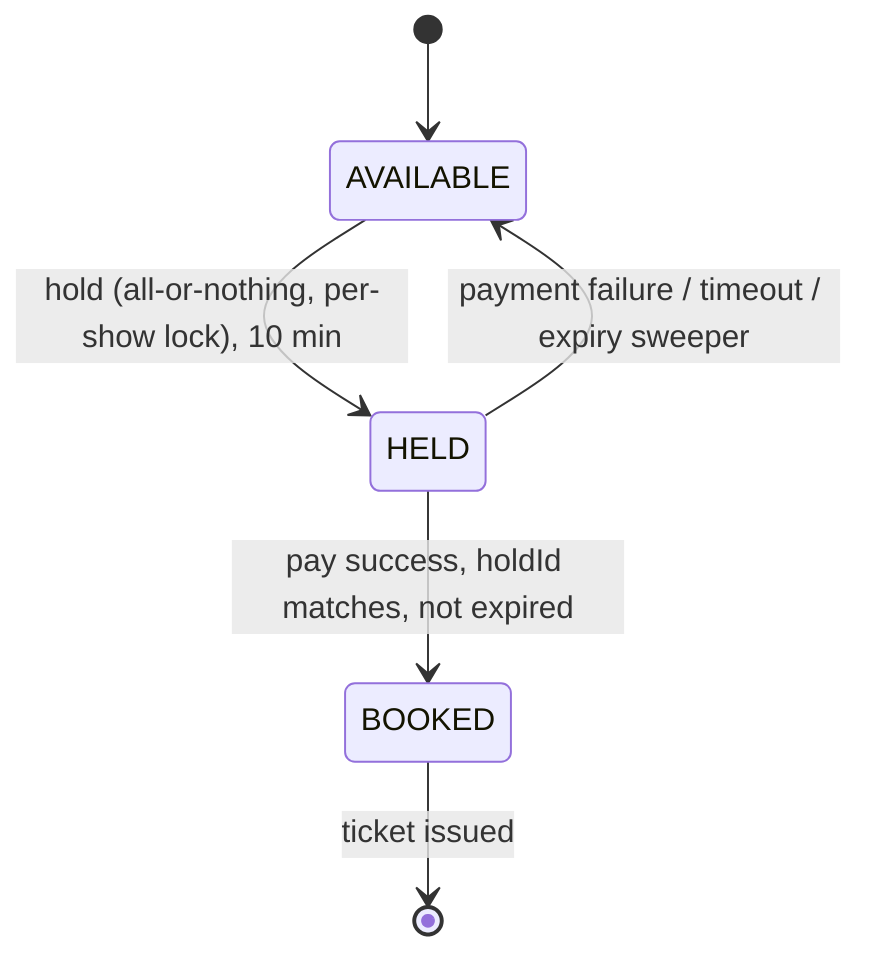

# 25 · Movie Ticket Booking (BookMyShow)

## Interview question
Design a movie ticket booking system: browse movies by city, theatres & shows, view seat map, select seats, hold, pay, confirm. Two users must never get the same seat.

## Assumptions / clarification
- City → Theatres → Screens → Shows (movie, screen, start time) → Seats (row, number, type: REGULAR/PREMIUM/RECLINER).
- User selects up to 10 seats; seats are **held for 10 minutes** during payment; auto-release on timeout/failure.
- Pricing by seat type (+ show time/day multiplier as follow-up).
- Payment via gateway; booking confirmed only after payment success.

## Functional requirements
1. Search movies by city/date; list theatres & shows.
2. Seat map with availability.
3. Hold seats (atomic, all-or-nothing).
4. Pay → confirm booking → ticket (QR).
5. Cancel booking (refund policy).
6. Release holds on expiry.

## Non-functional requirements
- No double booking.
- High read traffic on popular shows (Avengers opening) — seat map fast.
- Hold/confirm p99 < 500 ms; fair under contention.

## CAP / consistency
- Seat inventory for a show: **CP** (per-show consistency).
- Catalog (movies, theatres, show listings): **AP**, cached/CDN.

## Core entities
`City`, `Movie`, `Theatre`, `Screen`, `Seat`, `Show`, `ShowSeat` (show × seat status: AVAILABLE/HELD/BOOKED, holdId, holdExpiry), `SeatHold`, `Booking`, `Payment`, `PricingStrategy`, `User`.

## IS-A / HAS-A
- `RegularSeat`, `PremiumSeat` → better: `Seat` HAS-A `SeatType` enum (no behaviour difference).
- `SeatTypePricing`, `DynamicPricing` **IS-A** `PricingStrategy`.
- `Theatre` **HAS-A** `Screen`s; `Screen` **HAS-A** `Seat`s; `Show` **HAS-A** `ShowSeat`s; `Booking` **HAS-A** `ShowSeat`s + `Payment`.

## Mermaid UML class diagram


## APIs
```
GET  /cities/{city}/movies?date=
GET  /movies/{id}/shows?city=&date=
GET  /shows/{id}/seats                        -> seat map with status
POST /shows/{id}/holds {seatIds[]}            -> 201 {holdId, expiresAt, amount} | 409 {unavailableSeats}
POST /holds/{holdId}/confirm {paymentRef}     Idempotency-Key -> Booking
DELETE /holds/{holdId}
POST /bookings/{id}/cancel
```

## Design patterns
- **Strategy** – pricing, payment.
- **State** – ShowSeat: AVAILABLE → HELD → BOOKED (HELD → AVAILABLE on expiry).
- **Facade** – `BookingService`.
- **Observer** – booking confirmed → email/SMS ticket; seat changes → live seat map (WebSocket).
- **Factory** – seat layout generation for a screen.

## SOLID mapping
- **S**: catalog vs seat inventory vs payment vs notifications.
- **O**: new pricing (weekend, dynamic) as strategy.
- **L**: payment providers interchangeable.
- **D**: `BookingService` depends on `PricingStrategy`, `PaymentGateway`.

## High-level flow


## Concurrency
- **In-memory**: lock per show (`synchronized(show)`) — hold checks all requested seats, then marks all → all-or-nothing, no partial holds. Different shows proceed in parallel.
- **DB**: `UPDATE show_seat SET status='HELD', hold_id=:h, hold_expiry=:t WHERE show_id=:s AND seat_id IN (:ids) AND (status='AVAILABLE' OR (status='HELD' AND hold_expiry < now()))` → if affected rows ≠ requested count, rollback transaction. Or `SELECT ... FOR UPDATE` on those rows in a consistent order (sorted seat ids) to avoid deadlocks.
- **Redis** variant: `SET seat:{show}:{seat} holdId NX PX 600000` per seat in a Lua script for all-or-nothing.
- Confirm only if `hold_id` matches and not expired (payment arriving late → refund).

## Edge cases
- User holds, payment succeeds after hold expired and seat re-sold → auto refund.
- Partial availability → 409 with list; UI suggests alternatives.
- Double-click confirm → idempotency.
- Show cancelled → mass refund.
- Seat gap rules (don't leave single empty seat) — optional validation.
- Max 10 seats per hold per user; limit concurrent holds per user (anti-scalping).

## End-to-end Java implementation
```java
import java.math.BigDecimal;
import java.time.*;
import java.util.*;
import java.util.concurrent.*;

enum SeatType { REGULAR, PREMIUM, RECLINER }
enum SeatStatus { AVAILABLE, HELD, BOOKED }
enum BookingStatus { CONFIRMED, CANCELLED }

record Movie(String id, String title) {}
record Seat(String id, SeatType type) {}

final class ShowSeat {
    final Seat seat; SeatStatus status = SeatStatus.AVAILABLE; String holdId; Instant holdExpiry;
    ShowSeat(Seat s) { seat = s; }
    boolean isFree(Instant now) { return status == SeatStatus.AVAILABLE || (status == SeatStatus.HELD && holdExpiry.isBefore(now)); }
}

final class Show {
    final String id; final Movie movie; final Instant start; final Map<String, ShowSeat> seats = new LinkedHashMap<>();
    Show(String id, Movie m, Instant start, List<Seat> layout) { this.id = id; movie = m; this.start = start; layout.forEach(s -> seats.put(s.id(), new ShowSeat(s))); }
}

record SeatHold(String id, String userId, String showId, List<String> seatIds, Instant expiresAt, BigDecimal amount) {}
record Booking(String id, SeatHold hold, String paymentRef, BookingStatus status) {}

interface PricingStrategy { BigDecimal price(Show show, List<Seat> seats); }

final class SeatTypePricing implements PricingStrategy {
    private final Map<SeatType, BigDecimal> prices;
    SeatTypePricing(Map<SeatType, BigDecimal> prices) { this.prices = Map.copyOf(prices); }
    public BigDecimal price(Show show, List<Seat> seats) {
        return seats.stream().map(s -> prices.get(s.type())).reduce(BigDecimal.ZERO, BigDecimal::add);
    }
}

final class SeatUnavailableException extends RuntimeException {
    final List<String> seats;
    SeatUnavailableException(List<String> seats) { super("409 unavailable: " + seats); this.seats = seats; }
}

final class BookingService {
    private static final int MAX_SEATS = 10;
    private final Map<String, Show> shows = new ConcurrentHashMap<>();
    private final Map<String, SeatHold> holds = new ConcurrentHashMap<>();
    private final Map<String, Booking> bookingsByHold = new ConcurrentHashMap<>();
    private final PricingStrategy pricing; private final Clock clock; private final Duration holdTtl;

    BookingService(PricingStrategy p, Clock c, Duration ttl) { pricing = p; clock = c; holdTtl = ttl; }
    void addShow(Show s) { shows.put(s.id, s); }

    SeatHold hold(String userId, String showId, List<String> seatIds) {
        if (seatIds.isEmpty() || seatIds.size() > MAX_SEATS) throw new IllegalArgumentException("1-" + MAX_SEATS + " seats");
        Show show = Objects.requireNonNull(shows.get(showId), "show");
        synchronized (show) {                                           // per-show lock
            Instant now = clock.instant();
            List<String> taken = seatIds.stream().filter(id -> { ShowSeat s = show.seats.get(id); return s == null || !s.isFree(now); }).toList();
            if (!taken.isEmpty()) throw new SeatUnavailableException(taken);   // all-or-nothing
            String holdId = UUID.randomUUID().toString();
            Instant exp = now.plus(holdTtl);
            List<Seat> seats = new ArrayList<>();
            for (String id : seatIds) {
                ShowSeat s = show.seats.get(id);
                s.status = SeatStatus.HELD; s.holdId = holdId; s.holdExpiry = exp; seats.add(s.seat);
            }
            SeatHold h = new SeatHold(holdId, userId, showId, List.copyOf(seatIds), exp, pricing.price(show, seats));
            holds.put(holdId, h);
            return h;
        }
    }

    Booking confirm(String holdId, String paymentRef) {
        Booking existing = bookingsByHold.get(holdId);
        if (existing != null) return existing;                          // idempotent
        SeatHold h = Optional.ofNullable(holds.get(holdId)).orElseThrow(() -> new NoSuchElementException("hold"));
        Show show = shows.get(h.showId());
        synchronized (show) {
            Instant now = clock.instant();
            boolean valid = h.seatIds().stream().map(show.seats::get)
                    .allMatch(s -> s.status == SeatStatus.HELD && holdId.equals(s.holdId) && !s.holdExpiry.isBefore(now));
            if (!valid) throw new IllegalStateException("Hold expired — refund " + paymentRef);
            h.seatIds().forEach(id -> { ShowSeat s = show.seats.get(id); s.status = SeatStatus.BOOKED; s.holdExpiry = null; });
            Booking b = new Booking(UUID.randomUUID().toString(), h, paymentRef, BookingStatus.CONFIRMED);
            bookingsByHold.put(holdId, b);
            holds.remove(holdId);
            return b;
        }
    }

    void release(String holdId) {
        SeatHold h = holds.remove(holdId);
        if (h == null) return;
        Show show = shows.get(h.showId());
        synchronized (show) {
            h.seatIds().forEach(id -> { ShowSeat s = show.seats.get(id);
                if (s.status == SeatStatus.HELD && holdId.equals(s.holdId)) { s.status = SeatStatus.AVAILABLE; s.holdId = null; } });
        }
    }

    Map<String, SeatStatus> seatMap(String showId) {
        Show show = shows.get(showId); Instant now = clock.instant();
        synchronized (show) {
            Map<String, SeatStatus> m = new LinkedHashMap<>();
            show.seats.forEach((id, s) -> m.put(id, s.isFree(now) ? SeatStatus.AVAILABLE : s.status));
            return m;
        }
    }
}

public class MovieBookingDemo {
    public static void main(String[] args) throws Exception {
        BookingService svc = new BookingService(new SeatTypePricing(Map.of(
                SeatType.REGULAR, new BigDecimal("200"), SeatType.PREMIUM, new BigDecimal("350"), SeatType.RECLINER, new BigDecimal("600"))),
                Clock.systemUTC(), Duration.ofMinutes(10));
        List<Seat> layout = List.of(new Seat("A1", SeatType.REGULAR), new Seat("A2", SeatType.REGULAR), new Seat("P1", SeatType.PREMIUM), new Seat("P2", SeatType.PREMIUM));
        svc.addShow(new Show("S1", new Movie("M1", "Avengers"), Instant.parse("2026-10-01T14:30:00Z"), layout));

        ExecutorService pool = Executors.newFixedThreadPool(2);
        Callable<String> amar = () -> { try { return "amar " + svc.hold("amar", "S1", List.of("P1", "P2")).amount(); } catch (SeatUnavailableException e) { return "amar " + e.getMessage(); } };
        Callable<String> guru = () -> { try { return "guru " + svc.hold("guru", "S1", List.of("P2", "A1")).amount(); } catch (SeatUnavailableException e) { return "guru " + e.getMessage(); } };
        Future<String> a = pool.submit(amar), g = pool.submit(guru);
        System.out.println(a.get() + " | " + g.get());            // exactly one gets P2
        pool.shutdown();
        System.out.println(svc.seatMap("S1"));
    }
}
```

## New requirements → how the class diagram evolves
| New requirement | Change |
|---|---|
| Dynamic pricing (weekend, prime time, occupancy) | `DynamicPricing` decorator over `SeatTypePricing`. |
| Coupons / offers | `DiscountRule` chain. |
| Food & beverages add-on | `Booking` HAS-A `AddOn`s. |
| Waitlist for sold-out show | `WaitlistService`; on release notify next user (Observer). |
| Live seat map | Publish seat state changes to WebSocket (Observer). |
| Virtual queue for blockbuster openings | Queue-it style admission service before hold. |

## Amazon follow-up questions
1. Two users click the same seat at the same millisecond — what exactly happens?
2. Why hold with TTL instead of locking until payment?
3. Payment callback arrives after hold expiry — what do you do?
4. DB-level approach: optimistic vs `SELECT FOR UPDATE` vs conditional update? Deadlocks with multiple seats?
5. How do you scale the seat map reads for a blockbuster? (Cache + push deltas; DB only for writes.)
6. How to prevent bots from holding all seats?
