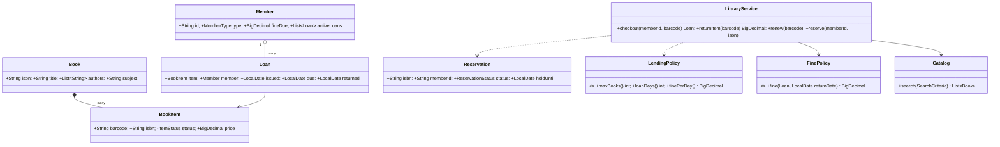

# 26 · Library Management System

## Interview question
Design a library management system: catalogue books, members borrow/return copies, reservations (holds), due dates, fines, search.

## Assumptions / clarification
- A **Book** (title/ISBN) has many physical **BookItems** (copies, barcode).
- Member types: STUDENT (max 3 books, 14 days), FACULTY (max 10, 30 days).
- Fine: ₹10/day overdue (configurable by member type), cap at book price.
- Reservation queue per Book: when a copy is returned, it's held for the first person in queue for 2 days.
- Librarian adds/removes books; members search by title/author/subject/ISBN.

## Functional requirements
1. Add/remove books and copies.
2. Search catalogue.
3. Checkout (issue) a copy; enforce limits and holds.
4. Return; compute fine; trigger reservation.
5. Renew (if nobody waiting).
6. Reserve a book; notify when available.
7. Pay fines; block borrowing if unpaid fines > threshold.

## Non-functional requirements
- Consistency: one copy can't be issued twice.
- Extensible rules (limits, fines per member type).
- Audit history of loans.

## CAP / consistency
Single library DB → **CP**. Search index can be eventually consistent.

## Core entities
`Book` (ISBN, title, authors, subject), `BookItem` (barcode, status), `Member` (id, type, active loans, fines), `Loan` (item, member, issuedAt, dueAt, returnedAt), `Reservation` (book, member, status, expiresAt), `FinePolicy`, `LendingPolicy`, `Catalog` (search), `LibraryService`, `Notifier`.

## IS-A / HAS-A
- `Student`, `Faculty` → modelled as `MemberType` enum + `LendingPolicy` strategy (composition over inheritance).
- `Librarian`, `Member` **IS-A** `Account` (different permissions).
- `PerDayFinePolicy`, `SlabFinePolicy` **IS-A** `FinePolicy`.
- `Book` **HAS-A** many `BookItem`; `Member` **HAS-A** `Loan`s; `Book` **HAS-A** reservation queue.

## Mermaid UML class diagram


## APIs
```
GET  /books?title=&author=&subject=&isbn=
POST /books {isbn, title, authors[], subject}       POST /books/{isbn}/items {barcode, price}
POST /loans {memberId, barcode}                     -> Loan | 409 (limit/hold/fines)
POST /loans/{barcode}/return                        -> {fine}
POST /loans/{barcode}/renew
POST /reservations {memberId, isbn}                 DELETE /reservations/{id}
POST /members/{id}/fines/pay {amount}
```

## Design patterns
- **Strategy** – `LendingPolicy` per member type, `FinePolicy`.
- **Observer** – book returned → reservation service → notify member.
- **State** – BookItem: AVAILABLE → LOANED → AVAILABLE / ON_HOLD / LOST.
- **Specification** – search criteria composable (see #03).
- **Facade** – `LibraryService`.
- **Factory** – `LendingPolicy.forType(MemberType)`.

## SOLID mapping
- **S**: catalog search vs lending vs fines vs notifications.
- **O**: new member type (STAFF) = new policy entry.
- **L**: all fine policies interchangeable.
- **I**: `Notifier` separate.
- **D**: service depends on policies/interfaces.

## High-level flow
```
checkout: member active & fines ≤ limit & loans < max → item AVAILABLE (or ON_HOLD for this member) → CAS to LOANED → Loan(due = today + days)
return:   Loan closed → fine = policy.fine → member.fineDue += fine
          → reservation queue for ISBN non-empty? item ON_HOLD for first member (holdUntil = +2 days), notify : AVAILABLE
renew:    no pending reservations and not overdue → due += days
```

## Concurrency
- Item status transitions via CAS / `UPDATE book_item SET status='LOANED' WHERE barcode=? AND status='AVAILABLE'`.
- Member loan count check + insert in one transaction (or synchronized on member) to avoid exceeding limits with parallel checkouts.
- Reservation queue per ISBN: `ConcurrentLinkedQueue` / DB ordered by created_at.

## Edge cases
- Returning an item not on loan → error.
- Lost book → mark LOST, fine = price.
- Hold expires unclaimed → move to next in queue or AVAILABLE.
- Member reserves a book they already hold/borrow → reject.
- Fine cap at book price.
- Leap years / time zones → `LocalDate` with library zone.

## End-to-end Java implementation
```java
import java.math.BigDecimal;
import java.time.*;
import java.time.temporal.ChronoUnit;
import java.util.*;
import java.util.concurrent.*;
import java.util.concurrent.atomic.AtomicReference;
import java.util.stream.Collectors;

enum MemberType { STUDENT, FACULTY }
enum ItemStatus { AVAILABLE, LOANED, ON_HOLD, LOST }

interface LendingPolicy {
    int maxBooks(); int loanDays(); BigDecimal finePerDay();
    static LendingPolicy forType(MemberType t) {
        return switch (t) {
            case STUDENT -> new SimplePolicy(3, 14, new BigDecimal("10"));
            case FACULTY -> new SimplePolicy(10, 30, new BigDecimal("5"));
        };
    }
}
record SimplePolicy(int maxBooks, int loanDays, BigDecimal finePerDay) implements LendingPolicy {}

record Book(String isbn, String title, List<String> authors, String subject) {}

final class BookItem {
    final String barcode, isbn; final BigDecimal price;
    final AtomicReference<ItemStatus> status = new AtomicReference<>(ItemStatus.AVAILABLE);
    volatile String heldFor;
    BookItem(String barcode, String isbn, BigDecimal price) { this.barcode = barcode; this.isbn = isbn; this.price = price; }
}

final class Member {
    final String id; final MemberType type; final LendingPolicy policy;
    BigDecimal fineDue = BigDecimal.ZERO; final Set<String> activeLoans = new HashSet<>();
    Member(String id, MemberType type) { this.id = id; this.type = type; this.policy = LendingPolicy.forType(type); }
}

final class Loan {
    final BookItem item; final Member member; final LocalDate issued; LocalDate due; LocalDate returned;
    Loan(BookItem i, Member m, LocalDate issued, LocalDate due) { item = i; member = m; this.issued = issued; this.due = due; }
}

interface FinePolicy { BigDecimal fine(Loan loan, LocalDate returnDate); }

final class PerDayFinePolicy implements FinePolicy {
    public BigDecimal fine(Loan l, LocalDate ret) {
        long late = Math.max(0, ChronoUnit.DAYS.between(l.due, ret));
        return l.member.policy.finePerDay().multiply(BigDecimal.valueOf(late)).min(l.item.price);   // cap at price
    }
}

interface Notifier { void notify(String memberId, String msg); }

final class Catalog {
    private final Map<String, Book> books = new ConcurrentHashMap<>();
    void add(Book b) { books.put(b.isbn(), b); }
    Optional<Book> byIsbn(String isbn) { return Optional.ofNullable(books.get(isbn)); }
    List<Book> search(String q) {
        String s = q.toLowerCase();
        return books.values().stream().filter(b -> b.title().toLowerCase().contains(s) || b.subject().toLowerCase().contains(s)
                || b.authors().stream().anyMatch(a -> a.toLowerCase().contains(s)) || b.isbn().equals(q)).collect(Collectors.toList());
    }
}

final class LibraryService {
    private static final BigDecimal MAX_FINE_TO_BORROW = new BigDecimal("100");
    private final Catalog catalog = new Catalog();
    private final Map<String, BookItem> items = new ConcurrentHashMap<>();
    private final Map<String, Member> members = new ConcurrentHashMap<>();
    private final Map<String, Loan> activeLoanByBarcode = new ConcurrentHashMap<>();
    private final Map<String, Queue<String>> reservations = new ConcurrentHashMap<>();   // isbn → memberIds
    private final FinePolicy finePolicy; private final Notifier notifier; private final Clock clock;

    LibraryService(FinePolicy f, Notifier n, Clock c) { finePolicy = f; notifier = n; clock = c; }

    void addBook(Book b) { catalog.add(b); }
    void addItem(BookItem i) { catalog.byIsbn(i.isbn).orElseThrow(); items.put(i.barcode, i); }
    void addMember(Member m) { members.put(m.id, m); }
    List<Book> search(String q) { return catalog.search(q); }

    Loan checkout(String memberId, String barcode) {
        Member m = members.get(memberId); BookItem item = items.get(barcode);
        synchronized (m) {                                                  // member-level limit check
            if (m.fineDue.compareTo(MAX_FINE_TO_BORROW) > 0) throw new IllegalStateException("Pay fines first: " + m.fineDue);
            if (m.activeLoans.size() >= m.policy.maxBooks()) throw new IllegalStateException("Limit " + m.policy.maxBooks() + " reached");
            boolean ok = item.status.compareAndSet(ItemStatus.AVAILABLE, ItemStatus.LOANED)
                    || (memberId.equals(item.heldFor) && item.status.compareAndSet(ItemStatus.ON_HOLD, ItemStatus.LOANED));
            if (!ok) throw new IllegalStateException("Item not available: " + item.status.get());
            if (memberId.equals(item.heldFor)) item.heldFor = null;
            LocalDate today = LocalDate.now(clock);
            Loan loan = new Loan(item, m, today, today.plusDays(m.policy.loanDays()));
            m.activeLoans.add(barcode);
            activeLoanByBarcode.put(barcode, loan);
            return loan;
        }
    }

    BigDecimal returnItem(String barcode) {
        Loan loan = Optional.ofNullable(activeLoanByBarcode.remove(barcode)).orElseThrow(() -> new IllegalStateException("Not on loan"));
        LocalDate today = LocalDate.now(clock);
        loan.returned = today;
        BigDecimal fine = finePolicy.fine(loan, today);
        synchronized (loan.member) { loan.member.activeLoans.remove(barcode); loan.member.fineDue = loan.member.fineDue.add(fine); }

        String next = Optional.ofNullable(reservations.get(loan.item.isbn)).map(Queue::poll).orElse(null);
        if (next != null) {
            loan.item.heldFor = next;
            loan.item.status.set(ItemStatus.ON_HOLD);
            notifier.notify(next, "Your reserved book " + loan.item.isbn + " is ready for pickup (2 days).");
        } else loan.item.status.set(ItemStatus.AVAILABLE);
        return fine;
    }

    void renew(String barcode) {
        Loan loan = Optional.ofNullable(activeLoanByBarcode.get(barcode)).orElseThrow();
        if (!reservations.getOrDefault(loan.item.isbn, new ArrayDeque<>()).isEmpty()) throw new IllegalStateException("Others are waiting");
        if (LocalDate.now(clock).isAfter(loan.due)) throw new IllegalStateException("Overdue — return first");
        loan.due = loan.due.plusDays(loan.member.policy.loanDays());
    }

    void reserve(String memberId, String isbn) {
        catalog.byIsbn(isbn).orElseThrow();
        Queue<String> q = reservations.computeIfAbsent(isbn, k -> new ConcurrentLinkedQueue<>());
        if (q.contains(memberId)) throw new IllegalStateException("Already reserved");
        q.add(memberId);
    }

    void payFine(String memberId, BigDecimal amount) {
        Member m = members.get(memberId);
        synchronized (m) { m.fineDue = m.fineDue.subtract(amount).max(BigDecimal.ZERO); }
    }
}

public class LibraryDemo {
    public static void main(String[] args) {
        MutableClock clock = new MutableClock(Instant.parse("2026-09-01T10:00:00Z"));
        LibraryService lib = new LibraryService(new PerDayFinePolicy(), (m, msg) -> System.out.println("notify " + m + ": " + msg), clock);
        lib.addBook(new Book("978-0134685991", "Effective Java", List.of("Joshua Bloch"), "Programming"));
        lib.addItem(new BookItem("EJ-1", "978-0134685991", new BigDecimal("900")));
        lib.addMember(new Member("amar", MemberType.STUDENT));
        lib.addMember(new Member("guru", MemberType.FACULTY));

        System.out.println(lib.search("bloch").get(0).title());
        Loan l = lib.checkout("amar", "EJ-1");
        System.out.println("Due " + l.due);
        lib.reserve("guru", "978-0134685991");
        try { lib.renew("EJ-1"); } catch (IllegalStateException e) { System.out.println("Renew: " + e.getMessage()); }

        clock.plusDays(17);                                     // 3 days late
        System.out.println("Fine ₹" + lib.returnItem("EJ-1"));
        try { lib.checkout("amar", "EJ-1"); } catch (IllegalStateException e) { System.out.println("amar: " + e.getMessage()); }
        System.out.println("guru due " + lib.checkout("guru", "EJ-1").due);
    }

    static final class MutableClock extends Clock {
        private Instant now; MutableClock(Instant n) { now = n; }
        void plusDays(long d) { now = now.plus(Duration.ofDays(d)); }
        public ZoneId getZone() { return ZoneOffset.UTC; }
        public Clock withZone(ZoneId z) { return this; }
        public Instant instant() { return now; }
    }
}
```

## New requirements → how the class diagram evolves
| New requirement | Change |
|---|---|
| E-books with concurrent-license limits | `DigitalItem` with `licenses` count; `ItemStatus` not needed — counter CAS. |
| Multiple branches | `Branch` HAS-A items; inter-branch transfer requests. |
| Slab fines (first week ₹5, then ₹20) | `SlabFinePolicy`. |
| Hold expiry | Scheduler: ON_HOLD past holdUntil → next reservation / AVAILABLE. |
| Membership renewals / suspension | `MemberStatus` state. |
| Recommendations | Loan history → "members who borrowed X also borrowed Y". |

## Amazon follow-up questions
1. Why is Student/Faculty an enum + policy, not subclasses?
2. Two librarians issue the same copy at the same time — what prevents it?
3. How does the reservation queue interact with returns and renewals?
4. How would you make fine rules configurable?
5. Where would you use the Observer pattern here?
6. How would you scale search for millions of titles? (Search index, see #03/#13.)
